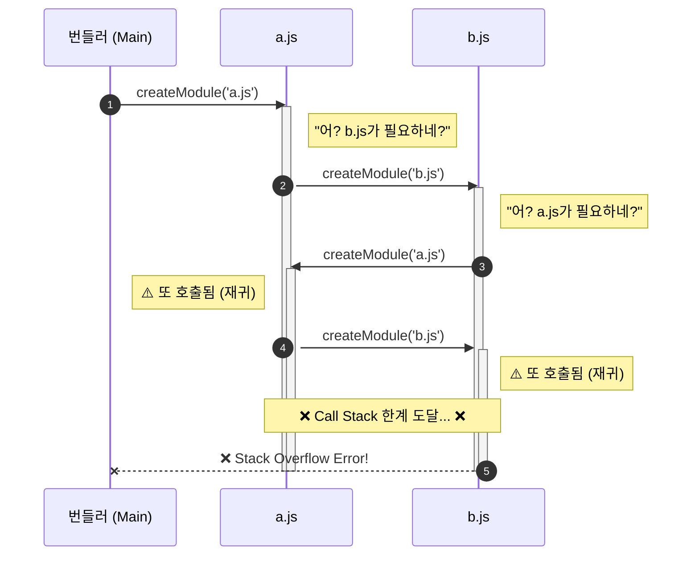

# 2. 코드를 데이터로 보는 법 (AST Graph)

> **"코드는 텍스트가 아니다. 트리다."**

[1편에서는 번들러](https://blog.sangwook.dev/posts/no-one-asked-library-bundler-01-concept/)를 왜 만들어야 하는지, 그리고 `magic-string`이라는 도구를 맛봤습니다. 이제 본격적으로 코드를 분석하고, 여러 파일을 하나로 묶기 위한 준비를 시작해 봅시다.

이번 편의 목표는 **"흩어진 파일들을 찾아내어 하나의 지도로 그리는 것"** 입니다.

---

## 1. 어디서부터 묶어야 할까?

번들러가 가장 먼저 해야 할 일은 무엇일까요? 바로 **"진입점"** 을 찾는 것입니다.

우리가 작성한 수많은 파일들을 하나로 묶으려면 어떻게 해야 할까요? 무턱대고 폴더의 모든 파일을 합치는 것은 좋은 방법이 아닙니다. **시작점이 되는 파일(보통 `index.js`나 `main.js`)**을 읽고, 그 파일이 어떤 다른 파일들을 필요로 하는지(`import`) 추적해 나가야 합니다. 이것이 바로 **의존성 그래프**를 그리기 위한 첫 단추입니다.

---

## 2. 코드는 단순한 텍스트가 아니다

자, 이제 엔트리 파일의 내용을 읽어왔습니다. 그 다음은 파일 내용에서 `import ... from ...` 구문을 찾아내야 합니다.

### 왜 정규표현식을 썼을까?

문자열에서 특정 패턴을 찾는 것. 개발자라면 누구나 가장 먼저 떠올리는 도구가 있죠. 바로 **정규표현식** 입니다.

직관적으로 생각해보면, `import` 문은 꽤 단순한 패턴을 가지고 있어 보입니다.

```javascript
import { a } from './a.js';
import b from './b.js';
```

"어? 이거 그냥 문자열 검색으로 찾으면 되는 거 아냐?"

그래서 처음에는 **정규표현식**을 떠올리게 됩니다. 정규표현식은 강력하고, 빠르고, 무엇보다 **구현하기 쉽습니다.** 복잡한 파서를 도입하는 것보다 `String.match()` 한 방이면 끝날 것 같았죠.

```javascript
const regex = /import\s+.*\s+from\s+['"](.*)['"];?/g;
const code = "import { a } from './a.js';";
const result = code.match(regex);
// 오! 찾아졌다! ./a.js
```

---

## 3. 정규표현식은 파서가 아니다

### 예외 케이스

하지만 코드가 조금만 복잡해져도 정규표현식은 무력해집니다.

```javascript
// 1. 주석 처리된 코드
// import { a } from './a.js';

// 2. 문자열 내부의 텍스트
const message = "Please import './config.js' first.";

// 3. 줄바꿈이 포함된 import
import { somethingLong } from './utils.js';
```

정규표현식은 **문맥**을 모릅니다. 주석인지, 문자열인지 구분하지 못하고 **"패턴이 맞네? 가져와!"** 라고 외칠 뿐입니다. 결국 우리는 엉뚱한 파일을 `import` 하려고 시도하다가 에러를 뿜어내는 번들러를 마주하게 됩니다.

**결론**: 코드를 단순한 텍스트로 처리하려다간 큰코다친다. **구조**로 봐야 합니다.

---

## 4. 도구 1: AST - 코드를 해부하다

그래서 등장하는 도구가 바로 **AST 추상 구문 트리**입니다.

AST는 우리가 작성한 코드를 컴퓨터가 이해하기 쉬운 **트리 형태의 데이터 구조**로 변환한 것입니다. 자바스크립트 파서인 `acorn`을 사용하면 코드를 다음과 같이 분석해줍니다.

### 코드가 데이터가 되는 과정

```javascript
// 입력 코드
import { name } from './name.js';
```

이 한 줄의 코드는 파서를 거치면 거대한 JSON 객체가 됩니다. 핵심만 요약했습니다.

```json
{
  "type": "Program",
  "body": [
    {
      "type": "ImportDeclaration",
      // "이건 import 선언문이야!"
      "source": {
        "type": "Literal",
        "value": "./name.js"
        // "경로는 이거야!"
      },
      "specifiers": [
        {
          "type": "ImportSpecifier",
          "imported": {
            "name": "name"
          }
          // "name을 가져왔어!"
        }
      ]
    }
  ]
}
```

이제 우리는 `type === 'ImportDeclaration'`인 노드만 골라내면 됩니다. 주석이나 문자열은 `ImportDeclaration`이 아니므로 자연스럽게 무시됩니다. **정확도 100%의 import 탐지기**가 생긴 셈입니다.

### Code Module.ts 구현

우리의 번들러에서 파일 하나를 담당하는 `Module` 클래스는 이렇게 AST를 생성합니다.

```typescript
// packages/@package/bundler/src/Module.ts

import * as fs from 'fs';
import * as acorn from 'acorn';

export class Module {
  constructor(filePath: string) {
    this.content = fs.readFileSync(filePath, 'utf-8');
    // 1. 코드를 AST로 변환
    this.ast = acorn.parse(this.content, {
      ecmaVersion: 'latest',
      sourceType: 'module',
    });
  }

  init() {
    // 2. AST를 순회하며 import 찾기
    this.ast.body.forEach(node => {
      if (node.type === 'ImportDeclaration') {
        // 찾았다! 의존성 추가
        this.dependencies.push(node.source.value);
      }
    });
  }
}
```

> **전체 코드 보기**: [Module.ts GitHub](https://github.com/Han5991/fe-lab/blob/1f0ff742d5c057b891b22871588cdd8e2101802b/packages/@package/bundler/src/Module.ts#L69-L118)

---

## 5. 도구 2: Resolve - 진짜 파일 찾기

AST를 통해 `'./utils'`라는 문자열을 찾아냈습니다. 하지만 이건 파일 경로의 **힌트**일 뿐, 실제 파일 시스템상의 위치는 아닙니다.

- `./utils`가 `utils.js`인가? `utils.ts`인가?
- 아니면 `utils/index.js`인가?

이 힌트를 가지고 실제 파일을 찾아내는 과정을 **Resolve**라고 합니다. Node.js는 꽤 복잡한 Resolve 규칙을 가지고 있지만, 우리는 핵심적인 부분만 구현해 봅시다.

### Code 확장자 추론하기

```typescript
// packages/@package/bundler/src/Graph.ts

resolve(importPath: string, importer: string): string {
  // 1. 현재 파일(importer)이 있는 폴더 기준
  const baseDir = path.dirname(importer);
  let fullPath = path.resolve(baseDir, importPath);

  // 2. 확장자가 없으면 .js 붙여보기 (간단한 버전)
  // (실제로는 .mjs, .json, 디렉토리 내 index.js 등도 고려해야 합니다)
  if (!fullPath.endsWith('.js')) {
    fullPath += '.js';
  }

  return fullPath;
}
```

이제 `'./utils'`를 요청하면 `/Users/.../src/utils.js`라는 **절대 경로**를 얻을 수 있습니다.

---

## 6. 도구 3: DFS & Graph - 지도를 그리자

이제 재료는 다 모였습니다.

1. 파일 내용을 읽어서 `fs`
2. `import` 문을 찾아내고 `AST`
3. 그 파일의 절대 경로를 알아냈습니다. `Resolve`

이제 이 과정을 **모든 파일**에 대해 반복하면 됩니다. `index.js`에서 시작해서 꼬리에 꼬리를 물고 찾아 들어가는 방식, 바로 **DFS 깊이 우선 탐색**입니다.

### 그래프 구축 과정 Graph.ts

우리의 `Graph` 클래스는 `Map` 자료구조를 사용하여 전체 파일들의 관계를 저장합니다.

```typescript
// packages/@package/bundler/src/Graph.ts

export class Graph {
  // 방문한 모듈을 저장하는 저장소 (Visited Map)
  modules = new Map<string, Module>();

  createModule(filePath: string): Module {
    // 1. 모듈 생성 및 AST 분석
    const module = new Module(this.nextId++, filePath);
    module.init(); // import 구문 추출

    // 2. 저장소에 등록
    this.modules.set(filePath, module);

    // 3. 의존성 재귀 탐색 (DFS)
    module.dependencies.forEach(importPath => {
      const absolutePath = this.resolve(importPath, filePath);
      const childModule = this.createModule(absolutePath);

      // 4. 부모-자식 연결 (Mapping)
      module.mapping.set(importPath, childModule.id);
    });

    return module;
  }
}
```

이렇게 하면 `index.js` 하나만 넣어도 연결된 모든 파일이 `modules` 맵에 담기게 됩니다. 파일 시스템이라는 거대한 미로를 탐험해서 지도를 완성하는 것이죠.

---

## 7. 하이라이트: "순환 참조"

하지만 DFS에는 치명적인 약점이 있습니다. 바로 **순환 참조**입니다.

### A -> B -> A 무한 루프

만약 `a.js`가 `b.js`를 부르고, `b.js`가 다시 `a.js`를 부른다면 번들러 내부에서는 **호출 스택** 이 계속 쌓이게 됩니다.

이 과정을 **시퀀스 다이어그램** 으로 보면, 함수가 끝나지 않고 계속 깊어지는 것을 확인할 수 있습니다.



결국 **Stack Overflow**가 발생하며 번들러는 장렬히 전사합니다.

### 해결책: 방명록 Visited Map

이 문제를 해결하려면 **"어? 너 아까 왔던 앤데?"** 라고 알아볼 수 있어야 합니다. 우리가 `Graph` 클래스에 만들어둔 `modules` 맵이 바로 그 **방명록** 역할을 합니다.

```typescript
createModule(filePath: string): Module {
  // 0. 방명록 확인: 이미 왔던 파일이면, 기존 모듈 반환하고 끝!
  if (this.modules.has(filePath)) {
    return this.modules.get(filePath)!;
  }

  // ... (새 모듈 생성 로직)
}
```

이 간단한 체크 하나로 번들러는 무한 루프의 늪에서 탈출할 수 있습니다.

### 실전 bundler-playground 예제

실제 예제 코드 `packages/@package/bundler-playground` 에는 `a.js -> c.js -> a.js` 순환 참조 케이스가 들어있습니다.

```javascript
// a.js
import { c } from './c.js';

// c.js
import { a } from './a.js'; // 범인!
```

우리의 번들러는 `c.js`를 처리할 때 `a.js`를 다시 만나지만, `modules.has()` 덕분에 쿨하게 지나갑니다. 덕분에 그래프는 안전하게 완성됩니다.

---

## 8. 에필로그: 이제 지도는 완성됐다

우리는 이제 코드를 **텍스트**가 아닌 **데이터 AST**로 바라보게 되었습니다.
그리고 그 데이터를 바탕으로 파일들의 복잡한 관계를 **그래프 Graph**로 그려냈습니다.

하지만 아직 파일들은 제각각 떨어져 있습니다. 다음 단계에서는 이 그래프를 바탕으로 파일들을 **하나의 파일로 합치는 Bundling** 과정을 다룹니다.

이때 가장 골치 아픈 문제는 **"변수 이름 충돌"** 입니다.
`a.js`의 `const name`과 `b.js`의 `const name`이 만나면 어떻게 될까요?

다음 편, **Step 3. 번들링과 스코프 격리**에서 계속됩니다.

---

### 🔗 참고 자료

- [전체 소스 코드 Graph.ts](https://github.com/Han5991/fe-lab/blob/1f0ff742d5c057b891b22871588cdd8e2101802b/packages/@package/bundler/src/Graph.ts)
- [AST Explorer](https://astexplorer.net/) AST 구조를 눈으로 확인해보세요!
