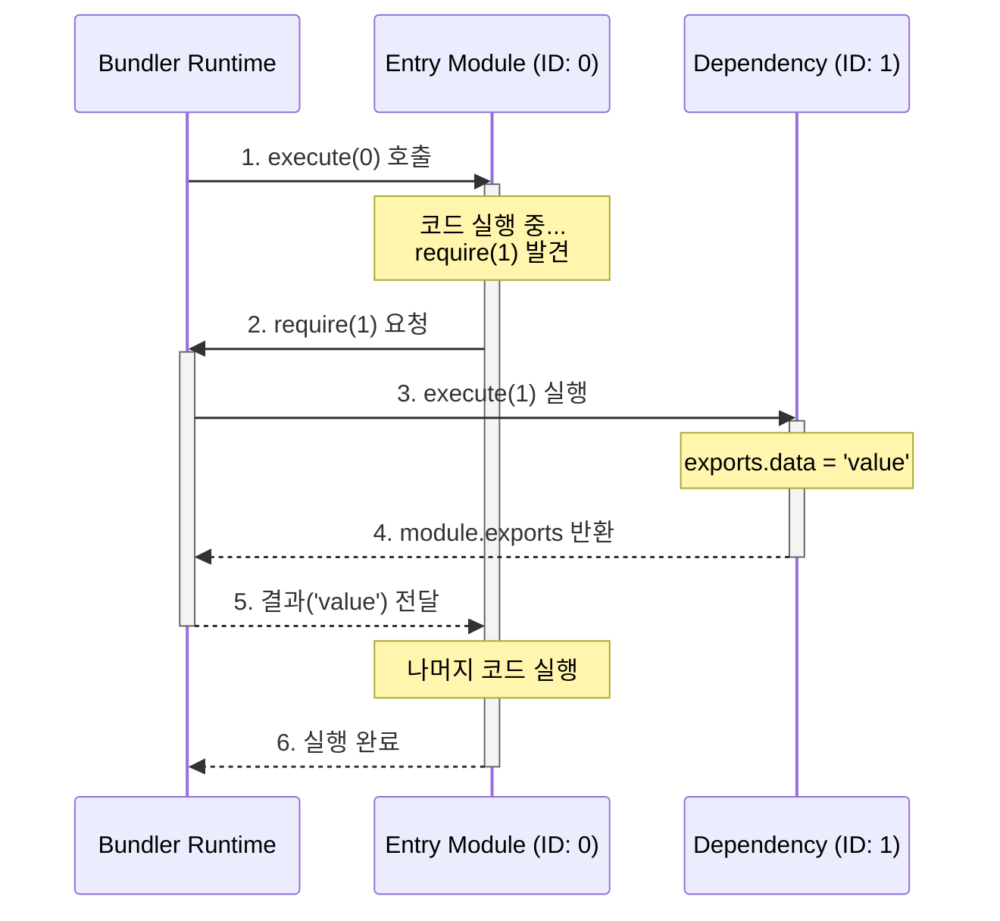
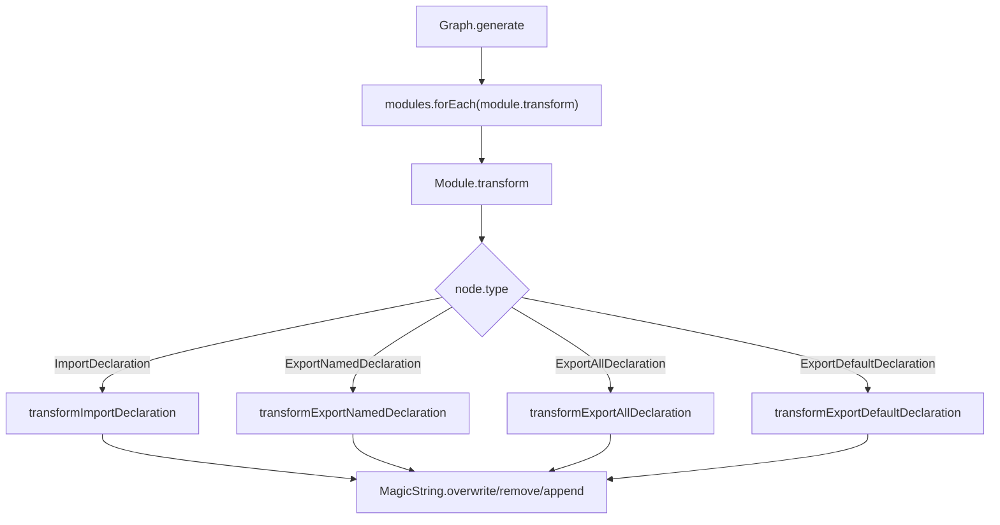

# 3. 번들링과 스코프: 파일 합치기의 기술

> **"지도는 완성됐다. 이제 길을 닦을 차례다."**

지난 시간([Step 2. 코드를 데이터로 보는 법](https://blog.sangwook.dev/posts/no-one-asked-library-bundler-02-ast-graph/)), 우리는 코드를 **데이터** 로 변환하고, 파일들 사이의 복잡한 관계를 **그래프**로 그려냈습니다. 이제 우리 손에는 프로젝트의 모든 파일 정보가 담긴 '지도'가 쥐어져 있습니다.

이제 남은 건 하나입니다. 이 흩어진 파일 조각들을 모아서, 브라우저가 실행할 수 있는 **단 하나의 결과물(`bundle.js`)** 로 만드는 것입니다.

---

## 1. 그냥 텍스트로 합치면 안 되나요?

가장 단순하게 생각해보죠. 번들링이란 결국 파일을 합치는 것이니, 파일 내용을 순서대로 복사해서 붙여넣으면 되지 않을까요?

```javascript
// a.js
const name = 'Module A';
console.log(name);

// b.js
const name = 'Module B'; // 앗, 여기서 에러 발생!
console.log(name);
```

**절대 안 됩니다.**

만약 위 코드를 하나의 파일로 합친다면, 브라우저는 즉시 `SyntaxError: Identifier 'name' has already been declared`를 뱉어낼 것입니다. 파일이 나뉘어 있을 때는 각자의 공간이 있었지만, 하나로 합쳐지는 순간 **전역 스코프**라는 거대한 운동장에서 이름 쟁탈전이 벌어지기 때문입니다.

이것이 바로 번들러가 단순히 파일을 이어 붙이는 `cat` 명령어와 다른 점입니다. 번들러의 첫 번째 임무는 **"각 모듈의 독립적인 방을 지켜주는 것"** 입니다.

---

## 2. 함수로 감싸기 (IIFE)

이 문제를 해결하기 위해 우리의 미니 번들러는 **IIFE** 패턴을 사용합니다. 자바스크립트에서 스코프를 생성하는 가장 전통적이고 확실한 방법은 **함수**이기 때문입니다.

```javascript
// 우리의 번들러가 만들 결과물
(function (modules) {
  // ... 런타임 코드 ...
})({
  0: function (require, module, exports) {
    const name = 'Module A'; // 안전함!
  },
  1: function (require, module, exports) {
    const name = 'Module B'; // 안전함!
  },
});
```

각 파일의 코드를 함수로 감싸버리면, 변수 `name`은 해당 함수 안에서만 살아있게 됩니다.

> **💡 기술적 배경: Webpack 초기 모델 vs 현대적 방식**
>
> 이 방식은 **Webpack 1~3 버전** 시절에 주로 사용되던 "고전적인" 방식입니다.
>
> 최근의 **Rollup**, **Vite(Rolldown)**, **Webpack 5** 등은 성능을 위해 **Scope Hoisting** 이라는 기술을 사용합니다. 함수로 감싸지 않고 최대한 하나의 스코프로 합치되, 변수 이름이 겹치면 자동으로 이름을 바꿔주는 방식이죠.
>
> 하지만 우리는 번들러의 원리인 **"모듈 시스템의 구현"** 을 배우는 것이 목표이므로, 모듈의 경계가 명확히 보이는 이 방식을 채택하여 직접 구현해 보겠습니다.

---

## 3. 브라우저엔 require가 없다

이제 우리는 각 파일을 함수로 꽁꽁 감싸서 **안전한 방**을 만들었습니다. 그런데 문제가 하나 있습니다.

함수 안에서 다른 모듈을 불러오려면 `require` 함수가 필요한데, **브라우저에는 `require`가 없습니다.**

```javascript
// 브라우저 콘솔
require(1); // Uncaught ReferenceError: require is not defined
```

따라서 번들러는 단순히 파일을 합치는 것뿐만 아니라, **Node.js의 모듈 시스템(`require`, `module`, `exports`)을 브라우저에서 흉내 내는 코드**를 직접 주입해 줘야 합니다.

### 런타임 구현 (Runtime Shim)

우리의 미니 번들러가 생성할 **런타임 코드**를 뜯어봅시다. ([Graph.ts 소스 코드 보기](https://github.com/Han5991/fe-lab/blob/main/packages/@package/bundler/src/Graph.ts#L86))

```javascript
// Graph.ts (요약)
(function (modules) {
  // 1. 모듈 실행 결과를 저장할 캐시
  const cache = {};

  // 2. 가짜 require 함수 구현
  function require(id) {
    // [중요] 캐시 확인: 이미 실행된 모듈이면 결과만 반환
    if (cache[id]) return cache[id].exports;

    // 새 모듈 객체 생성
    const module = { exports: {} };
    cache[id] = module;

    // 모듈 함수 실행 (의존성 주입!)
    // 여기서 require, module, exports를 인자로 넘겨줍니다.
    modules[id](require, module, module.exports);

    return module.exports;
  }

  // 3. 엔트리 파일(0번) 실행으로 시작!
  require(0);
})({
  /* ... 모듈 맵 ... */
});
```

### 핵심: 왜 캐시가 필요한가요?

위 코드에서 `cache[id]`를 확인하는 로직은 선택이 아니라 **필수**입니다. 두 가지 중요한 이유가 있습니다.

1.  **효율성 & 싱글톤**: 모듈은 여러 곳에서 `import` 되더라도 **단 한 번만 실행**되어야 합니다. 그렇지 않으면 `count` 같은 상태 변수가 import 할 때마다 초기화되어 버립니다.
2.  **순환 참조 방지**: `A -> B -> A` 구조에서 캐시가 없다면, `require`가 무한히 호출되어 **Stack Overflow**가 발생합니다. 캐시가 있으면, 두 번째 `A`를 불렀을 때 이미 만들어진(비어있더라도) 객체를 반환하여 루프를 끊을 수 있습니다.

### 실행 흐름

번들 코드가 실행될 때, `require`가 어떻게 모듈을 넘나드는지 시각적으로 확인해 봅시다.



---

## 4. ESM을 CJS로 통역하기

마지막 퍼즐 조각은 **문법 변환**입니다. 우리가 작성한 코드는 최신 **ESM(`import/export`)** 이지만, 위에서 구현한 런타임은 **CJS(`require/exports`)** 기반입니다.

따라서 번들러는 코드를 합치기 전에, **모든 `import` 문을 `require` 함수 호출로 바꿔치기**해야 합니다.

### 변환 전/후 예시 (실제 파일 기준)

`src/index.js`를 번들링하면, 아래처럼 변환됩니다. 모듈 ID는 그래프 탐색 순서에 따라 달라질 수 있지만, 여기서는 `Button` 모듈이 `1`번이라고 가정합니다.

**[Before: ESM (입력)]**

```javascript
import { Button } from './components/Button.js';

export { Button };
export const version = '1.0.0';
```

**[After: CJS (출력)]**

```javascript
// import -> require 변환
const { Button } = require(1);

// export -> exports 객체 할당 변환
exports.Button = Button;
const version = '1.0.0';
exports.version = version;
```

이 과정은 `Module.ts`의 `transform` 메서드에서 일어납니다. AST를 순회하며 `ImportDeclaration`을 찾아내고, `magic-string`을 사용해 `require(...)`로 감쪽같이 바꿔치기하는 것이죠.

---

## 5. AST 수술 집도하기: `import`가 `require`로 바뀌는 순간

**"AST를 분석해서 코드를 바꾼다"** 는 말이 너무 추상적인가요? 실제 코드 레벨에서 어떤 일이 일어나는지 현미경으로 들여다보겠습니다.

우리의 목표는 아래의 **ESM 코드**를 **CJS 코드**로 성형수술하는 것입니다.

```javascript
// 📄 원본 (src/index.js)
import { sum } from './math.js';
```

👇 **변환 목표**

```javascript
// 📄 결과물 (dist/bundle.js 내부)
const { sum } = require(1); // './math.js'가 ID: 1로 변환됨
```

이 과정은 `Module.ts` 내부의 `transform` 메서드에서 일어납니다. 핵심 로직을 3단계로 쪼개 봅시다.

### 1단계: 환부 찾기

Step 2에서 `acorn`이 파싱해준 AST에서 `ImportDeclaration` 타입을 가진 노드를 찾습니다.

```json
// AST Node (ImportDeclaration)
{
  "type": "ImportDeclaration",
  "start": 0,       // "import"가 시작되는 인덱스
  "end": 32,        // 세미콜론(;)이 끝나는 인덱스
  "source": {
    "type": "Literal",
    "value": "./math.js"  // 👈 우리가 필요한 경로!
  },
  "specifiers": [...]
}
```

만약 정규표현식을 썼다면 문자열 안에 있는 가짜 import까지 찾았겠지만, **AST 덕분에 우리는 진짜 import 문이 어디서부터 어디까지인지(`start`, `end`) 정확히 알고 있습니다.**

### 2단계: 트리 순회와 변환 흐름

`Module.transform()` 메서드가 실행되면, AST 트리를 순회하며 노드의 타입에 따라 수술을 집도합니다. 이 과정을 다이어그램으로 보면 다음과 같습니다.



### 3단계: MagicString 조작

타입을 확인하고(`ImportDeclaration`), 매핑된 ID(`1`)를 가져왔다면, 이제 `magic-string`이라는 메스를 들 차례입니다. 원본 코드를 건드리지 않고, 기존 `import` 문을 덮어쓰기 합니다.

```typescript
// 실제 구현 로직 (의사 코드)

// 1. 가져올 변수들 문자열 만들기: "{ sum }"
const imported = node.specifiers.map(...).join(', ');

// 2. require 문 만들기: "const { sum } = require(1);"
const newCode = `const { ${imported} } = require(${moduleId});`;

// 3. 덮어쓰기! (수술 집도)
// 원본 코드의 start(0)부터 end(32)까지를 newCode로 교체합니다.
this.magicString.overwrite(node.start, node.end, newCode);
```

이 과정을 거치면, 번들러는 원본 소스 코드의 위치 정보를 유지한 채로 브라우저가 이해할 수 없는 `import` 문을 깔끔하게 도려내고, 우리가 만든 런타임 함수인 `require`로 교체해 넣습니다.

👉 **[Module.ts 전체 변환 로직 보러 가기](https://github.com/Han5991/fe-lab/blob/main/packages/@package/bundler/src/Module.ts#L121)**

---

## 6. 직접 돌려봅시다

백문이 불여일견입니다. 우리가 만든 번들러가 실제로 잘 동작하는지 확인해 볼까요?

```bash
# 1. 번들러 실행 (sample-lib 패키지 빌드)
$ pnpm --filter @package/sample-lib run build

📦 Minibundler started...
🔍 Entry: src/index.js
📂 Processing: src/index.js
📂 Processing: src/components/Button.js
🛠️  Generating bundle...
📦 Generated CJS Bundle: dist/index.js
✨ Bundle built successfully!
```

빌드가 완료되면 `dist/index.js` 파일이 생성됩니다. 이 파일을 열어보면 우리가 의도한 대로 IIFE로 감싸진 코드를 볼 수 있습니다.

```bash
# 2. 결과물 실행 (Node.js 환경에서 테스트)
$ node -e "require('./packages/@package/sample-lib/dist/index.js')"

# (에러 없이 실행된다면 성공입니다!)
```

이제 우리의 번들러는 흩어진 파일들을 모아, Node.js는 물론 브라우저에서도 실행 가능한 하나의 파일로 만들어냅니다.

---

## 7. 결과물의 형태: Dual Package 전략

우리가 만든 번들러는 내부적으로 ESM 코드를 CJS(`require`) 런타임 위에서 돌아가도록 변환했습니다. 그렇다면 최종 결과물은 CJS 파일 하나만 나오는 걸까요?

최신 라이브러리들은 **Dual Package** 구조를 지향합니다.

1. **CJS (`index.js`)**: 우리가 구현한 런타임을 포함하여 구형 환경이나 Node.js require를 지원합니다.
2. **ESM (`index.mjs`)**: 런타임 심 없이 순수 `import/export`를 유지한 채로 파일만 합쳐서(Bundling), Tree Shaking이 가능한 환경을 지원합니다.

우리 시리즈에서는 로직의 복잡도를 낮추기 위해 **CJS 번들링**에 집중하고 있지만, 실무용 번들러라면 이 두 가지 포맷을 모두 생성하여 `package.json`의 `exports` 필드에 연결해 주는 것이 정석입니다.

```json
{
  "exports": {
    ".": {
      "import": "./dist/index.mjs",
      "require": "./dist/index.js"
    }
  }
}
```

---

## 8. 하지만 이게 끝이 아닙니다

이제 파일은 합쳐졌고, 브라우저에서도 돌아갑니다. (`bundle.js`)
하지만 아직 해결하지 못한 숙제가 있습니다.

에러가 났을 때 번들링 된 파일(`bundle.js`)의 1번째 줄에서 에러가 났다고 하면, 우리는 원본 코드의 어디를 고쳐야 할까요? 수천 줄의 코드 뭉치 속에서 원본의 위치를 찾는 것은 불가능에 가깝습니다.

다음 편, **[Step 4. 디버깅의 마법, 소스맵]** 에서 번들러가 망가뜨린 코드를 다시 원본으로 되돌리는 기술을 다뤄보겠습니다.

---

## 체크리스트 (Step 3)

- [ ] `Graph.generate()`가 모듈을 함수로 감싸고 런타임 심을 주입하는 위치를 확인했다.
- [ ] `Module.transform()`에서 ESM→CJS 변환이 어떻게 이루어지는지 이해했다.
- [ ] Default Import/Side Effect/Export All 같은 케이스가 별도로 처리되는 이유를 설명할 수 있다.
