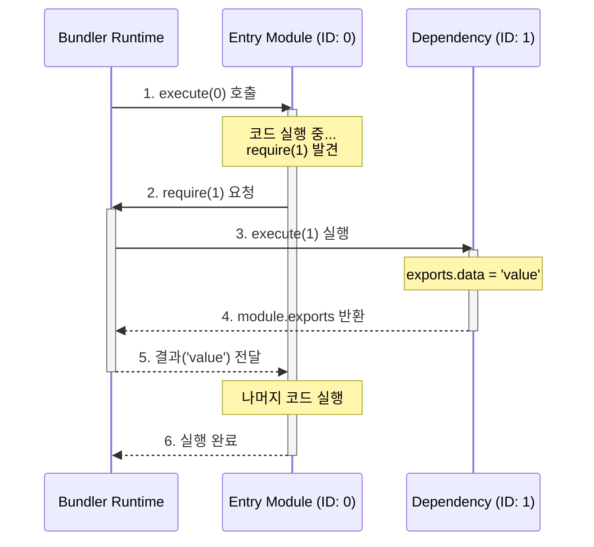

# 3. 번들링과 스코프: 파일 합치기의 기술

> **"지도는 완성됐다. 이제 길을 닦을 차례다."**

지난 시간([Step 2. 코드를 데이터로 보는 법](https://blog.sangwook.dev/posts/no-one-asked-library-bundler-02-ast-graph/)), 우리는 코드를 **데이터** 로 변환하고, 파일들 사이의 복잡한 관계를 **그래프** 로 그려냈습니다. 이제 우리 손에는 프로젝트의 모든 파일 정보가 담긴 '지도'가 쥐어져 있습니다.

이제 남은 건 하나입니다. 이 흩어진 파일 조각들을 모아서, 브라우저가 실행할 수 있는 **단 하나의 결과물(`bundle.js`)** 로 만드는 것입니다.

---

## 1. 그냥 텍스트로 합치면 안 되나요?

가장 단순하게 생각해봅시다. 번들링이란 결국 파일을 합치는 것이니, 리눅스의 `cat` 명령어처럼 파일 내용을 순서대로 이어 붙이면 되지 않을까요?

```javascript
// a.js
const name = 'Module A';
console.log(name);

// b.js
const name = 'Module B';
console.log(name);
```

이 두 파일을 합쳐서 브라우저에서 실행해 봅니다. 결과는 어떨까요?

> ❌ **Uncaught SyntaxError: Identifier 'name' has already been declared**

**처참한 실패입니다.**
파일이 나뉘어 있을 때는 각자의 공간이 있었지만, 하나로 합쳐지는 순간 **전역 스코프**라는 거대한 운동장에서 이름 쟁탈전이 벌어졌기 때문입니다.

이것이 바로 번들러가 단순히 파일을 이어 붙이는 것과 다른 점입니다. 번들러의 첫 번째 임무는 **"각 모듈의 독립적인 방을 지켜주는 것"** 입니다.

---

## 2. 해결책: 함수로 벽 세우기

자바스크립트에서 변수를 가두는 가장 확실한 방법은 무엇일까요? 바로 **함수** 입니다.

우리는 모듈의 코드를 **즉시 실행 함수** 로 감싸서, 외부와 격리된 스코프를 만들어줄 것입니다.

### 🏗️ Before & After

**[Before: 충돌하는 코드]**

```javascript
const name = 'Module A'; // 💥 전역 변수 충돌!
const name = 'Module B';
```

**[After: 평화를 되찾은 코드]**

```javascript
(function () {
  const name = 'Module A'; // ✅ 이 함수 안에서만 유효함
})();

(function () {
  const name = 'Module B'; // ✅ 안전함
})();
```

이제 변수 `name`은 각자의 함수 안에 갇혔습니다. 아무리 많은 파일을 합쳐도 변수 이름이 겹칠 걱정은 없습니다.

> **💡 기술적 배경: Webpack vs Rollup**
>
> 이 방식은 **Webpack 1~3 버전** 시절의 "고전적인" 방식입니다. 최신 도구들(Rollup, Vite)은 성능을 위해 **Scope Hoisting** 기술을 써서 함수 없이 합치기도 하지만, 모듈 시스템의 본질인 **'격리(Isolation)'** 를 이해하기에는 이 방식이 가장 직관적입니다.

---

## 3. 브라우저엔 require가 없다

이제 우리는 각 파일을 함수로 안전하게 감쌌습니다. 그런데 문제가 하나 있습니다. 함수 안에서 다른 모듈을 불러오려면 `require`가 필요한데, **브라우저에는 `require`가 없습니다.**

```javascript
// 브라우저 콘솔
require(1); // 🚨 Uncaught ReferenceError: require is not defined
```

따라서 번들러는 단순히 파일을 합치는 것뿐만 아니라, **Node.js의 모듈 시스템(`require`, `module`, `exports`)을 브라우저에서 흉내 내는 런타임** 을 직접 주입해 줘야 합니다.

### 미션: 런타임 심 만들기

우리가 구현해야 할 런타임 함수는 크게 3가지 미션을 수행해야 합니다.

#### Mission 1. 모듈을 실행하고 값을 반환하라

가장 기본적인 역할입니다. 모듈 ID를 받아서 해당 함수를 실행하고, 그 결과(`exports`)를 내뱉습니다.

```javascript
function require(id) {
  const module = { exports: {} };

  // 모듈 함수 실행 (의존성 주입!)
  // 여기서 require, module, exports를 인자로 넘겨줍니다.
  modules[id](require, module, module.exports);

  return module.exports;
}
```

#### Mission 2. 두 번 실행하지 마라 (캐싱)

이게 **핵심**입니다. 모듈은 `importz` 할 때마다 실행되는 게 아닙니다. **최초 한 번만 실행**되고, 그 뒤로는 저장된 값을 써야 합니다. 안 그러면 `count++` 같은 상태가 계속 초기화되겠죠?

```javascript
const cache = {}; // ✅ 실행 결과를 저장할 메모리

function require(id) {
  // 1. 이미 실행한 적 있나요? 그럼 그거 씁시다.
  if (cache[id]) return cache[id].exports;

  // ... (실행 로직) ...
}
```

#### Mission 3. 순환 참조를 막아라

`A -> B -> A` 구조에서 캐시가 없다면, `require`가 무한히 호출되어 **Stack Overflow**가 발생합니다.

빈 객체라도 먼저 캐시에 등록해두면, 두 번째 `A`를 불렀을 때 루프를 끊고 실행을 이어갈 수 있습니다. 이것이 Node.js가 순환 참조를 버티는 원리입니다.

---

## 4. 실행 흐름 (Execution Flow)

번들 코드가 실행될 때, `require`가 어떻게 모듈을 넘나드는지 시각적으로 확인해 봅시다.



---

## 5. 최종 모습: ESM을 CJS로 통역하기

마지막 퍼즐 조각은 **문법 변환**입니다.

우리가 작성한 코드는 최신 **ESM(`import/export`)** 이지만, 방금 만든 런타임은 **CJS(`require/exports`)** 기반입니다. 번들러는 코드를 합치기 전에, **`import` 문을 `require` 함수 호출로 바꿔치기(Transpile)** 해야 합니다.

이 과정은 우리가 지난 시간에 만든 `Module.ts`가 AST를 분석해서 수행합니다.

#### Case 1. 가져오기

모듈 ID를 기반으로 값을 가져옵니다.

```javascript
// Input (ESM)
import { a } from './a';

// Output (CJS)
const { a } = require(1);
```

#### Case 2. 이름 내보내기

`exports` 객체에 속성을 추가합니다.

```javascript
// Input (ESM)
export const b = 1;

// Output (CJS)
const b = 1;
exports.b = b;
```

#### Case 3. 기본 내보내기

`default`라는 이름의 속성으로 할당합니다.

```javascript
// Input (ESM)
export default c;

// Output (CJS)
exports.default = c;
```

#### Case 4. 전체 내보내기

대상 모듈의 모든 수출항을 복사합니다.

```javascript
// Input (ESM)
export * from './a';

// Output (CJS)
Object.assign(exports, require(1));
```

### AST 적용하기: `import`가 `require`로 바뀌는 순간

"AST를 분석해서 코드를 바꾼다"는 말이 너무 추상적인가요? 실제 코드 레벨에서 어떤 일이 일어나는지 현미경으로 들여다보겠습니다.

우리의 목표는 아래의 **ESM 코드**를 **CJS 코드**로 성형수술하는 것입니다.

```typescript
// 📄 원본 (src/index.js)
import { sum } from './math.js';
```

👇 **변환 목표**

```javascript
// 📄 결과물 (dist/bundle.js 내부)
const { sum } = require(1); // './math.js'가 ID: 1로 변환됨
```

이 과정은 `Module.ts` 내부의 `transform` 메서드에서 일어납니다. 핵심 로직을 3단계로 쪼개 봅시다.

#### 1단계: 환부 찾기 (AST 탐색)

`acorn`이 파싱한 AST에서 `ImportDeclaration` 타입을 가진 노드를 찾습니다.

```json
// AST Node (ImportDeclaration)
{
  "type": "ImportDeclaration",
  "start": 0, // "import"가 시작되는 인덱스
  "end": 32, // 세미콜론(;)이 끝나는 인덱스
  "source": {
    "type": "Literal",
    "value": "./math.js" // 👈 우리가 필요한 경로!
  },
  "specifiers": [...]
}
```

#### 2단계: 매핑 조회 (ID 치환)

번들러는 이미 `Graph`를 만들면서 `'./math.js'`에게 주민등록번호(ID) `1`번을 부여했습니다.

```typescript
// Module.ts의 transform 메서드 내부
const sourcePath = node.source.value; // './math.js'
const moduleId = this.mapping.get(sourcePath); // 1 (Graph가 미리 매핑해둠)

// 이제 우리는 require('./math.js') 대신 require(1)을 쓸 수 있습니다.
```

#### 3단계: 봉합 수술 (MagicString 조작)

이제 `magic-string`이라는 메스를 들 차례입니다. 원본 코드를 건드리지 않고, 기존 `import` 문을 덮어쓰기 합니다.

```typescript
// 실제 구현 로직 (의사 코드)

// 1. 가져올 변수들 문자열 만들기: "{ sum }"
const imported = node.specifiers
  .map(s => `${s.imported.name}: ${s.local.name}`)
  .join(', ');

// 2. require 문 만들기: "const { sum } = require(1);"
const newCode = `const { ${imported} } = require(${moduleId});`;

// 3. 덮어쓰기! (수술 집도)
// 원본 코드의 start(0)부터 end(32)까지를 newCode로 교체합니다.
this.magicString.overwrite(node.start, node.end, newCode);
```

---

## 6. 결과물의 형태: Dual Package 전략

우리가 만든 번들러는 내부적으로 ESM 코드를 CJS(`require`) 런타임 위에서 돌아가도록 변환했습니다. 그렇다면 최종 결과물은 CJS 파일 하나만 나오는 걸까요?

최신 라이브러리들은 **Dual Package** 구조를 지향합니다.

1.  **CJS (`index.js`)**: 우리가 구현한 런타임을 포함하여 구형 환경이나 Node.js require를 지원합니다.
2.  **ESM (`index.mjs`)**: 런타임 심 없이 순수 `import/export`를 유지한 채로 파일만 합쳐서, Tree Shaking이 가능한 환경을 지원합니다.

우리 시리즈에서는 로직의 복잡도를 낮추기 위해 **CJS 번들링**에 집중하고 있지만, 실무용 번들러라면 이 두 가지 포맷을 모두 생성하여 `package.json`의 `exports` 필드에 연결해 주는 것이 정석입니다.

---

## 7. 직접 돌려봅시다

백문이 불여일견입니다. 우리가 만든 번들러가 실제로 잘 동작하는지 확인해 볼까요?

```bash
$ pnpm --filter @package/sample-lib run build

📦 Minibundler started...
🛠️  Generating bundle...
📦 Generated CJS Bundle: dist/index.js
✨ Bundle built successfully!
```

생성된 `dist/index.js`를 열어보면, 수십 개의 파일이 하나의 **IIFE** 안에 질서 정연하게 들어있는 모습을 볼 수 있습니다. 우리는 브라우저 안에 **작은 Node.js**를 창조해낸 것입니다.

---

## 🚀 Next Step: 하지만 이게 끝이 아닙니다

이제 파일은 합쳐졌고, 브라우저에서도 잘 돌아갑니다. (`bundle.js`)
하지만 치명적인 문제가 하나 남았습니다.

**에러가 나면 무조건 `bundle.js` 1번째 줄이라고 뜹니다.**
수천 줄로 합쳐진 코드 뭉치 속에서, 도대체 **원본 소스 코드의 몇 번째 줄**이 문제인지 어떻게 알 수 있을까요?

다음 편, **[Step 4. 디버깅의 마법, 소스맵]** 에서 번들러가 망가뜨린 코드를 다시 원본으로 되돌리는 기술을 다뤄보겠습니다.

---

## 체크리스트 (Step 3)

- [ ] 단순히 파일을 합치면(Concatenation) 전역 변수 충돌이 일어남을 이해했다.
- [ ] **IIFE**가 어떻게 스코프를 격리하는지 설명할 수 있다.
- [ ] 런타임 구현에서 **캐시(Cache)**가 왜 필수적인지(싱글톤, 순환 참조) 이해했다.
- [ ] ESM 문법이 CJS 런타임(`require`)으로 변환되는 과정을 확인했다.
