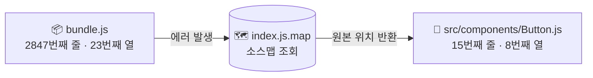
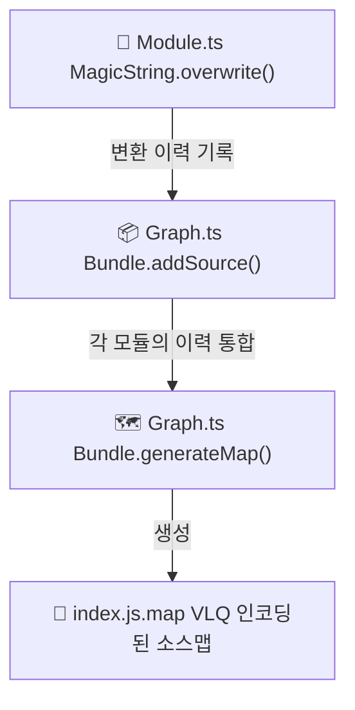
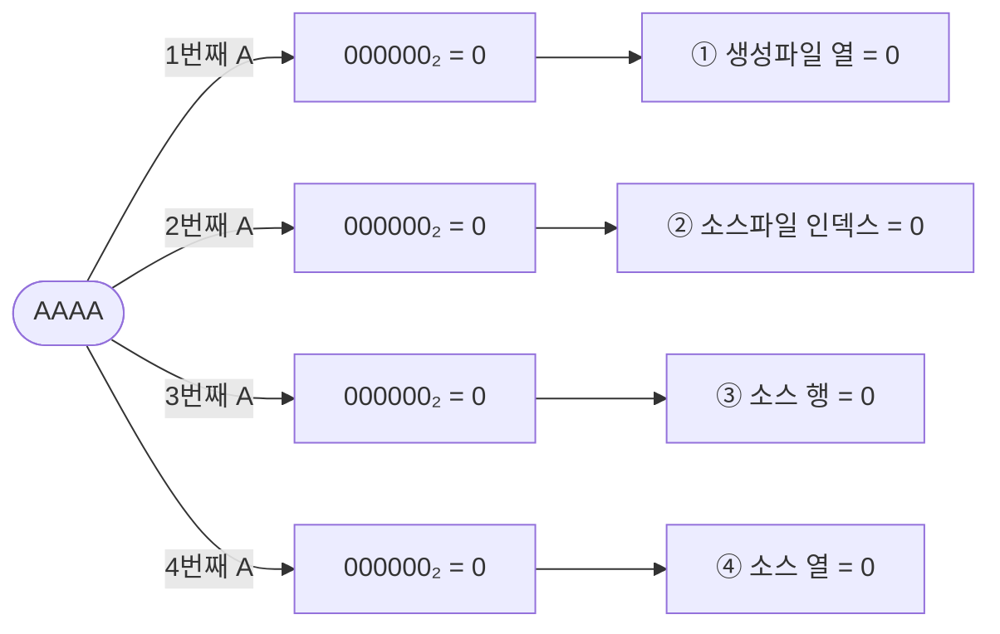
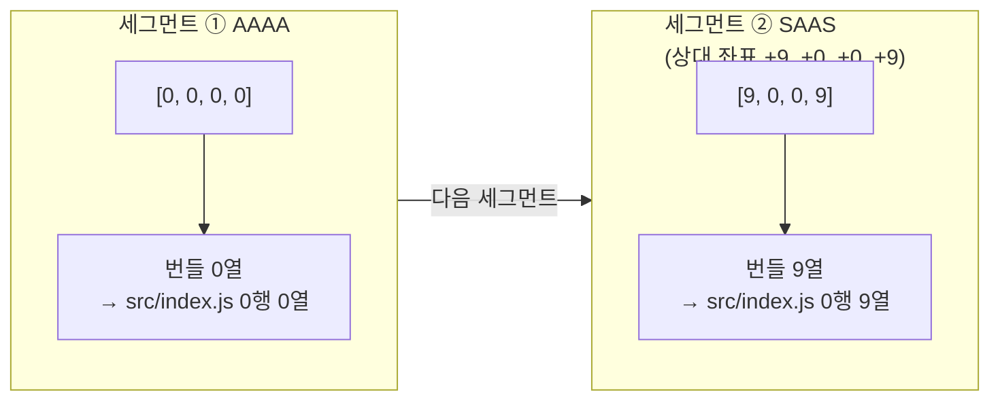
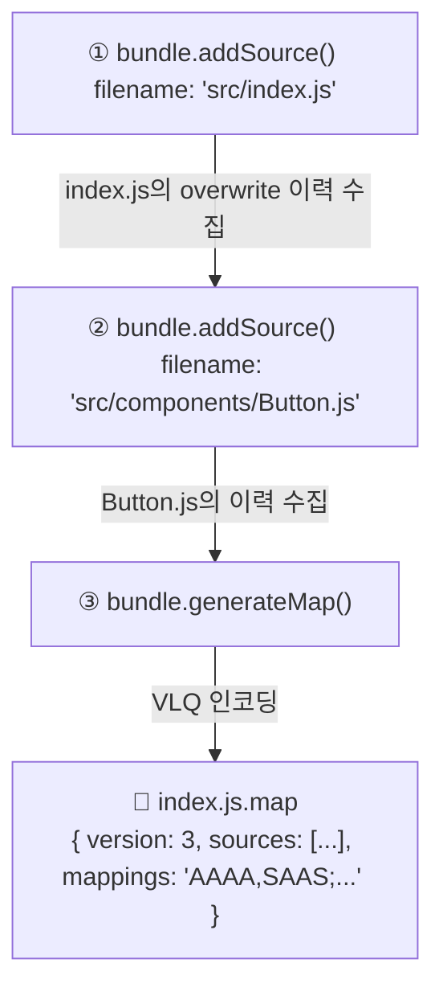

# 4. 소스맵: 번들된 코드에서 원본의 흔적 찾기

> **"에러 위치: bundle.js 2847번째 줄"**

지난 편([Step 3. 번들링과 스코프](https://blog.sangwook.dev/posts/no-one-asked-library-bundler-03-bundling-scope/))에서 우리는 드디어 파일을 하나로 합치는 데 성공했습니다. 수십 개의 파일이 IIFE 안에 질서 정연하게 들어가고, 브라우저에서도 정상적으로 실행됩니다.  
그런데 잠깐. 실제 프로젝트에서 이 번들 파일을 배포했다고 상상해 봅시다. 운영 중에 에러가 납니다. 브라우저 콘솔이 이렇게 말합니다.

```text
Uncaught TypeError: Cannot read properties of undefined at bundle.js:2847:23
```

`bundle.js` 2847번째 줄. 여러분이 작성한 수십 개의 원본 파일 중 **어디**에 해당하는 코드일까요? 그 파일의 몇 번째 줄일까요?  
번들러가 파일을 합치는 과정에서 원본의 행과 열 정보는 완전히 뒤섞입니다. 소스맵이 없다면, 이 에러를 디버깅하는 것은 사실상 불가능에 가깝습니다.  
이번 편에서는 **소스맵**의 원리를 파헤치고, 우리 번들러에 직접 구현해보겠습니다.

---

## 1. 소스맵이란: "번들 좌표 → 원본 좌표" 변환표

소스맵을 가장 쉽게 설명하자면 **좌표 변환표**입니다.



이 변환표가 `.map` 파일 형태로 번들 파일과 함께 배포됩니다.  
브라우저 DevTools는 이 파일을 읽어서, 에러 위치를 자동으로 원본 파일 기준으로 표시해 줍니다.  
실제 `.map` 파일을 열어보면 이런 모양입니다.

```json
{
  "version": 3,
  "file": "index.js.map",
  "sources": ["src/index.js", "src/components/Button.js"],
  "sourcesContent": ["...", "..."],
  "mappings": "AAAA,SAAS;AACT,IAAIA..."
}
```

`sources`는 원본 파일 목록, `sourcesContent`는 원본 파일 내용, 그리고 `mappings`는... 외계어처럼 보이는 암호문입니다.  
이 `mappings` 필드가 소스맵의 핵심입니다. 여기에 모든 좌표 변환 정보가 압축되어 있습니다.  
이걸 이해하려면 **VLQ**를 알아야 합니다.

---

## 2. magic-string의 진짜 목적

잠깐, 본론으로 들어가기 전에 한 가지 물어보겠습니다.  
우리는 1편부터 `magic-string`이라는 라이브러리를 써왔습니다. 단순히 **"문자열을 덮어쓰는 도구"** 로만 알고 있었죠. 그런데 왜 굳이 `String.replace()`나 정규식을 쓰지 않고 이 라이브러리를 선택했을까요?

**magic-string의 진짜 목적은 소스맵 생성입니다.**  
일반 문자열 치환은 **"무엇이 바뀌었는지"** 를 기억하지 못합니다. 하지만 `magic-string`은 모든 변환 작업의 **이력**을 내부에 쌓아둡니다.

```typescript
// Module.ts (line 198)
// import { Button } from './Button.js' → const { Button } = require(1)
this.magicString.overwrite(node.start, node.end, replacement);
//                          ^^^^^^^^^^  ^^^^^^^^
//                          원본에서 어디부터 어디까지를 바꿨는지 기록!
```

`overwrite(start, end, newText)`를 호출할 때마다, `magic-string`은 내부적으로 이런 기록을 남깁니다.

> `"원본 코드의 0번 인덱스부터 32번 인덱스까지가 'const { Button } = require(1);'로 교체되었다"`

이 이력이 쌓이면 쌓일수록, `magic-string`은 나중에 **"원본의 어느 위치가 결과물의 어느 위치에 해당하는지"** 역산할 수 있게 됩니다.



---

## 3. VLQ: mappings 가 외계어인 이유

이제 그 암호문으로 돌아올 차례입니다.

```
"mappings": "AAAA,SAAS"
```

이게 뭘까요? 이건 **VLQ(Variable Length Quantity)** 인코딩으로 압축된 좌표 데이터입니다.

### 왜 이렇게 압축하나요?

소스맵은 원본 코드의 모든 토큰(변수명, 괄호, 세미콜론 하나하나)에 대한 위치 정보를 담아야 합니다. 수천 개의 좌표를 그냥 숫자로 저장하면 `.map` 파일이 번들 파일보다 훨씬 커질 수 있습니다.  
VLQ는 두 가지 트릭으로 이를 해결합니다.

**트릭 1. 상대 좌표**  
절대 좌표(100번째 줄) 대신 이전 항목으로부터의 거리(+2줄)를 저장합니다. 대부분의 연속된 코드는 서로 가깝기 때문에, 숫자가 훨씬 작아집니다.

**트릭 2. 가변 길이 인코딩 + Base64**  
작은 숫자(`0`)는 1글자(`A`)로, 큰 숫자는 여러 글자로 표현합니다. `Base64(A-Z, a-z, 0-9, +, /)`를 사용해 바이너리 없이 텍스트 파일에 저장합니다.

### AAAA 직접 해독해보기

`mappings`의 각 세그먼트는 쉼표(`,`)로 구분되고, 세미콜론(`;`)은 번들 파일의 줄 바꿈을 의미합니다.

`AAAA`라는 가장 단순한 세그먼트를 직접 해독해봅시다.

각 글자 `'A'`는 Base64로 `000000`(6비트), VLQ 연속 비트 없음 → 값 `0`입니다.



이 4개의 숫자는 각각 다음을 의미합니다.

| 순서  | 의미                | 값               |
| ----- | ------------------- | ---------------- |
| 1번째 | 번들 파일 열        | 0 (0번째 열)     |
| 2번째 | sources 배열 인덱스 | 0 (첫 번째 파일) |
| 3번째 | 원본 파일 행        | 0 (0번째 줄)     |
| 4번째 | 원본 파일 열        | 0 (0번째 열)     |

따라서 `AAAA`는 **"번들 파일의 0번째 열 → 소스 0번 파일(src/index.js)의 0행 0열"** 을 의미합니다.

조금 더 복잡한 예시를 보겠습니다.



이 복잡한 비트 연산을 직접 구현하는 건 매우 어렵습니다. 그래서 우리는 `magic-string`이 이걸 대신해 줍니다. 우리가 할 일은 단지 `overwrite()`로 이력을 남기고, `generateMap()`을 호출하는 것뿐입니다.

---

## 4. 구현: Graph.ts와 Module.ts

이제 실제 코드를 봅시다. 소스맵 생성은 `Graph.ts`의 `generate()` 메서드에서 이루어집니다.

### Module.ts: 변환 이력 기록

`Module` 클래스는 생성 시점에 `MagicString`을 초기화합니다.

```typescript
// Module.ts (line 65)
this.magicString = new MagicString(this.content);
// 원본 코드 내용을 MagicString으로 감쌉니다.
// 이후 모든 변환 작업은 이 객체를 통해 이루어집니다.
```

`transform()` 메서드에서 ESM → CJS 변환이 이루어질 때마다 이력이 쌓입니다.

```typescript
// Module.ts (line 198): ImportDeclaration 변환 시
// "import { Button } from './Button.js'" 구간을 교체
this.magicString.overwrite(node.start, node.end, replacement);
// node.start, node.end: AST가 알려준 원본 코드의 정확한 위치
// replacement: "const { Button } = require(1);"
```

AST가 **"어디를 바꿔야 하는지"** 를 알려주고, `magic-string`이 **"어디가 어떻게 바뀌었는지"** 를 기억합니다. 이 두 도구의 역할 분리가 핵심입니다.

> **[MagicString 초기화 코드 보기 (Module.ts:65)](https://github.com/Han5991/fe-lab/blob/main/packages/@package/bundler/src/Module.ts#L65)**

> **[overwrite() 이력 기록 전체 보기 (Module.ts:198)](https://github.com/Han5991/fe-lab/blob/main/packages/@package/bundler/src/Module.ts#L198)**

### Graph.ts: 소스맵 통합 생성

`generate()` 메서드에서 모든 모듈의 이력을 `Bundle`로 통합하고 소스맵을 생성합니다.

```typescript
// Graph.ts (line 97~)
const bundle = new Bundle({
  separator: '\n', // 각 모듈 사이의 구분자
});

// 각 모듈을 Bundle에 추가 (line 155~158)
bundle.addSource({
  filename: path.relative(process.cwd(), module.filePath), // ⭐ 보안 핵심 (아래 설명)
  content: module.magicString, // 변환 이력이 담긴 객체를 통째로 전달
});

// VLQ 인코딩된 소스맵 생성 (line 178~182)
const map = bundle.generateMap({
  file: 'index.js.map', // 소스맵 파일명
  includeContent: true, // 원본 코드도 .map에 포함
  hires: true, // 고해상도 (열 단위 매핑)
});
```

`bundle.generateMap()`이 호출되는 순간, `magic-string`은:

1. 모든 `addSource()`로 추가된 모듈들의 변환 이력을 수집합니다.
2. 각 변환 이력을 VLQ 인코딩으로 변환합니다.
3. `mappings` 문자열을 생성해서 `.map` 파일로 저장합니다.



> **[소스맵 생성 전체 코드 보기 (Graph.ts:92)](https://github.com/Han5991/fe-lab/blob/main/packages/@package/bundler/src/Graph.ts#L92)**

---

## 5. 보안: 절대 경로 노출 문제

`filename` 옵션에 주목하세요. 여기에 무심코 절대 경로를 넣으면 보안 문제가 생깁니다.

```typescript
// ❌ 위험: 절대 경로 그대로 사용
bundle.addSource({
  filename: module.filePath,
  // → "/Users/han/repository/my-company/secret-project/src/index.js"
  content: module.magicString,
});
```

소스맵의 `sources` 배열에 이 경로가 그대로 들어갑니다.

```json
{
  "sources": ["/Users/han/repository/my-company/secret-project/src/index.js"]
}
```

이 `.map` 파일이 프로덕션 서버에 배포된다면:

- 개발자의 **로컬 시스템 구조**가 노출됩니다.
- **프로젝트 내부 경로**가 외부에 공개됩니다.
- 보안 감사에서 지적 사항이 될 수 있습니다.

### 해결책: path.relative()

```typescript
// ✅ 안전: 프로젝트 루트 기준 상대 경로 사용 (Graph.ts line 156)
bundle.addSource({
  filename: path.relative(process.cwd(), module.filePath),
  // → "src/index.js" (프로젝트 루트 기준)
  content: module.magicString,
});
```

`path.relative(process.cwd(), module.filePath)`는:

- `process.cwd()`: 번들러가 실행되는 디렉토리 (보통 프로젝트 루트)
- `module.filePath`: 모듈의 절대 경로
- 결과: 프로젝트 루트 기준의 상대 경로

소스맵 `sources` 배열에는 깔끔한 상대 경로만 남습니다.

```json
{
  "sources": ["src/index.js", "src/components/Button.js"]
}
```

> **[path.relative() 적용 코드 보기 (Graph.ts:156)](https://github.com/Han5991/fe-lab/blob/main/packages/@package/bundler/src/Graph.ts#L156)**

---

## 6. 결과물 확인

```bash
$ pnpm --filter @package/sample-lib run build

📦 Minibundler started...
📂 Processing: /Users/han/.../src/index.js
📂 Processing: /Users/han/.../src/components/Button.js
🛠️  Generating bundle...
📦 Generated CJS Bundle: dist/index.js
🗺️  Generated SourceMap: dist/index.js.map
✨ Generated Standalone ESM: dist/index.mjs
✅ Bundle built successfully!
```

`dist/` 디렉토리에 세 개의 파일이 생성됩니다.

```text
dist/
├── index.js        ← CJS 번들 (맨 아래에 sourceMappingURL 주석 포함)
├── index.js.map    ← 소스맵
└── index.mjs       ← ESM 번들
```

`index.js` 맨 마지막 줄을 확인해보면 소스맵 참조 주석이 붙어 있습니다.

```javascript
// dist/index.js 마지막 줄
//# sourceMappingURL=index.js.map
```

브라우저와 Node.js는 이 주석을 읽고 자동으로 소스맵을 불러옵니다.

### 왜 JS 파일명과 똑같이 만들까요? 다르면 안 되나요?

`index.js` → `index.js.map`. 이 패턴이 너무 당연하게 느껴지지 않나요?

사실 **이름은 달라도 됩니다.** JS 파일과 소스맵 파일을 연결하는 건 파일명이 아니라, JS 파일 맨 아래의 주석 한 줄입니다.

```javascript
//# sourceMappingURL=index.js.map
//                   ^^^^^^^^^^^^
//                   여기에 적힌 경로로 소스맵을 찾아감
```

브라우저는 오직 이 주석만 봅니다. 따라서 이렇게 써도 동작합니다.

```javascript
//# sourceMappingURL=debug-info.map       // 완전히 다른 이름
//# sourceMappingURL=sourcemaps/main.map  // 하위 디렉토리
//# sourceMappingURL=data:application/json;base64,eyJ2Z... // 파일 없이 인라인으로 embed
```

그렇다면 이름을 바꾸려면 코드의 어디를 수정해야 할까요? 우리 코드에서 `index.js.map`이 **세 군데** 등장합니다.

```typescript
// Graph.ts (line 178~192): 세 곳이 모두 맞물려야 합니다
const map = bundle.generateMap({
  file: 'index.js.map',  // ① 소스맵 내부의 자기 파일명
  ...
});

fs.writeFileSync(path.join(distDir, 'index.js.map'), map.toString()); // ② 실제 저장 파일명

fs.appendFileSync(
  path.join(distDir, 'index.js'),
  '\n//# sourceMappingURL=index.js.map',  // ③ JS 파일에 심는 참조 경로
);
```

세 곳 중 하나라도 어긋나면 소스맵 연결이 끊깁니다. 예를 들어 ③만 바꾸면 브라우저가 없는 파일을 찾으러 가고, ②만 바꾸면 브라우저가 여전히 `index.js.map`을 찾으려다 404를 냅니다.

그럼에도 `<파일명>.map` 관행이 굳어진 이유는 실용적인 이유 때문입니다.

| 이유            | 설명                                                                                      |
| --------------- | ----------------------------------------------------------------------------------------- |
| **가독성**      | `main.js.map`, `vendor.js.map`처럼 번들이 여러 개일 때 어떤 맵인지 이름만 봐도 알 수 있다 |
| **일괄 처리**   | 배포 스크립트에서 `*.map` 패턴으로 소스맵만 골라 서버에서 제외하거나 별도 보관하기 쉽다   |
| **도구 호환성** | 일부 도구가 `<name>.map` 패턴을 기반으로 소스맵을 자동 탐색한다                           |

결론적으로, 파일명은 **관행이지 규칙이 아닙니다.** 세 곳을 일관되게 맞추기만 하면 어떤 이름이든 동작합니다.

실제로 Next.js의 Turbopack은 `turbopack://[project]/src/...` 접두사를 붙인 가상 경로를 `sources`에 사용하고, `sourceMappingURL`도 URL 인코딩된 경로로 씁니다. 관행과 다른 형식이지만 브라우저는 문제없이 처리합니다.

### sources 상대 경로 확인

소스맵에 절대 경로가 포함되지 않았는지 확인해봅시다.

```bash
node -e "
  const fs = require('node:fs');
  const map = JSON.parse(fs.readFileSync('packages/@package/sample-lib/dist/index.js.map', 'utf-8'));
  console.log('sources:', map.sources);
"
```

정상이라면 아래처럼 상대 경로만 출력됩니다.

```bash
sources: [ 'src/index.js', 'src/components/Button.js' ]
```

절대 경로(`/Users/han/...`)가 보인다면 `path.relative()` 처리가 빠진 것입니다.

---

## 7. 마무리

이번 편에서 우리가 만든 것을 정리해봅시다.

```text
번들러 소스맵 구현 흐름:

1. Module 생성 시
   new MagicString
   → 원본 코드를 변환 이력 저장소에 담기

2. ESM → CJS 변환 시
   magicString.overwrite(start, end, replacement)
   → "원본 N번째 ~ M번째 자리가 새 코드로 바뀌었다" 기록

3. 번들 조합 시
   bundle.addSource({ filename: 상대경로, content: magicString })
   → 각 모듈의 이력을 Bundle에 통합

4. 소스맵 생성 시
   bundle.generateMap({ includeContent: true, hires: true })
   → 이력을 VLQ 인코딩 → mappings 문자열 → .map 파일 저장
```

1편에서 처음 `MagicString`을 소개했을 때, 단순한 문자열 치환 도구처럼 보였습니다. 하지만 이제는 그 진짜 목적이 보입니다. **변환 이력을 기록하기 위한 장치**였던 것입니다. 소스맵을 위해 처음부터 설계된 선택이었습니다.

---

## 에필로그: 여기서 더 나아간다면

소스맵까지 완성한 지금, 우리 번들러는 **"번들러가 어떻게 동작하는가"** 라는 질문에 충분히 답할 수 있는 도구가 됐습니다.  
`acorn`으로 AST를 파싱하고, 모듈 그래프를 따라 의존성을 추적하고, `MagicString`으로 코드를 합치고, 소스맵으로 원본을 추적하는 것까지.

실제 번들러들은 여기에 더 많은 것을 올려놓습니다.

- **Externals** — `react` 같은 peer dependency를 번들에서 제외하고 런타임에 외부에서 주입받는 전략. 라이브러리 배포에 필수적입니다.
- **Tree Shaking** — ESM의 정적 구조를 분석해 실제로 사용되지 않는 export를 번들에서 제거합니다. `import { one } from './math'`만 썼다면 `two`, `three`는 번들에 들어가지 않습니다.
- **Code Splitting** — 번들을 여러 청크로 나눠 초기 로딩에 필요한 코드만 먼저 내려받게 합니다. 동적 `import()`가 분기점이 됩니다.
- **Plugin System** — webpack의 탭어블 훅, rollup의 플러그인 API처럼, 번들링 파이프라인의 각 단계에 외부 코드가 끼어들 수 있는 확장 지점을 만드는 구조입니다.
- **Scope Hoisting** — 모듈 경계를 제거해 함수 래퍼를 줄이고 런타임 오버헤드를 낮춥니다.
- **HMR (Hot Module Replacement)** — 전체 페이지 리로드 없이 변경된 모듈만 런타임에 교체합니다.

이 중 어느 것을 열어봐도, 우리가 Step 1부터 다뤄온 개념들이 그 안에 있습니다.  
acorn, AST, 모듈 그래프, 코드 생성. 실제 도구의 코드베이스가 낯설지 않을 겁니다. [rollup](https://github.com/rollup/rollup)이 비교적 읽기 쉽고, [esbuild](https://github.com/evanw/esbuild)는 성능 관점에서 흥미롭습니다.

---

## 체크리스트 (Step 4)

- [ ] 소스맵이 "번들 좌표 → 원본 좌표" 변환표라는 개념을 이해했다.
- [ ] `MagicString.overwrite()`가 단순 치환이 아니라 **이력 기록**임을 이해했다.
- [ ] `Bundle.addSource()` → `Bundle.generateMap()` 흐름을 설명할 수 있다.
- [ ] `AAAA` VLQ 세그먼트가 `[0, 0, 0, 0]`을 의미함을 이해했다.
- [ ] `path.relative()`를 써야 하는 **보안 이유**를 설명할 수 있다.
- [ ] `dist/index.js.map`의 `sources`가 상대 경로인지 직접 확인했다.
