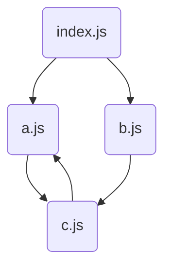

# Step 2: 코드를 데이터로 보는 법 (AST & Resolve)

번들러가 파일 하나만 처리하는 것은 의미가 없다. `import` 문을 따라가며 프로젝트 전체의 의존성 구조를 파악해야 한다. 이번 단계에서는 **AST(추상 구문 트리)**를 이용해 의존성을 찾고, **그래프(Graph)** 자료구조로 관리하는 법을 구현했다.

## 1. AST (Abstract Syntax Tree)

단순 문자열인 코드를 "의미 있는 트리 구조"로 변환한다. 우리는 정규표현식 대신 `acorn` 파서를 사용했다.

### 왜 정규표현식이 아닐까?
정규식은 **문맥(Context)**을 모른다. 주석이나 문자열 내부에 있는 `import` 텍스트까지 찾아내어 오작동을 일으킬 수 있다. AST는 문법적으로 유효한 실제 코드만 걸러낸다.

```javascript
// 코드
import { name } from './name.js';
```

```javascript
// AST (acorn)
{
  type: "ImportDeclaration",
  source: { value: "./name.js" }
}
```

## 2. 의존성 그래프 (Dependency Graph)

파일 간의 관계를 관리하기 위해 `Graph`와 `Module` 클래스를 설계했다.

### 핵심 로직: DFS & Visited Map
단순 리스트가 아닌 **그래프**가 필요한 이유는 **순환 참조(Circular Dependency)** 때문이다.
`A -> B -> A` 구조에서 무한 루프(Stack Overflow)에 빠지지 않으려면 **"이미 방문한 파일"**을 기억해야 한다.

```typescript
// Graph.ts (Simplified)
class Graph {
  modules = new Map(); // Visited Map (캐싱 & 중복 방지)

  createModule(filePath) {
    if (this.modules.has(filePath)) return; // 이미 왔던 곳이면 패스!

    const module = new Module(filePath);
    this.modules.set(filePath, module); // 도장 쾅!

    module.dependencies.forEach(dep => {
      this.createModule(resolve(dep)); // 재귀 호출
    });
  }
}
```

## 3. 구현 결과 (Playground 테스트)

복잡한 순환 참조 시나리오(`Index -> A, B`, `A <-> C`)를 만들어 테스트했다.



**결과:**
- 4개의 파일(`index`, `a`, `b`, `c`)이 모두 정확히 한 번씩만 처리됨.
- 무한 루프 없이 안정적으로 그래프 생성 완료.

이제 모든 파일의 내용과 관계를 파악했으니, 다음 단계는 이들을 하나로 합치는 **번들링(Bundling)**이다.