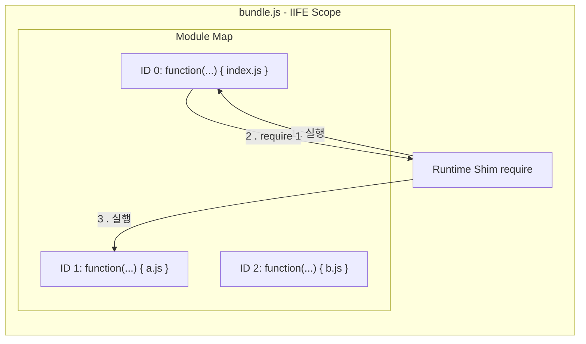
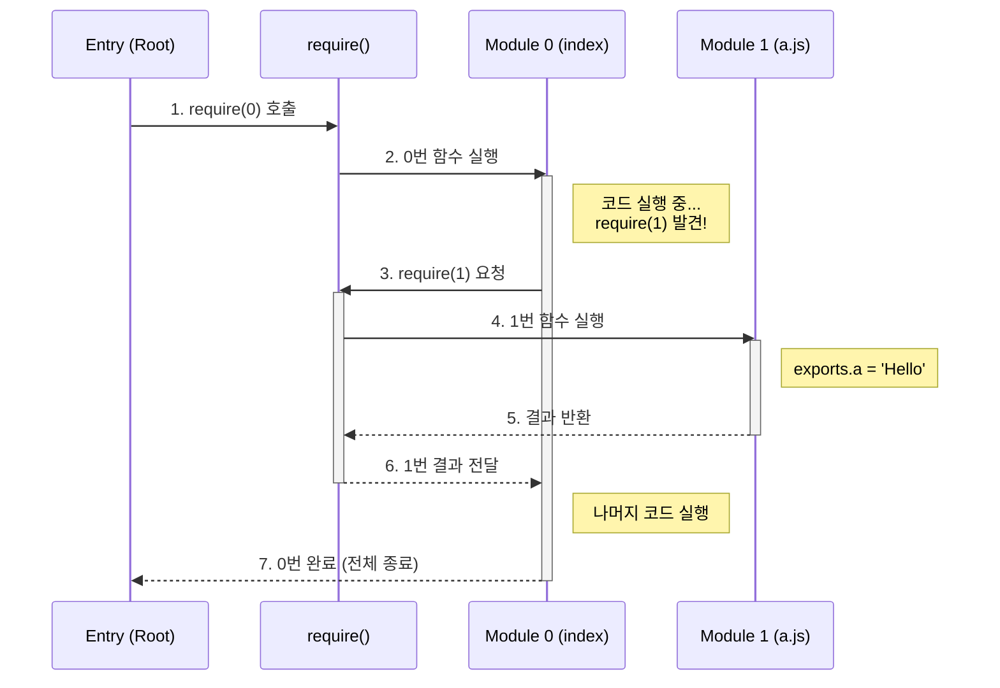
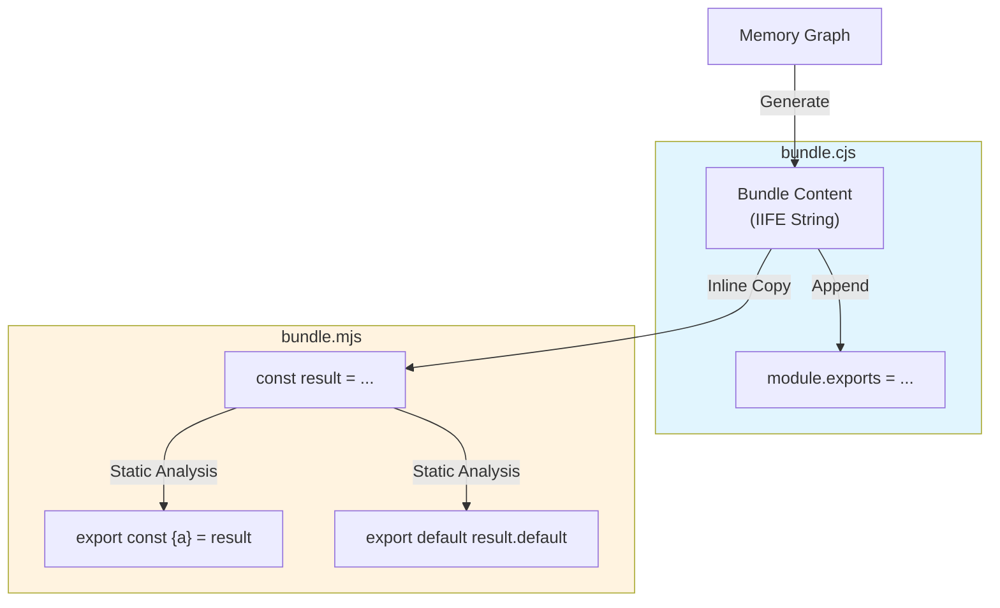

# Step 3: 번들링과 스코프 (Bundling & Scope)

메모리 상에 흩어진 모듈 그래프를 **실행 가능한 하나의 파일**로 합치는 것은 단순히 코드를 이어 붙이는 것이 아닙니다. 브라우저 환경에서 Node.js의 모듈 로딩/캐시를 **부분적으로 흉내내는 과정**입니다.

## 1. 스코프 격리: "변수 충돌이라는 재앙 막기"

여러 파일의 코드를 그냥 합치면 변수 이름(`const a`)이 겹쳐서 실행조차 되지 않습니다.

- **해결책**: 각 파일의 내용을 **함수(Function Scope)**로 감쌉니다.
- **구조**: `(function(require, module, exports) { ... })`
- **의미**: 이렇게 감싸는 순간, 각 파일은 외부와 차단된 자신만의 '방'을 갖게 됩니다. 이 안에서 선언된 변수는 밖으로 새어나가지 않습니다.



---

## 2. 모듈 시스템 흉내내기 (The Shim)

브라우저에는 `require`, `module`, `exports`가 없습니다. 번들러는 이 도구 3개를 직접 만들어서 각 파일(함수)에게 인자로 쥐여줍니다.

### 🏨 호텔 룸서비스 비유 (작동 원리)

- **호텔 지배인 (번들러 런타임)**: 전체 실행을 관리합니다.
- **빈 접시 (`module.exports = {}`)**: 요리사(모듈)에게 전달할 결과물 그릇입니다.
- **요리사 호출 (`modules[id](...)`)**: 요리사에게 도구(require, exports)를 주고 요리를 시킵니다. 요리사는 이 도구를 사용해 빈 접시에 결과물을 채워 넣습니다.
- **서빙 (`return module.exports`)**: 다 채워진 접시를 주문자에게 전달합니다.

### 🔄 도미노 효과 (Execution Flow)

"0번 함수에 모든 게 몰려 있는 것 아닌가요?"라는 질문의 해답입니다. 0번이 뿌리가 되어 멈추고 실행하기를 반복하며 깊이 우선 탐색(DFS)하듯 실행됩니다.



---

## 3. 상세 변환 전략 (ESM → CJS)

일부 런타임(CJS 환경, 구형 브라우저 등)에서는 ESM을 그대로 실행할 수 없으므로, 빌드 타임에 AST를 분석해 모든 ESM 문법을 우리가 만든 `require` 체계로 번역해야 합니다.

| AST 타입                     | 원본 코드 (ESM)           | 변환된 코드 (CJS)                    | 역할                         |
| :--------------------------- | :------------------------ | :----------------------------------- | :--------------------------- |
| **ImportDeclaration**        | `import { a } from './a'` | `const { a } = require(1)`           | 다른 파일의 값을 가져옴      |
| **ExportNamedDeclaration**   | `export const a = 1`      | `const a = 1; exports.a = a`         | 값을 이름 붙여 내보냄        |
| **ExportDefaultDeclaration** | `export default a`        | `exports.default = a`                | 파일의 대표 값을 내보냄      |
| **ExportAllDeclaration**     | `export * from './a'`     | `Object.assign(exports, require(1))` | 다른 파일의 모든 수출을 복사 |

> 참고: `export *`의 실제 스펙은 `default` 제외, 이름 충돌 처리, live binding 등을 고려해야 합니다. 여기서는 학습용으로 단순화된 변환만 다룹니다.

---

## 4. 효율적인 관리: 번호표(ID) 시스템

파일 경로(`'./src/utils/math.js'`) 대신 숫자(`1`, `2`)를 사용하는 이유는 명확합니다.

- **용량**: 긴 주소를 숫자로 치환하여 파일 크기를 줄입니다.
- **단순화**: 문자열 경로 대신 숫자 키로 관리해 조회 로직이 단순해집니다.
- **캡슐화**: 내부 파일 구조를 외부에 숨깁니다.

---

## 5. ESM 지원 및 독립형(Standalone) 번들링

최신 환경을 위해 `.mjs` 파일을 생성할 때, 단순한 Wrapper 방식이 아닌 **완전 독립형** 방식을 채택했습니다.



### 정적 분석을 통한 수출 명단 수집

ESM은 수출할 변수 이름을 미리 알아야 하기에 `Module.ts`에서 다음 상태를 관리합니다.

- **`exportsList`**: 직접 내보내는 이름들 수집 (`export const a` 등)
- **`exportAllSources`**: `export *` 처럼 다른 파일에 떠넘긴 경로 기록. 나중에 재귀적으로 추적하여 명단을 합칩니다.

### 결과물 구조

- **bundle.cjs**: `module.exports = (function...)` (CJS 완전 독립)
- **bundle.mjs**: 번들 로직을 복사(Inlining)한 뒤 `export const { ... } = result` (ESM 완전 독립)

---

## 6. 심화: 번들러의 두 가지 철학 (Webpack vs Rollup)

오늘 우리가 구현한 방식은 **런타임 모듈 로더 중심(Webpack 스타일)**입니다. 반면 라이브러리 번들링에는 **정적 분석 중심(Rollup 스타일)**이 자주 쓰입니다. 다만 이 구분은 "경향"이지 절대 규칙은 아닙니다.

### 📦 Webpack 스타일: 런타임 모듈 로더 중심

> "모듈을 함수로 감싸 두고, 런타임 로더(`require`)가 실행을 관리한다."

- **특징**:
  1.  **런타임 유연성**: 모듈을 독립된 함수로 관리해 실행 순서/캐싱을 런타임에서 제어하기 쉽습니다.
  2.  **대규모 앱 번들링 친화**: 다양한 로더/플러그인 생태계를 바탕으로 복잡한 앱 구성에 강점이 있습니다.
  3.  **스코프 호이스팅도 가능**: 기본은 함수 래핑이지만, 설정에 따라 스코프 호이스팅도 수행합니다.

### 📜 Rollup 스타일: 정적 분석/스코프 호이스팅 중심

> "정적 분석을 기반으로 모듈을 한 스코프로 펼치는 경향이 강하다."

- **특징**:
  1.  **결과물 간결성**: 런타임 보일러플레이트가 적어 라이브러리 배포에 유리합니다.
  2.  **트리 쉐이킹에 유리**: 정적 분석 기반이라 미사용 코드 제거가 잘 동작합니다.
  3.  **코드 스플리팅은 포맷/설정 의존**: ESM 출력 등 특정 조건에서 강점을 가집니다.

**우리의 선택**: 우리는 번들러의 기본 런타임 구조를 이해하기 위해 **런타임 모듈 로더 방식**을 먼저 정복했습니다.

## 7. 검증 결과 및 로그

실제 프로젝트를 빌드하고 실행한 결과입니다.

```bash
# 실행 결과 (Node.js)
Value of a in C: undefined  <-- 순환 참조 재현 성공
Local name in A: A
Local name in B: B
Module A Module B
Hello, Bundler Master! 🎉!

# 라이브러리 모드 테스트 (test-bundle.cjs / test-bundle.mjs)
Exported: { name: 'Universe' }
✅ Success: Named Import 및 require() 값이 정확히 일치함.
```

---

**Next Step**: 이제 합쳐진 코드 속에서 길을 잃지 않게 도와주는 **Step 4: 소스맵(SourceMap)**으로 나아갑니다.
