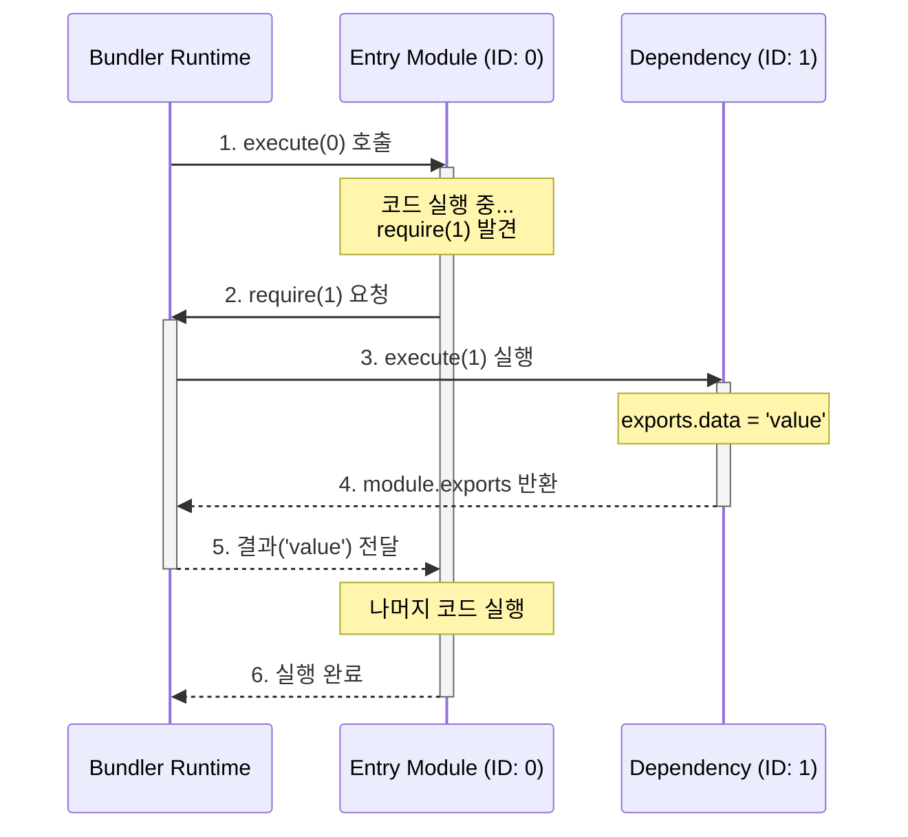

# Step 3: 번들링과 스코프 (Bundling & Scope)

메모리상에 구축된 모듈 그래프를 하나의 실행 가능한 파일로 결합하는 과정은 단순한 텍스트 이어 붙이기가 아닙니다. 브라우저 환경에는 존재하지 않는 Node.js의 모듈 시스템을 구현하고, 각 모듈이 서로 간섭하지 않도록 독립적인 실행 환경을 보장해야 합니다. 이번 단계에서는 번들러가 어떻게 **스코프를 격리**하고, **런타임을 구현**하여 코드를 실행하는지 상세히 알아봅니다.

---

## 1. 스코프 격리 (Scope Isolation)

여러 파일의 코드를 단순히 합치면 변수 이름 충돌(Namespace Collision)이라는 치명적인 문제가 발생합니다. 서로 다른 파일에서 선언한 동일한 이름의 변수가 전역 공간에서 충돌하여 의도치 않은 동작을 일으키기 때문입니다.

이를 해결하기 위해 번들러는 **IIFE(Immediately Invoked Function Expression, 즉시 실행 함수)** 패턴을 사용합니다. 각 모듈의 코드를 하나의 함수로 감쌈으로써, 자바스크립트의 함수 스코프 특성을 활용해 외부로부터 변수를 격리합니다.

```javascript
// 번들 파일 내부의 모듈 구조 예시
{
  0: function(require, module, exports) {
    const message = "Hello"; // 이 변수는 0번 모듈 내부에서만 유효합니다.
    const utils = require(1);
    console.log(message, utils.name);
  },
  1: function(require, module, exports) {
    exports.name = "Bundler";
  }
}
```

---

## 2. 런타임 심 구현 (Runtime Shim)

브라우저 환경에는 `require`, `module`, `exports`와 같은 모듈 시스템 객체가 기본적으로 존재하지 않습니다. 따라서 번들러는 이러한 도구들을 직접 구현하여 각 모듈 함수에 주입해 주어야 합니다. 이를 **런타임 심(Runtime Shim)**이라고 부릅니다.

### 런타임의 핵심 역할

1.  **모듈 실행**: 특정 ID를 가진 모듈 함수를 찾아 실행합니다.
2.  **의존성 주입**: 모듈 함수가 필요로 하는 `require`, `module`, `exports` 객체를 인자로 전달합니다.
3.  **캐싱(Caching)**: 동일한 모듈이 여러 번 호출되더라도 한 번만 실행되도록 결과를 저장해 둡니다.

```javascript
// 단순화된 런타임 로직
function require(id) {
  // 1. 캐시 확인
  if (cache[id]) return cache[id].exports;

  const module = { exports: {} };
  cache[id] = module;

  // 2. 모듈 함수 실행 및 도구 주입
  modules[id](require, module, module.exports);

  // 3. 결과 반환
  return module.exports;
}
```

---

## 3. 실행 흐름 (Execution Flow)

번들링된 코드는 엔트리 포인트(보통 ID 0)부터 시작하여 의존성 그래프를 따라 **깊이 우선 탐색(DFS)** 방식으로 실행됩니다. 이 과정을 시퀀스 다이어그램으로 나타내면 다음과 같습니다.



---

## 4. 문법 변환 (ESM to CJS Transform)

최신 자바스크립트에서는 `import/export`(ESM) 문법을 사용하지만, 위에서 구현한 런타임은 `require/exports`(CJS) 구조를 기반으로 합니다. 따라서 빌드 과정에서 추상 구문 트리(AST)를 분석하여 문법을 변환하는 작업이 필요합니다.

| 분류              | 원본 코드 (ESM)           | 변환된 코드 (CJS 방식)               | 설명                                      |
| :---------------- | :------------------------ | :----------------------------------- | :---------------------------------------- |
| **가져오기**      | `import { a } from './a'` | `const { a } = require(1)`           | 모듈 ID를 기반으로 값을 가져옵니다.       |
| **이름 내보내기** | `export const b = 1`      | `const b = 1; exports.b = b`         | `exports` 객체에 속성을 추가합니다.       |
| **기본 내보내기** | `export default c`        | `exports.default = c`                | `default`라는 이름의 속성으로 할당합니다. |
| **전체 내보내기** | `export * from './a'`     | `Object.assign(exports, require(1))` | 대상 모듈의 모든 수출항을 복사합니다.     |

### 상세 변환 로직의 주의점

- **Default Import**: `import A from './a'`는 런타임에서 `require(1).default`를 참조하도록 변환되어야 합니다.
- **Side Effect**: `import './style.css'`와 같이 변수 할당이 없는 경우, 단순히 `require(1)`만 실행하여 모듈 내부의 로직이 구동되도록 합니다.
- **순환 참조**: CJS 방식에서는 `exports` 객체를 먼저 생성한 후 코드를 실행하므로, 순환 참조 발생 시 "부분적으로 완성된(Partial)" 객체가 노출될 수 있음에 유의해야 합니다.

---

## 5. 요약

번들링의 핵심은 단순히 파일을 합치는 것을 넘어, **격리된 스코프**를 제공하고 브라우저가 이해할 수 없는 **모듈 시스템을 런타임으로 재현**하는 데 있습니다. 이를 통해 개발자는 모듈화된 설계를 유지하면서도, 브라우저 환경에서 안정적으로 동작하는 단일 실행 파일을 얻게 됩니다.

다음 단계에서는 실행 중인 번들 코드와 원본 소스 코드를 연결해 주는 **Step 4: 소스맵(SourceMap)**에 대해 알아보겠습니다.
