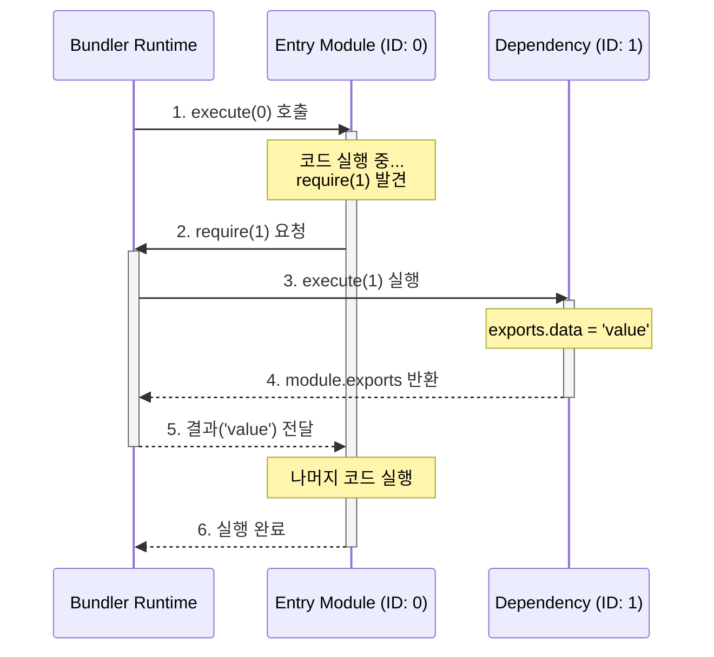

# Step 3: 번들링과 스코프 (Bundling & Scope)

메모리상에 구축된 모듈 그래프를 하나의 실행 가능한 파일로 결합하는 과정은 단순한 텍스트 이어 붙이기가 아닙니다. 브라우저 환경에는 존재하지 않는 Node.js의 모듈 시스템을 구현하고, 각 모듈이 서로 간섭하지 않도록 독립적인 실행 환경을 보장해야 합니다. 이번 단계에서는 번들러가 어떻게 **스코프를 격리**하고, **런타임을 구현**하여 코드를 실행하는지 상세히 알아봅니다.

---

## 1. 스코프 격리 (Scope Isolation)

여러 파일의 코드를 단순히 합치면 변수 이름 충돌(Namespace Collision)이라는 치명적인 문제가 발생합니다. 서로 다른 파일에서 선언한 동일한 이름의 변수가 전역 공간에서 충돌하여 의도치 않은 동작을 일으키기 때문입니다.

이를 해결하기 위해 번들러는 **IIFE(Immediately Invoked Function Expression, 즉시 실행 함수)** 패턴을 사용합니다. 각 모듈의 코드를 하나의 함수로 감쌈으로써, 자바스크립트의 함수 스코프 특성을 활용해 외부로부터 변수를 격리합니다.

```javascript
// 번들 파일 내부의 모듈 구조 예시
{
  0: function(require, module, exports) {
    const message = "Hello"; // 이 변수는 0번 모듈 내부에서만 유효합니다.
    const utils = require(1);
    console.log(message, utils.name);
  },
  1: function(require, module, exports) {
    exports.name = "Bundler";
  }
}
```

> **💡 기술적 선택: 왜 Rollup(Scope Hoisting)이 아닌 Webpack 초기 방식을 택했나요?**
>
> 사실 요즘의 번들러(Rollup, Webpack 5+)는 성능 최적화를 위해 모든 코드를 하나의 스코프로 합치는 **Scope Hoisting** 기법을 선호합니다. 함수 호출 비용을 없애고 코드를 더 압축할 수 있기 때문입니다.
>
> 하지만 Scope Hoisting은 변수 이름 충돌을 해결하기 위해 매우 복잡한 리네이밍(Renaming) 알고리즘을 필요로 합니다. 반면, 우리가 구현하는 **"함수로 감싸기"** 방식은 Webpack 초기 버전(v1~v3)이 사용했던 전략으로, 구현이 단순하면서도 모듈 격리 개념을 확실하게 보여줍니다. 학습용 프로젝트에서는 이 "고전적인 방식"이 번들러의 본질인 **의존성 주입과 스코프 격리**를 이해하기에 훨씬 적합합니다.

---

## 2. 런타임 심 구현 (Runtime Shim)

브라우저 환경에는 `require`, `module`, `exports`와 같은 모듈 시스템 객체가 기본적으로 존재하지 않습니다. 따라서 번들러는 이러한 도구들을 직접 구현하여 각 모듈 함수에 주입해 주어야 합니다. 이를 **런타임 심(Runtime Shim)**이라고 부릅니다.

### 런타임의 핵심 역할

1.  **모듈 실행**: 특정 ID를 가진 모듈 함수를 찾아 실행합니다.
2.  **의존성 주입**: 모듈 함수가 필요로 하는 `require`, `module`, `exports` 객체를 인자로 전달합니다.
3.  **캐싱(Caching)**: 동일한 모듈이 여러 번 호출되더라도 한 번만 실행되도록 결과를 저장해 둡니다.

```javascript
// 단순화된 런타임 로직
function require(id) {
  // 1. 캐시 확인
  if (cache[id]) return cache[id].exports;

  const module = { exports: {} };
  cache[id] = module;

  // 2. 모듈 함수 실행 및 도구 주입
  modules[id](require, module, module.exports);

  // 3. 결과 반환
  return module.exports;
}
```

---

## 3. 모듈 줄 세우기: 그래프에서 선형 배열로

Step 2에서 만든 의존성 그래프는 그물처럼 얽힌 구조입니다. 하지만 최종 결과물인 번들 파일은 위에서 아래로 읽히는 하나의 **긴 문자열**이어야 합니다. 따라서 우리는 그래프를 평탄화(Flatten)하여 모듈에 순서(ID)를 부여해야 합니다.

이때 단순히 발견 순서대로 나열하면 안 됩니다. 의존하는 모듈이 먼저 정의되어야 런타임 에러가 없기 때문입니다. 하지만 CJS 런타임은 `require` 호출 시점에 모듈을 찾으므로, **ID 기반의 배열**로만 매핑되어 있다면 물리적인 배치 순서는 크게 중요하지 않습니다.

보통은 **엔트리 파일(0번)**을 시작으로 탐색한 순서대로 고유 ID를 부여하고, 이를 배열이나 객체 형태로 만듭니다.

```javascript
// 그래프(Graph) -> 번들(Array) 변환 예시
const modules = [
  /* ID 0 */ function(require, module, exports) { ... },
  /* ID 1 */ function(require, module, exports) { ... },
  /* ID 2 */ function(require, module, exports) { ... },
];
```

## 4. 실행 흐름 (Execution Flow)

번들링된 코드는 엔트리 포인트(보통 ID 0)부터 시작하여 의존성 그래프를 따라 **깊이 우선 탐색(DFS)** 방식으로 실행됩니다. 이 과정을 시퀀스 다이어그램으로 나타내면 다음과 같습니다.



---

## 5. 문법 변환 (ESM to CJS Transform)

최신 자바스크립트에서는 `import/export`(ESM) 문법을 사용하지만, 위에서 구현한 런타임은 `require/exports`(CJS) 구조를 기반으로 합니다. 따라서 빌드 과정에서 추상 구문 트리(AST)를 분석하여 문법을 변환하는 작업이 필요합니다.

| 분류              | 원본 코드 (ESM)           | 변환된 코드 (CJS 방식)               | 설명                                      |
| :---------------- | :------------------------ | :----------------------------------- | :---------------------------------------- |
| **가져오기**      | `import { a } from './a'` | `const { a } = require(1)`           | 모듈 ID를 기반으로 값을 가져옵니다.       |
| **이름 내보내기** | `export const b = 1`      | `const b = 1; exports.b = b`         | `exports` 객체에 속성을 추가합니다.       |
| **기본 내보내기** | `export default c`        | `exports.default = c`                | `default`라는 이름의 속성으로 할당합니다. |
| **전체 내보내기** | `export * from './a'`     | `Object.assign(exports, require(1))` | 대상 모듈의 모든 수출항을 복사합니다.     |

### 실제 구현 흐름 (코드 위치 포함)

이 변환 로직은 `packages/@package/bundler/src/Module.ts` 안에 그대로 구현되어 있습니다. 흐름은 다음과 같습니다.

1. **AST 파싱**: `acorn.parse(content, { ecmaVersion: 'latest', sourceType: 'module' })`
2. **모듈 그래프 매핑**: `Graph.createModule()`에서 import 경로를 숫자 ID로 매핑
3. **변환 실행**: `Module.transform()`에서 AST를 순회하며 `MagicString`으로 코드 조작

핵심 함수는 아래 네 가지입니다.

- `transformImportDeclaration()`  
- `transformExportNamedDeclaration()`  
- `transformExportAllDeclaration()`  
- `transformExportDefaultDeclaration()`  

아래는 **실제 코드와 동일한 변환 패턴**(축약본)입니다.

```typescript
// Module.ts (요약)
const depId = this.mapping.get(node.source.value);
const requireCall = typeof depId === 'number' ? `require(${depId})` : `require('${depId}')`;

// 1) default import
const _m = requireCall;
const local = _m && _m.__esModule ? _m.default : _m;

// 2) named import
const { a, b: localB } = requireCall;

// 3) side effect import
requireCall;
```

### 함수 흐름 다이어그램 (Module.ts 기준)

`Module.transform()`이 어떤 순서로 변환 로직을 호출하는지 한눈에 보는 흐름입니다.

```mermaid
flowchart TD
  A[Graph.generate] --> B[modules.forEach(module.transform)]
  B --> C[Module.transform]
  C --> D{node.type}
  D -->|ImportDeclaration| E[transformImportDeclaration]
  D -->|ExportNamedDeclaration| F[transformExportNamedDeclaration]
  D -->|ExportAllDeclaration| G[transformExportAllDeclaration]
  D -->|ExportDefaultDeclaration| H[transformExportDefaultDeclaration]
  E --> I[MagicString.overwrite/remove/append]
  F --> I
  G --> I
  H --> I
```

변환은 **AST 노드 타입 분기 → MagicString 조작**이라는 단순한 규칙을 반복합니다.  
그래서 전체 구조를 이해하면 edge case를 추가하는 것도 어렵지 않습니다.

### 변환 전/후 예시 (실제 파일 기준)

`packages/@package/sample-lib/src/index.js`를 번들링하면, 아래처럼 변환됩니다.  
모듈 ID는 그래프 탐색 순서에 따라 달라질 수 있지만, 여기서는 `Button` 모듈이 `1`번이라고 가정합니다.

```javascript
// ESM (입력)
import { Button } from './components/Button.js';

export { Button };
export const version = '1.0.0';
```

```javascript
// CJS (출력)
const { Button } = require(1);

exports.Button = Button;
const version = '1.0.0';
exports.version = version;
```

### 🔬 [Deep Dive] AST 수술 집도하기: `import`가 `require`로 바뀌는 순간

"AST를 분석해서 코드를 바꾼다"는 말이 너무 추상적인가요? 실제 코드 레벨에서 어떤 일이 일어나는지 현미경으로 들여다보겠습니다.

우리의 목표는 아래의 **ESM 코드**를 **CJS 코드**로 성형수술하는 것입니다.

```typescript
// 📄 원본 (src/index.js)
import { sum } from './math.js';
```

👇 **변환 목표**

```javascript
// 📄 결과물 (dist/bundle.js 내부)
const { sum } = require(1); // './math.js'가 ID: 1로 변환됨
```

이 과정은 `Module.ts` 내부의 `transform` 메서드에서 일어납니다. 핵심 로직을 3단계로 쪼개 봅시다.

#### 1단계: 환부 찾기 (AST 탐색)
`acorn`이 파싱한 AST에서 `ImportDeclaration` 타입을 가진 노드를 찾습니다. 이 노드는 다음과 같은 정보를 가지고 있습니다.

```json
// AST Node (ImportDeclaration)
{
  "type": "ImportDeclaration",
  "start": 0,  // "import"가 시작되는 인덱스
  "end": 32,   // 세미콜론(;)이 끝나는 인덱스
  "source": {
    "type": "Literal",
    "value": "./math.js" // 👈 우리가 필요한 경로!
  },
  "specifiers": [
    {
      "type": "ImportSpecifier",
      "imported": { "name": "sum" }, // 가져올 변수명
      "local": { "name": "sum" }     // 내 파일에서 쓸 변수명
    }
  ]
}
```

#### 2단계: 매핑 조회 (ID 치환)
번들러는 이미 `Graph`를 만들면서 `'./math.js'`에게 주민등록번호(ID) `1`번을 부여했습니다.

```typescript
// Module.ts의 transform 메서드 내부
const sourcePath = node.source.value; // './math.js'
const moduleId = this.mapping.get(sourcePath); // 1 (Graph가 미리 매핑해둠)

// 이제 우리는 require('./math.js') 대신 require(1)을 쓸 수 있습니다.
```

#### 3단계: 봉합 수술 (MagicString 조작)
이제 `magic-string`이라는 메스를 들 차례입니다. 원본 코드를 건드리지 않고, 기존 `import` 문을 덮어쓰기(overwrite) 합니다.

```typescript
// 실제 구현 로직 (의사 코드)

// 1. 가져올 변수들 문자열 만들기: "{ sum }"
const imported = node.specifiers
  .map(s => `${s.imported.name}: ${s.local.name}`)
  .join(', ');

// 2. require 문 만들기: "const { sum } = require(1);"
const newCode = `const { ${imported} } = require(${moduleId});`;

// 3. 덮어쓰기! (수술 집도)
// 원본 코드의 start(0)부터 end(32)까지를 newCode로 교체합니다.
this.magicString.overwrite(node.start, node.end, newCode);
```

이 과정을 거치면, 번들러는 원본 소스 코드의 위치 정보(소스맵)를 유지한 채로 브라우저가 이해할 수 없는 `import` 문을 깔끔하게 도려내고, 우리가 만든 런타임 함수인 `require`로 교체해 넣습니다.

### edge case 처리 포인트

- **Default Import Interop**: `__esModule` 플래그가 없으면 모듈 자체를 사용합니다.
- **Side Effect Import**: `import './x.js'`는 단순 `require()` 호출만 남깁니다.
- **Re-export**: `export { a } from './b'`는 `exports.a = require(1).a`로 변환됩니다.
- **Export All**: `export * from './b'`는 `Object.assign(exports, require(1))`로 처리됩니다.

> **💡 순환 참조(Circular Dependency)는 어떻게 해결되나요?**
>
> 런타임 심 코드를 다시 보면, `modules[id](...)`를 실행하기 **전에** `cache[id] = { exports: {} }`를 먼저 할당하는 것을 볼 수 있습니다.
> 만약 `A -> B -> A` 순서로 호출되더라도, 두 번째 `A` 호출 시점에는 이미 캐시에 `A`의 빈 `exports` 객체가 존재하므로 무한 루프에 빠지지 않고 해당 객체(비록 비어있을지라도)를 반환받아 실행을 이어갑니다. 이것이 바로 CJS가 순환 참조를 버티는 원리입니다.

### 상세 변환 로직의 주의점

- **Default Import**: `import A from './a'`는 런타임에서 `require(1).default`를 참조하도록 변환되어야 합니다.
- **Side Effect**: `import './style.css'`와 같이 변수 할당이 없는 경우, 단순히 `require(1)`만 실행하여 모듈 내부의 로직이 구동되도록 합니다.
- **순환 참조**: CJS 방식에서는 `exports` 객체를 먼저 생성한 후 코드를 실행하므로, 순환 참조 발생 시 "부분적으로 완성된(Partial)" 객체가 노출될 수 있음에 유의해야 합니다.

---

## 6. 결과물의 형태: Dual Package 전략

우리가 만든 번들러는 내부적으로 ESM 코드를 CJS(`require`) 런타임 위에서 돌아가도록 변환했습니다. 그렇다면 최종 결과물은 CJS 파일 하나만 나오는 걸까요?

최신 라이브러리들은 **Dual Package** 구조를 지향합니다.

1. **CJS (`index.js`)**: 우리가 구현한 런타임을 포함하여 구형 환경이나 Node.js require를 지원합니다.
2. **ESM (`index.mjs`)**: 런타임 심 없이 순수 `import/export`를 유지한 채로 파일만 합쳐서(Bundling), Tree Shaking이 가능한 환경을 지원합니다.

우리 시리즈에서는 로직의 복잡도를 낮추기 위해 **CJS 번들링**에 집중하고 있지만, 실무용 번들러라면 이 두 가지 포맷을 모두 생성하여 `package.json`의 `exports` 필드에 연결해 주는 것이 정석입니다.

```json
{
  "exports": {
    ".": {
      "import": "./dist/index.mjs",
      "require": "./dist/index.js"
    }
  }
}
```

---

## 7. 요약

번들링의 핵심은 단순히 파일을 합치는 것을 넘어, **격리된 스코프**를 제공하고 브라우저가 이해할 수 없는 **모듈 시스템을 런타임으로 재현**하는 데 있습니다. 이를 통해 개발자는 모듈화된 설계를 유지하면서도, 브라우저 환경에서 안정적으로 동작하는 단일 실행 파일을 얻게 됩니다.

다음 단계에서는 실행 중인 번들 코드와 원본 소스 코드를 연결해 주는 **Step 4: 소스맵(SourceMap)**에 대해 알아보겠습니다.

---

## 체크리스트 (Step 3)

- `Graph.generate()`가 모듈을 함수로 감싸고 런타임 심을 주입하는 위치를 확인했다.
- `Module.transform()`에서 ESM→CJS 변환이 어떻게 이루어지는지 이해했다.
- Default Import/Side Effect/Export All 같은 케이스가 별도로 처리되는 이유를 설명할 수 있다.
