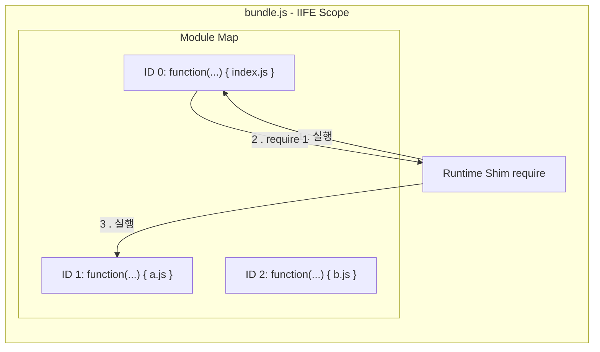
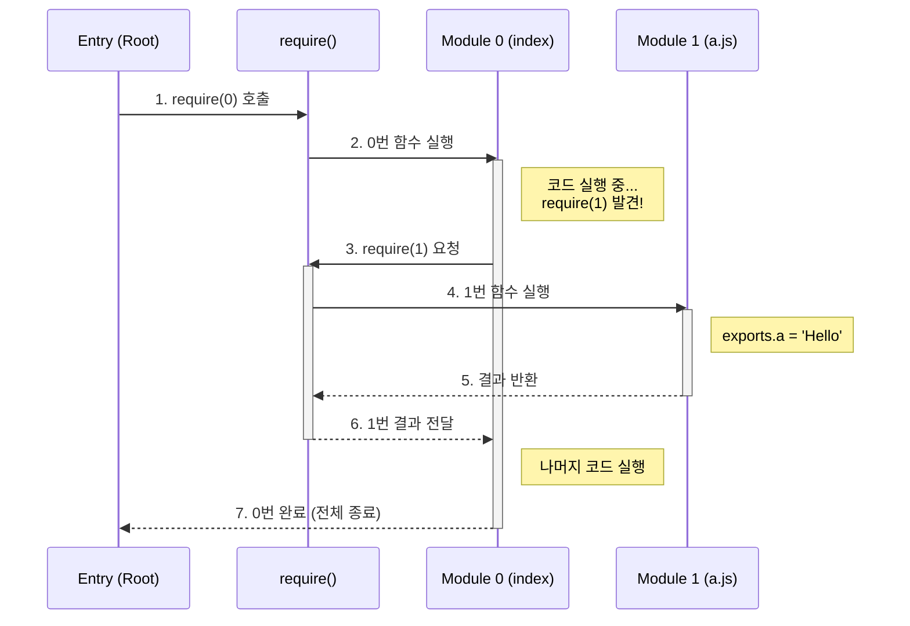

# Step 3: 번들링과 스코프 (Bundling & Scope)

메모리 상에 흩어진 모듈 그래프를 **실행 가능한 하나의 파일**로 합치는 것은 단순히 코드를 이어 붙이는 것이 아닙니다. 브라우저라는 낯선 환경에서 Node.js의 시스템을 완벽하게 재현(Emulation)하는 과정입니다.

## 1. 스코프 격리: "변수 충돌이라는 재앙 막기"

여러 파일의 코드를 그냥 합치면 변수 이름(`const a`)이 겹쳐서 실행조차 되지 않습니다.

- **해결책**: 각 파일의 내용을 **함수(Function Scope)**로 감쌉니다.
- **구조**: `(function(require, module, exports) { ... })`
- **의미**: 이렇게 감싸는 순간, 각 파일은 외부와 차단된 자신만의 '방'을 갖게 됩니다. 이 안에서 선언된 변수는 밖으로 새어나가지 않습니다.



---

## 2. 모듈 시스템 흉내내기 (The Shim)

브라우저에는 `require`, `module`, `exports`가 없습니다. 번들러는 이 도구 3개를 직접 만들어서 각 파일(함수)에게 인자로 쥐여줍니다.

### 🏨 호텔 룸서비스 비유 (작동 원리)

- **호텔 지배인 (번들러 런타임)**: 전체 실행을 관리합니다.
- **빈 접시 (`module.exports = {}`)**: 요리사(모듈)에게 전달할 결과물 그릇입니다.
- **요리사 호출 (`modules[id](...)`)**: 요리사에게 도구(require, exports)를 주고 요리를 시킵니다. 요리사는 이 도구를 사용해 빈 접시에 결과물을 채워 넣습니다.
- **서빙 (`return module.exports`)**: 다 채워진 접시를 주문자에게 전달합니다.

### 🔄 도미노 효과 (Execution Flow)

"0번 함수에 모든 게 몰려 있는 것 아닌가요?"라는 질문의 해답입니다. 0번이 뿌리가 되어 멈추고 실행하기를 반복하며 깊이 우선 탐색(DFS)하듯 실행됩니다.



---

## 3. 상세 변환 전략 (ESM → CJS)

브라우저는 `import`를 모르기 때문에, 빌드 타임에 AST를 분석하여 모든 ESM 문법을 우리가 만든 `require` 체계로 번역해야 합니다.

| AST 타입                     | 원본 코드 (ESM)           | 변환된 코드 (CJS)                    | 역할                         |
| :--------------------------- | :------------------------ | :----------------------------------- | :--------------------------- |
| **ImportDeclaration**        | `import { a } from './a'` | `const { a } = require(1)`           | 다른 파일의 값을 가져옴      |
| **ExportNamedDeclaration**   | `export const a = 1`      | `const a = 1; exports.a = a`         | 값을 이름 붙여 내보냄        |
| **ExportDefaultDeclaration** | `export default a`        | `exports.default = a`                | 파일의 대표 값을 내보냄      |
| **ExportAllDeclaration**     | `export * from './a'`     | `Object.assign(exports, require(1))` | 다른 파일의 모든 수출을 복사 |

---

## 4. 효율적인 관리: 번호표(ID) 시스템

파일 경로(`'./src/utils/math.js'`) 대신 숫자(`1`, `2`)를 사용하는 이유는 명확합니다.

- **용량**: 긴 주소를 숫자로 치환하여 파일 크기를 줄입니다.
- **속도**: 문자열 비교보다 인덱스 접근이 훨씬 빠릅니다.
- **캡슐화**: 내부 파일 구조를 외부에 숨깁니다.

---

## 5. ESM 지원 및 독립형(Standalone) 번들링

최신 환경을 위해 `.mjs` 파일을 생성할 때, 단순한 Wrapper 방식이 아닌 **완전 독립형** 방식을 채택했습니다.

```mermaid
flowchart TD
    Graph[Memory Graph] -->|Generate| Core[Bundle Content<br/>(IIFE String)]

    subgraph CJS [bundle.cjs]
        Core -->|Append| CJS_Exp["module.exports = ..."]
    end

    subgraph ESM [bundle.mjs]
        Core -->|Inline Copy| Wrapper["const result = ..."]
        Wrapper -->|Static Analysis| Named["export const {a} = result"]
        Wrapper -->|Static Analysis| Default["export default result.default"]
    end

    style CJS fill:#e1f5fe
    style ESM fill:#fff3e0
```

### 정적 분석을 통한 수출 명단 수집

ESM은 수출할 변수 이름을 미리 알아야 하기에 `Module.ts`에서 다음 상태를 관리합니다.

- **`exportsList`**: 직접 내보내는 이름들 수집 (`export const a` 등)
- **`exportAllSources`**: `export *` 처럼 다른 파일에 떠넘긴 경로 기록. 나중에 재귀적으로 추적하여 명단을 합칩니다.

### 결과물 구조

- **bundle.cjs**: `module.exports = (function...)` (CJS 완전 독립)
- **bundle.mjs**: 번들 로직을 복사(Inlining)한 뒤 `export const { ... } = result` (ESM 완전 독립)

---

## 6. 검증 결과 및 로그

실제 프로젝트를 빌드하고 실행한 결과입니다.

```bash
# 실행 결과 (Node.js)
Value of a in C: undefined  <-- 순환 참조 재현 성공
Local name in A: A
Local name in B: B
Module A Module B
Hello, Bundler Master! 🎉!

# 라이브러리 모드 테스트 (test-bundle.cjs / test-bundle.mjs)
Exported: { name: 'Universe' }
✅ Success: Named Import 및 require() 값이 정확히 일치함.
```

---

**Next Step**: 이제 합쳐진 코드 속에서 길을 잃지 않게 도와주는 **Step 4: 소스맵(SourceMap)**으로 나아갑니다.
