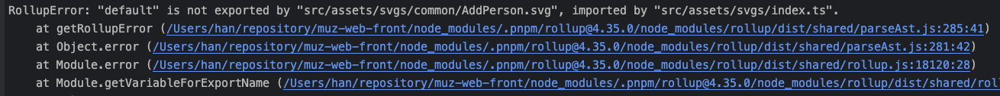
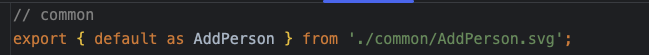

# 3주간의 패키지 배포 삽질기: 완벽을 포기하고 배운 것들

## 프롤로그: "별거 아니겠지"의 착각

> 타팀 기획자가 다가왔다.
>
> "개발자님, 저희 팀에서도 그 디자인 시스템 쓸 수 있을까요? 버튼이랑 인풋 컴포넌트가 정말 예쁘던데..."
>
> 내 대답은 자신만만했다. "별거 아니에요. NPM에 올리기만 하면 되니까 하루면 될 것 같은데요?"
>
> 그날의 나에게 말해주고 싶다. **별거 아닌 일은 없다고.**
>
> 3주 후, 나는 20MB짜리 괴물 패키지와 마주하고 있었다. GitHub Actions는 무한 재귀로 돌아가고, CSS는 적용되지 않고, SVGR은 빌드를 거부했다.
>
> 하지만 결국 해냈다. 완벽하지는 않지만, 팀 상황에 맞는 현실적인 해결책으로.

## 0부: 상황 설명 - "잘 구성했다고 생각했는데?"

### 모노레포를 선택한 이유

신규 프로젝트와 디자인 시스템을 동시에 구현하기로 논의가 나왔다. "어차피 언젠간 내보낼 거야"라는 생각으로 모노레포로 구성했고, 추가 프로젝트도 들어오기로 한 상황이라 더욱 확신했다.

당시엔 완벽한 판단이라고 생각했다.

### 기술 스택 선택의 배경

**Mantine + Panda CSS**라는 조합을 선택했다.

- 리소스 부족 상황
- Tailwind 문법에 대한 팀원들의 극혐 😅
- 모두가 동의한 현실적 선택

그리고 name을 당당하게 원하는 대로 설정했다. (나중에 scope 문제로 발목을 잡힐 줄 모르고...)

### 현재 모노레포 구조

```
monorepo/
├── design-system/          # 메인 디자인 시스템 패키지
└── packages/
    ├── @acme/core          # HTTP 클라이언트, 상태 코드
    ├── @acme/constants
    ├── @acme/entities
    └── @acme/service
```

**여기서 첫 번째 함정**: 디자인 시스템이 내부 패키지 4개에 의존하고 있었다.

> 글에서 사용하는 패키지 이름(`@acme/design-system`, `@acme/core` 등)은 이해를 돕기 위한 가상의 예시입니다.

왜? GNB 때문에... 거기에 모든 공통 로직을 몽땅 때려넣고 있었던 것이다.

### 의존성 구성: peerDependency의 선택

이 4개 패키지를 `peerDependency`로 설정했다.

왜 `peerDependency`를 선택했을까? 이걸 고민하면서 패키지 의존성에 대해 제대로 공부하게 됐다.

**`dependencies`로 넣으면?**

- 디자인 시스템을 설치할 때 내부 패키지 4개도 자동으로 설치됨
- 하지만 사용하는 쪽에서 같은 패키지를 이미 설치했다면? **중복 설치**

**`peerDependency`로 넣으면?**

- "이 패키지들이 필요해요"라고 알려주기만 함
- 사용하는 쪽에서 직접 설치하도록 강제
- pnpm의 엄격한 의존성 관리와 잘 맞음 (중복 설치 방지)

게다가 `@acme/core`, `@acme/service` 같은 패키지들은 디자인 시스템 외에도 재활용될 가능성이 높았다.

그래서 `peerDependency`로 결정했다.

### 요구사항과 첫 번째 좌절

**요구사항**:

1. NPM 패키지로 배포
2. 모노레포 외부의 다른 서비스에서 설치 가능
3. **Remix + Tailwind 환경**에서 **Mantine + Panda CSS** 잘 돌아가게 하기

**첫 번째 좌절 포인트**:

- 모노레포 안에 있는 패키지라 밖으로 내보내야만 가능
- 내부 패키지 4개를 어떻게 처리할 것인가?

"미리 잘 구성했다"고 생각했지만, 현실은 그렇지 않았다.

## 1부: 빌드 지옥편 - "tsup, 너 이럴 거야?"

### 빌드 도구 선정: tsup을 선택한 이유

당시 빠른 빌드와 TypeScript 타입을 동시에 지원하는 도구를 찾고 있었다. **tsup**이 최신이고 좋다는 평이 많았다.

"이거면 되겠다!"

### SVG와의 첫 번째 조우

우리는 SVGR을 사용해서 SVG를 컴포넌트로 변환하고 있었다. 빌드를 돌려보니...

```bash
Error: default export를 처리할 수 없습니다
```





**tsup이 SVGR의 default export 구문을 처리하지 못했다.**

#### 시도했던 해결책들

1. **tsup 설정 조정**: 별 소용없음
2. **esbuild 플러그인 추가**: 복잡성만 증가
3. **결국 타협**: TypeScript 컴파일은 따로 `tsc`로 처리

```json
{
  "scripts": {
    "build": "tsup && tsc --emitDeclarationOnly"
  }
}
```

SVG 때문에 빌드 시스템이 이원화되어 버렸다. 완벽하진 않지만 일단 돌아간다.

### Panda CSS 스타일시트 생성의 악몽

Panda CSS 공식 예제를 따라해봤지만 당연히 안 됐다.

#### 시도한 것들

1. **buildInfo 사용**: 동작 자체를 안 함
   - 원인: 클라이언트 측에 info 설정을 안 해둔 게 문제
2. **빌드 시 CSS 스타일시트 생성**: config에 넣은 게 아니라 필요한 class를 전부 생성하지 못함

결국 이 부분도 **나중에 해결하기로** 했다. 지금은 빌드부터 완성하자.

### 의존성 라이브러리 빌드 처리

내부 패키지들을 어떻게 빌드에 포함시킬 것인가?

`peerDependency`로 설정했으니 빌드에서 제외해야 한다.

```json
{
  "external": [
    "@acme/core",
    "@acme/constants",
    "@acme/entities",
    "@acme/service"
  ]
}
```

### Panda codegen 라이프사이클 문제

Panda는 `prepare` 스크립트에서 `panda codegen`을 수행하고 있었는데, 이 부분을 빌드 전에 넣어줘야 했다.

```json
{
  "scripts": {
    "prebuild": "panda codegen",
    "build": "tsup && tsc --emitDeclarationOnly"
  }
}
```

### tsup의 onSuccess 라이프사이클 이슈

`tsup`의 `onSuccess`를 사용해서 빌드 후에 `tsc`를 적용하려고 했지만, 라이프사이클이 달라서 결국 수동으로 처리하게 됐다.

지금 생각해보면 **esbuild**로도 충분했을 것 같다.

### 빌드 결과물과 마주하며

빌드가 끝나고 결과물을 확인하는 순간, `dist` 폴더 안의 파일들이 낯설게 느껴졌다.

```
dist/
├── index.js
├── index.mjs
├── index.d.ts
├── index.js.map
```

"`.mjs`는 뭐지? `.d.ts`는 어떻게 생성되는 거지?"

이 파일들을 제대로 이해하려면 JavaScript 모듈 시스템을 공부해야 했다:

- **CJS vs ESM**: CommonJS와 ES Modules의 차이
- **`.mjs`, `.mts`, `.cts`**: 모듈 타입별 확장자
- **`*.d.ts`**: TypeScript 타입 정의 파일 생성 방식
- **sourcemap**: 디버깅을 위한 소스맵 처리

`package.json`의 `exports` 필드, `main`, `module`, `types`... 하나하나 찾아보며 빌드 시스템을 이해해나갔다.

### 모노레포 빌드 시스템과의 싸움

현재 모노레포에서도 breaking change가 많으면 안 됐다. 하지만...

**실제로 깨졌다. (지금도 고생 중)**

이 과정에서 모노레포의 빌드 시스템과 오케스트레이션에 대해 공부하게 됐고, `package.json` 스펙도 많이 알게 됐다:

- `name`, `publishConfig`, `exports`, `files`
- `peerDependencies` vs `dependencies`

일단 빌드는 완성됐다. 이제 테스트해볼 차례다.

## 2부: 로컬 테스트와 적용 - "CSS가 안 보여요"

### pnpm pack으로 빠른 테스트 환경 구축

배포 전에 로컬에서 테스트하는 방법이 필요했다.

찾아보니 `pnpm pack`이 딱이었다.

```bash
# 디자인 시스템 패키지에서
pnpm pack

# 다른 서비스에서
pnpm install ../design-system/design-system-1.0.0.tgz
```


복붙만 하면 되니까 빠른 피드백 루프를 만들 수 있었다.

### 첫 번째 적용: "어라? CSS가 안 나와요?"

설치하고 컴포넌트를 import 해봤다.

```typescript
import { Button } from '@acme/design-system';
```

**컴포넌트는 뜨는데 스타일이 전부 깨져있었다.**

"왜지?"

### Panda CSS를 어떻게 전달할 것인가

문제는 Panda CSS였다.

빌드 시 생성된 CSS를 어떻게 사용하는 쪽에 전달할 것인가?

#### 시도 1: CSS 파일 생성해서 함께 배포

Panda CSS 스타일시트를 생성해서 `dist`에 넣고 배포하려 했지만... 필요한 클래스가 전부 생성되지 않았다.

#### 시도 2: buildInfo로 런타임 생성

공식 문서를 보고 `buildInfo`를 시도했지만 동작하지 않았다.

### 최후의 선택: 소스코드 통째로 넣기

뭔지 몰라서 **소스코드를 통째로 넣어서 내보내기로** 했다.

```typescript
// package.json의 exports 수정
{
  "exports": {
    ".": "./src/index.ts",  // dist가 아니라 src!
    "./components/*": "./src/components/*"
  }
}
```

돌려보니... **됐다!**

**성공 이유**: `styled-system`조차 통째로 들어있어서 Panda CSS의 함수를 런타임에 찾아갈 수 있었던 것이다.

### 20MB 괴물의 탄생

패키지 사이즈를 확인해보니...

**20MB**

"뭐지 이거?"

소스코드 전체 + `node_modules`의 일부 + `styled-system` 전체... 모든 게 다 들어가 있었다.

목표는 300KB였는데.

하지만 **일단 돌아간다.** 나중에 최적화하자.

### Remix + Tailwind 환경에서의 첫 시도

이제 실제로 사용할 Remix + Tailwind 환경에서 테스트했다.

설치하고... 컴포넌트 import하고...

**CSS가 또 안 보인다.**

### 기존 CSS와의 전쟁

Remix 프로젝트의 전역 CSS를 열어보니...

```css
/* 이런 식으로... */
@tailwind base;
@tailwind components;
@tailwind utilities;

/* Tailwind의 components layer 사용 */
@layer components {
  .button {
    background: red !important;
    padding: 10px !important;
  }
}

/* Tailwind의 base layer 사용 */
@layer base {
  div {
    box-sizing: border-box !important;
  }
}

/* layer 없이 직접 작성된 스타일들 */
.some-legacy-class {
  margin: 20px !important;
  color: blue !important;
}
```

**온갖 하드코딩 CSS가 `!important`로 도배**되어 있었고, Tailwind의 `@layer` 문법도 섞여 있었다.

우리 디자인 시스템 스타일이 전부 덮어씌워지고 있었다.

### PostCSS로 해결 시도

PostCSS 설정을 직접 만들어서 해결해보려 했다.

```javascript
// postcss.config.js
module.exports = {
  plugins: [
    require('@pandacss/dev/postcss'),
    require('tailwindcss'),
    // 충돌 해결이 안 됨
  ],
};
```

**실패.**

### CSS Layer로 우선순위 강제하기

그때 **CSS `@layer`**를 알게 됐다.

이 과정에서 두 가지 중요한 문법을 배웠다:

1. **`@layer`로 우선순위 선언**: 먼저 선언된 layer가 낮은 우선순위를 가짐
2. **`@import` with `layer()`**: 외부 CSS를 특정 layer에 배치

```css
/* 🎯 레이어 우선순위 설정 */
@layer reset, base, tokens, recipes, utilities, tailwind, mantine,
       panda-reset, panda-base, panda-tokens, panda-recipes, panda-utilities;

/* Mantine CSS를 낮은 우선순위 layer에 배치 */
@import '@mantine/core/styles.css' layer(mantine);

/* Tailwind도 별도 layer로 관리 */
@layer tailwind {
  @tailwind base;
  @tailwind components;
  @tailwind utilities;
}

@layer base {
  /* 기존 CSS - !important 제거 가능 */
  body {
    font-family: 'Pretendard';
    color: #121213;
    background-color: #fff; /* !important 없이도 동작 */
  }
}
```

**이것이 유일하게 원하던 대로 된 해결책이었다.**

`@layer`로 우선순위를 명시적으로 선언하고, `@import` 시 `layer()` 함수로 외부 CSS를 원하는 위치에 배치하니:

- `!important` 없이도 스타일 제어 가능
- Mantine, Tailwind, Panda CSS 모두 공존 가능
- 우선순위 디버깅이 훨씬 쉬워짐

### 로컬 테스트 성공

20MB 괴물이긴 하지만, 일단 **로컬에서 완벽히 동작**한다.

이제 배포 자동화를 구축할 차례다.

## 3부: 배포 자동화의 험난한 길

### Changeset 도입 결정

수동으로 버전 관리하면 실수가 많을 것 같았다.

**changeset**으로 자동화하기로 했다.

이 과정에서 공부한 것들:

- **시맨틱 버저닝**: major.minor.patch의 의미 (직접 고려해본 건 처음)
- **커밋 메시지 기반 버저닝**: conventional commits
- **자동 CHANGELOG 생성**

### npm scope 문제 - 대참사의 시작

GitHub npm에 배포하려고 했는데...

```bash
Error: Package name must start with @organization/
```

**우리 패키지 이름이 scope 규칙에 맞지 않았다.**

당당하게 지었던 패키지 이름이 발목을 잡았다.

#### 해결 방법 고민

1. **GitHub 조직 새로 만들기**: 너무 복잡하고 권한 문제 발생
2. **패키지 이름 변경**: 🔥 **이걸 선택**

```typescript
// Before
import { Button } from 'design-system';

// After
import { Button } from '@acme/design-system';
```

**모든 파일의 import를 바꿔야 했다.**

수십 개 파일에 걸친 대대적인 refactoring... 하지만 해야 한다.

### GitHub Token 권한 이슈

배포를 위한 토큰이 필요했다.

1. **내 개인 토큰으로 시도**: 권한 부족 에러
2. **GitHub 조직 토큰 발급받기**: 성공 (하지만 이것도 나중에 레거시가 됨)

### GitHub Actions 무한 재귀의 공포

배포 워크플로우를 만들고 push했더니...

```yaml
on:
  push:
    branches: [main]
```

**무한 재귀가 돌기 시작했다.**

1. Push → Actions 실행
2. Actions가 package.json 수정하고 커밋
3. 커밋 → 다시 Actions 실행
4. 무한 반복...

"미치겠다."

#### 해결책

```yaml
on:
  push:
    branches: [main]
    paths-ignore:
      - 'CHANGELOG.md'
      - 'package.json'
```

`paths-ignore`로 특정 파일 변경은 무시하도록 설정.

### 기존 워크플로우와의 충돌

기존에 잘 돌아가던 CI/CD 워크플로우가 있었다.

```yaml
# 기존 워크플로우
- name: Build all packages
  run: pnpm build

# changeset 워크플로우
- name: Create Release PR
  run: pnpm changeset version
```

두 워크플로우가 서로 간섭하면서 예상치 못한 에러들이 속출했다.

결국 워크플로우 실행 순서를 조정하고, 조건부 실행으로 분리했다.

### 배포 자동화 완성

우여곡절 끝에 배포 시스템이 완성됐다:

- PR 머지 → changeset이 버전 업데이트
- main 브랜치 push → 자동으로 npm 배포
- CHANGELOG 자동 생성

이제 실제 서비스에 배포할 차례다.

## 4부: 실제 서비스 배포 - "불가능한 조합의 현실"

### Remix + Tailwind 환경의 특수성

다른 팀이 사용하는 환경:

- **Remix** (React Router로 이전 중)
- **Tailwind CSS**
- **레거시 전역 CSS** (하드코딩 천지)

여기에 우리의 **Mantine + Panda CSS**를 올려야 했다.

### Mantine의 Remix 지원 중단

Mantine 공식 문서를 확인하니...

> "Remix는 더 이상 지원하지 않습니다."

Remix가 React Router로 통합되면서 생긴 일이었다.

"그래도 해야 한다."

### Mantine + Tailwind 조합의 지옥

GitHub 이슈를 검색해보니:

- "mantine + tailwind 조합 CSS 충돌"
- "클래스명 충돌 문제"
- "우선순위 꼬임"

**많은 사람들이 이 조합을 포기**했다는 걸 알게 됐다.

### 그래도 적용은 해야 한다

npm에서 패키지를 설치하고, 테스트했다.

```bash
npm install @acme/design-system
```

로컬 테스트에서 했던 것처럼:

1. CSS Layer로 우선순위 설정
2. 기존 전역 CSS 최소한으로 수정
3. PostCSS 설정 조정

### 추가로 발견한 문제들

- **로티(Lottie) 파일 컴포넌트**: 동작 안 함 (원인 파악 필요)
- **타입 정의 누락**: tsc 컴파일 미완성

하지만 **핵심 기능은 동작했다.**

### 우여곡절 끝에 성공

일단 사용 가능한 형태로 시스템 구축 완성! 🎉

완벽하진 않지만:

- ✅ 디자인 시스템을 다른 팀이 사용할 수 있다
- ✅ npm으로 배포되어 설치 가능하다
- ✅ 버전 관리가 자동화되어 있다
- ✅ Remix + Tailwind 환경에서 동작한다

문제들이 산적해있지만 **점진적으로 개선**하면 된다.

## 에필로그: 완벽을 포기하고 배운 것들

### "별거 아니라고 하지 마세요!"

3주간의 삽질 끝에 얻은 가장 큰 교훈:

**패키지 배포는 절대 별거 아닌 일이 아니다.**

### 포기한 것들 (그리고 왜 괜찮은가)

**❌ 포기 1: SVGR 완벽 처리** → tsc 따로 돌리기

- 이유: tsup 한계
- 대안: 추후 SVG를 별도 패키지로 분리

**❌ 포기 2: 최적화된 CSS 번들** → 소스코드 통째로

- 이유: Panda CSS 특성상 런타임 필요
- 대안: buildInfo로 정적 생성

**❌ 포기 3: 300KB 목표** → 일단 20MB

- 이유: 소스코드 전체 포함
- 대안: 트리쉐이킹 구조로 단계적 개선, 사용 안 하는 정적 자산 제거(font-file, svg)

**❌ 포기 4: 완벽한 타입 정의** → 일부 누락

- 이유: SVG 처리 문제
- 대안: tsc 빌드 개선

**❌ 포기 5: 자동화된 업데이트 알림** → 육성 + 슬랙

- 이유: 시간 부족
- 대안: 일단 확실한 방법 사용 😅

### 20MB → 300KB 최적화 로드맵

앞으로 해야 할 일들:

1. **트리쉐이킹 가능한 구조**: 개별 컴포넌트 import 가능하게
2. **SVG 별도 패키지화**: 타입 문제 해결
3. **의존성 최적화**: 불필요한 패키지 제거
4. **문서화 강화**: 사용 가이드, API 문서

### 배운 것들

**기술적 학습:**

- JavaScript 모듈 시스템 (CJS/ESM)
- package.json 스펙 완벽 이해
- peerDependencies vs dependencies 차이
- 빌드 도구 (tsup, esbuild, tsc)
- CSS Layer와 우선순위 제어
- GitHub Actions 워크플로우
- 시맨틱 버저닝과 changeset

**태도적 학습:**

- **완벽보다 실행**: 일단 돌아가게 만들고 개선
- **점진적 개선**: 한 번에 완벽할 순 없다
- **현실적 타협**: 팀 상황에 맞는 선택
- **빠른 피드백**: pnpm pack으로 테스트 환경 구축

### 다음에는 이렇게 하자 - 체크리스트

#### 🚨 **사전 계획 단계**

- [ ] **패키지 이름을 npm scope 규칙에 맞게 설정**
- [ ] **SVG 처리 방식 미리 결정** (SVGR 한계 인지)
- [ ] **CSS 프레임워크 조합 가능성 검증**
- [ ] **빌드 도구별 제약사항 사전 조사**
- [ ] **내부 패키지 의존성 최소화**

#### 🔧 **빌드 설정 단계**

- [ ] **pnpm pack으로 로컬 테스트 환경 먼저 구축**
- [ ] **External dependencies 명확히 정의**
- [ ] **빌드 결과물 확인 후 다음 단계 진행**

#### 🚀 **배포 설정 단계**

- [ ] **GitHub Token 권한 사전 확인**
- [ ] **기존 워크플로우와의 충돌 여부 확인**
- [ ] **배포 전 로컬에서 충분히 테스트**

#### 🎯 **적용 검증 단계**

- [ ] **CSS Layer 우선순위 미리 설계**
- [ ] **기존 CSS와의 충돌 지점 사전 파악**
- [ ] **실제 환경과 유사한 테스트 환경에서 검증**
- [ ] **문제 발견 시 최소한의 타협안 먼저 찾기**

#### 💡 **최적화는 나중에**

- [ ] **일단 돌아가게 만들기 우선**
- [ ] **최적화 로드맵 작성**
- [ ] **단계적으로 개선**
- [ ] **매 단계마다 측정 (번들 사이즈, 빌드 시간 등)**

### 마지막으로

이 모든 과정에서 배운 것은 **"완벽한 해결책은 없다"**는 것이다.

중요한 건:

- **팀 상황에 맞는 실용적 선택**
- **일단 돌아가게 만들기**
- **점진적으로 개선해나가기**

3주간의 삽질도 결국 소중한 학습 과정이었다.

누군가는 이 글을 보고 **"덕분에 삽질 안 하고 성공했어요!"** 라고 말해주길 바란다.

**그리고 무엇보다 - "별거 아니라고 하지 마세요!"** 🙏

---

_이 글이 도움이 되셨다면, 여러분의 패키지 배포 경험도 댓글로 공유해주세요. 함께 배워나가요!_
