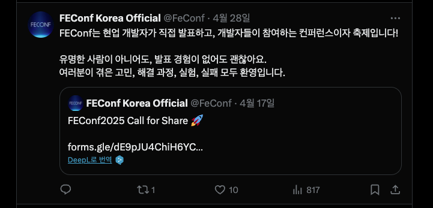
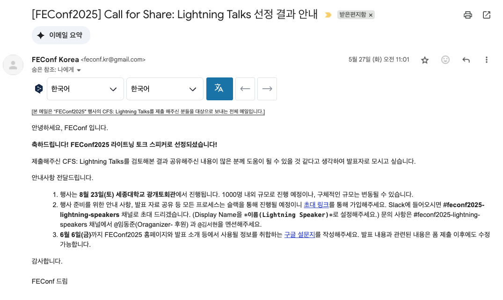
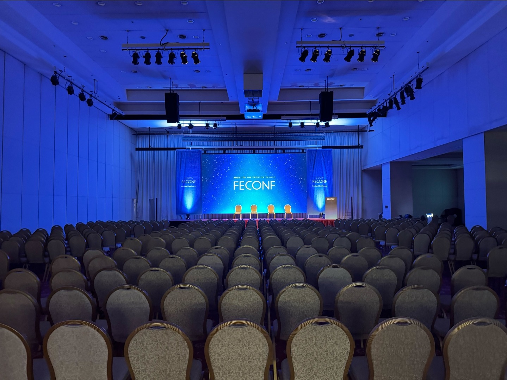

## 시작

마이크를 잡는 순간 정말 내가 말해도 되는건가? 나 해도되는건가?

이 생각이 든 건 몇 달 전부터였다. 어느 모임에서 feconf 2024 라이트닝 연사자 분을 만나게 되었다. 재미있게 이야기 하던 도중 나에게 날아든 질문이 있었다.

**"상욱님도 이거 잘 하실 수 있을 것 같아요! 너무 좋은 경험이었어서 꼭 해보셨으면 좋겠어요!"**

## 신청

마침 스피커 모집이 있었고 크게 고민하지 않고 신청을 했다. 마침 오픈소스의 즐거움을 알아가던 참이었다. 이 메시지를 전달하면 된다는 생각을 가졌기 때문이다.

평소에 글쓰기도 자주 하고 있어 요약본으로 form을 제출했다. 상세 내역은 github 주소에 md 파일로 올려 신청을 했다.

## 선정

**"됐네?!?!?"** 심장이 떨렸다. 스크롤을 다시 올렸다 내렸다를 반복했다. 하지만 카운트 다운이 시작된 것처럼 바쁘게 움직였다.

## 준비

### 일정

5/27일에 선정 결과를 받았고 8/23일에 발표였다. 3번 정도의 사전 리허설이 있었다. 나의 목표는 첫 리허설까지 발표 슬라이드 완성이었다.

그렇게 해야 발표일 전까지 피드백을 받아 수정도 가능할 것 같았다.

### 초안 작성

[관련링크](https://github.com/Han5991/fe-lab/tree/main/apps/blog/posts/feconf)

내용에 대한 고민은 많이 하지 않았다. 이미 전달하고 싶은 이야기는 정했기 때문이다. 가장 큰 걱정은 생각보다 양이 많다는 것이었다.

그래도 열심히 적었다. 정말 하고 싶은 이야기 다 적었다. 일단 적고 줄이는 전략으로 만들기 시작한 것이었다.

### 슬라이드 작성

이렇게 만든 초안을 슬라이드로 옮기는 것이 문제였다. 나는 정말 오랫동안 슬라이드를 만들어본 적이 없기 때문이다.  
그래서 여러 플랫폼을 찾아 다녔다. md 파일을 바로 슬라이드로 만들어주는 플랫폼 여러곳이 있었지만 `미리캠버스`가 가장 원하는 형태로 잘 만들어 주었다.
pdf가 필요하긴 했지만 md를 pdf로 바꾸는 건 쉽기 때문에 괜찮았다.

슬라이드로 만드니 대략 나오는 장수는 35장 많이 줄이는 것이 필요 했다. 정말 핵심적인 슬라이드 한장을 고르고 그걸 위주로 내용을 재편집 했다.  
그 한 장이 '오픈 소스 코드 읽기로 얻는 것들'이었다.

나도 이력서에 한 줄 넣기 혹은 회사 일 하다가 넣은 것이지만 이것보다는 직접 소스코드를 분석하고 오픈소스를 어떻게 운영하는지에 대해 많이 배웠기 때문이다.

### 발표 연습

가깝게는 아는 지인들을 총동원 했다. (글쓰기 모임, 아는 오픈 톡방, 회사) 이중에 회사는 사내 발표로 까지 이어져 용돈까지 벌었다. 매우 뜻하지 않게 금전적 이득이 있어 기분이 들떴다.  
이때 대략 15분 정도의 분량으로 준비를 해갔다. 남은 5분은 사전리허설의 피드백을 받아 줄여볼 생각이었기 때문이었다.

반응이 좋았다. 내용이 알차다고 피드백을 들었고 전부터 우려했던 목소리 톤이나 속도도 괜찮다는 피드백을 받았다.  
하지만 피드백 중에 성향이 갈리는 듯 하였다. 누군가는 **"그래서 오픈 소스 어떻게 기여할 수 있는건대?"** 또 누군가는 **"오픈 소스를 기여 해야하는 이유를 알 수 있어 좋았어요!"** 라고 했기 때문이다.  
둘다 공감 되는 내용이었고 어느정도 상충이 되는 내용이었다. 상충이 되는 이유는 이미 나에게 주어진 시간이 짧기 때문이었다.  
하지만 난 나의 메시지를 전하는 것이 중요하기에 현재 구성 그대로 가기로 했다.

이제 발표 분량을 10분으로 줄일 때가 됐다.

상세하게 넣은 내용들을 다 지우기 시작 했고 큰 뼈대만 남기기 시작 했다.  
그리고 내 소개도 지웠다. 내가 다니는 회사 연차 보다는 `난 이렇게 오픈소스에 기여 하는걸 즐기는 사람` 이라는 내용이 더 청자에게 신뢰감을 줄 수 있다는 판단이었다.  
그래서 기여 했던 유명한 오픈소스들을 넣었고 횟수까지 넣었다. 멘트까지 준비 했다. `짧은 기간동안 30회 정도 기여한 사람`이라고 이 내용이 현재 오픈 소스를 주제로 발표하는 나를 가장 잘 표현한 문장이라고 생각 했다.

이렇게 줄이기 시작하니 장표는 33장에서 11장으로 줄었다.

### 사전 리허설

각자의 시간을 투표 받아 사전 리허설을 했다. 정해진 순서에따라 발표를 해보는 건 아니었고 서로의 발표 자료를 보며 피드백을 하는 자리였다.  
오거나이저인 재엽님과 동준님이 분위기를 풀어주었고 덕분에 즐겁고 하하 호호 웃으면서 서로의 발표를 들을 수 있었다.  
나도 발표를 했고 **구성이 너무 좋다**, **오픈소스 기여하는 이유가 너무 좋다** 등의 좋은 피드백을 들을 수 있었고  
추가로 다른 곳에서도 발표 해달라는 제의(?)도 받았다. 기회가 된다면 다른 곳에 가서도 좀 더 내용을 채워서 해보고 싶다는 생각이 들었다.  
how에 대한 내용을 조금 줄이고 그 내용은 글을 통해서 남기는 것이 어떻겠냐는 피드백을 들어 이 부분을 좀 수정하기로 했다.  
피드백 받은 내용을 수정하기도 하고 발표 준비도 하면서 하루 하루를 보냈다.

## 발표

### 당일 도착 하기전

발표날 아침 동준님이 저 사진을 올리면서 라이트닝 스피커가 발표 하는 장소라고 알려주셨다.  
순간 당황했다. 하지만 이왕 하는 거 멋진 곳에서 하게 되어서 오히려 흥분됐다. 아드레날린이 손끝까지 전해져 왔다.

### 컨퍼런스장 도착

단장을 하느라 조금 늦게 갔다.  
가서 아는 사람들을 만났다. 오히려 더 많이 이야기를 나누었다. 글쓰기 모임 사람들과 이야기 하고 평소 아는 사람들과도 이야기를 많이 나누었다.  
긴장을 풀기 위한 나의 방법 중 하나였다. 하지만 긴장은 쉽게 풀리지 않았다. 다른 세션도 들으러 가보았지만 마음이 둥둥 떠다니다 보니 전혀 들리지 않았다. 리더 토크를 들을 수도 있었는데 전혀 집중하지 못한 것이 아쉽다.

### 실전

내 앞에 멋지게 킵올빌런님께서 발표 해주셨다. 본인의 은퇴식이라고 멋지게 트위터 계정을 비활성화 하는 퍼포먼스까지 해주셨다. ㅠㅠ  
마침내 내 차례가 됐다.  
마이크를 잡는 순간 정말 내가 말해도 되는건가? 나 해도되는건가?  
마이크는 생각보다 앞선 발표자로 인해 따뜻 했으며 앞에 놓인 노트북은 내가 만들어놓은 발표 자료가 놓여있었다. 관중은 화면을 집중하고 있었고 부모님도 앞아 앉아서 나와 내 발표자료를 바라 보았다.  
이런 생각을 2초동안 하고 눈을 질끈 감고 발표를 시작 했다.  
연습했던 내용들이 자연스럽게 흘러나왔고 생각보다 나의 발표 속도도 괜찮았다. 그러다 어느 순간 나의 숨쉬는 소리와 침 삼키는 소리가 내 귀에 들렸다.  
`듣는 순간 난 2초 동안 머리와 입이 멈추었다.`(생각해보니 그냥 말하면 되는건대 긴장을 많이 한 탓이다.)  
그래도 다행히 정신줄을 붙잡고 다시 발표를 이어나갔다. 그 순간 기묘한 깨달음이 왔다. '아, 나는 이미 충분히 준비됐어. 이제 내 이야기를 들려주기만 하면 되는거야.'

평소에 많이 연습을 한 탓인지 생각하면서 말을 하는 게 아니라 그냥 머슬메모리로 발표를 이어나갔다. 신기하게도 내 목소리가 점점 더 자연스러워지고 있었다.

발표가 끝났다. 마지막 슬라이드를 넘기는 순간, 본능적으로 숨을 깊게 들이마셨다. 박수 소리가 울리니까 비로소 속에서 그제서야 실감이 났다. '나, 해냈다!'

다리가 아직도 떨리고 있었지만, 이상하게 모든 게 선명해 보였다. 아들이 큰 곳에서 발표한다고 여기까지 와서 날 촬영해준 부모님의 웃음, 그동안 흐리게만 보였던 컨퍼런스장의 모습, 대기실에서 나를 지켜보던 다른 연사자들의 따뜻한 시선까지.

그제야 컨퍼런스장이 눈에 들어오기 시작했다. 네트워킹 장도 눈에 들어오기 시작했다.

### 컨퍼런스 즐기기

네트워크장은 매우 뜨거웠으며 다들 열띤 토론을 이어나갔다. 아쉽게도 내 발표가 뒷쪽이라 네트워크에 어울리지는 못 했지만 다들 비슷한 도메인 같은 직업 같은 고민을 하는 사람들이라 정말 쉼없이 토론을 하는 것을 보고 매우 흥미로웠다.  
네트워킹을 나도 나중에 꼭 즐길 수 있었으면 좋겠다는 생각을 했다.  
단 하나의 세션만 들었는대 그것은 flex 김종혁 님의 **모노레포 절망편, 14개 레포로 부활하기까지 걸린 1년** 이었다 나도 개인적으로 모노레포 떄문에 고통을 많이 받고 있어 이야기를 들으러 갔고 내가 얻은 인사이트는 결국 모노레포의 이야기 보다는  
각 레이어의 역할이 충실하지 않아 발생하는 문제라고 생각을 했고 여기선 그 문제를 코드를 물리적으로 떼어놓는 것으로 해결 했다는 것이었다. 매우 흥미로웠고 현재 회사의 프로젝트에 패키지를 하나 만들 때마다 어떻게 적용 시킬 수 있을 지 고민을 하게 되었다.

### 뒷풀이

발표가 끝난 뒤에는 토스에서 주최하는 프라이빗 파티에 왔다.

음식은 굉장히 맛있었고 몇가지 주제로 각 테이블에서 열띈 토론을 하였는대 우리테이블은

1. 빠르게 vs 잘하게
2. 코드 리뷰 문화 개선

각 회사의 사정이 다르고 상황이 달라 의견이 조금씩 차이가 났다 그래도 공감 하는 부분은
각 각의 트레이드 오프를 생각해서 상황에 맞게 잘 적용 하는 것이라는 것이다.  
사업의 생존이 걸릴 때는 빠르게 만들어서 반응을 보는 편이 좋고, 잘하게가 중요한 부분은 시스템을 설계하거나 기술 부채를 해결 할 때는 잘하게가 중요 했다.

코드리뷰 문화 개선은 소통 문제를 쿠션어나 영어만을 사용하여 말투를 바꾸어보는 사례가 있었고 병목이 되는 지점을 자동화나 프로세스 개선을 통해 해결 하는 모습이 있다로 정리 하였다.

## 마무리

한번도 컨퍼런스에 참여를 해보지 않았다. 선정에서 떨어지거나 표를 구하기도 어려웠고 시간을 내지 못 해 못 간 것도 있었다.  
하지만 이렇게 오프라인 네트워크가 짜릿한 즐거움을 줄 수 있다는 걸 처음 느꼈다. 그리고 그걸 컨퍼런스에서 할 수 있다는 것도 처음 알았다.  
그리고 feconf에서 발표를 하면서 내 안에 숨어있던 다른 모습을 발견했다. 예전 같으면 두려워서 피했을 일들에 도전하고 싶어하는 나. 완벽하지 않아도 일단 도전하고 나서 개선해 나가는 나. 그런 나를 처음 만났다.  
네트워킹 및 세션에는 적극적으로 참여하지 못 한건 많이 아쉽지만 그건 다음 feconf 에선 꼭 열심히 참여하겠다고 생각을 했다.

아직 하고 싶은 이야기가 많으니 내년엔 feconf 메인세션으로 올라가 발표를 한번 더 해보고 싶다.
