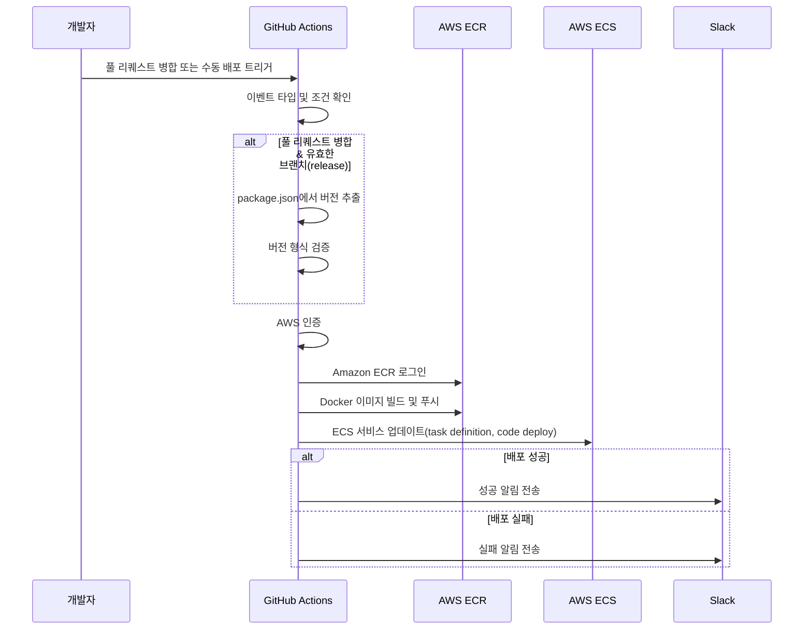

# 0. 프롤로그

> 이전에는 next.js의 standalone과 turborepo의 --docker 옵션을 활용한 도커라이징 하는 방법을 정리하였습니다.
> 이번에는 aws의 ecs를 통해 컨테이너관리를 하고 code deploy를 통해 배포 하는 방법에 대해서 정리 해보겠습니다.

---

# 1. [AWS ECS란?](https://docs.aws.amazon.com/ko_kr/AmazonECS/latest/developerguide/Welcome.html)

> AWS Elastic Container Service(ECS)는 완전관리형 컨테이너 오케스트레이션 서비스입니다. ECS를 사용하면 Docker 컨테이너를 손쉽게 실행 및 관리할
> 수 있으며, 클러스터를 구성하고 애플리케이션을 배포, 관리하는 데 도움을 줍니다.

# 2. ECS와 CodeDeploy를 이용한 배포 과정

아래는 ECS를 통해 컨테이너를 실행하고 CodeDeploy로 배포를 자동화하는 기본적인 과정을 정리한 내용입니다



#### 프로젝트 구조 참고

```
📂 apps
├── 📂 web1
│   ├── 📄 package.json
├── 📂 web2
│   ├── 📄 package.json
📂 pakages
├── 📂 ui
│   ├── 📄 package.json
📄 package.json
📄 package-lock.json
```

## 1-2. 워크플로우 설명

### 1-2-1 git action event type 및 조건 확인

> 프로젝트 구조상 web1과 web2의 코드가 동시에 수정되는 경우가 있습니다. 이러한 상황에서는 개발 과정에 병목현상이 발생하여 일정에 차질이 생길 수 있습니다. 이를 방지하기 위해 특정 브랜치에만 배포되도록 조건문을 설정하였습니다.

```yaml
# 다음 조건에서만 워크플로우 실행:
# 1. PR이 main 브랜치에 병합되었고, 병합된 브랜치가 'release/web1'을 포함하거나
# 2. 수동으로 워크플로우를 실행(workflow_dispatch)하고 version 파라미터가 'latest'인 경우
if: >
  (github.event.pull_request.merged == true &&
  github.event.pull_request.base.ref == 'main' &&
  (contains(github.event.pull_request.head.ref, 'release/web1') || 
  (github.event_name == 'workflow_dispatch' && inputs.version == 'latest')
```

```yaml
# package.json에서 직접 버전을 뽑아 사용하고 이걸 docker image tag에 사용
run: |
  # package.json에서 version 추출
  VERSION=$(jq -r '.version' apps/web1/package.json)
  VERSION="v${VERSION}"

  # 버전 값이 올바른지 검증
  if [[ ! $VERSION =~ ^v[0-9a-zA-Z._-]+$ ]]; then
    echo "유효하지 않은 버전 형식입니다: $VERSION"
    exit 1
  fi

  echo "VERSION=$VERSION" >> $GITHUB_ENV
  echo "확정된 버전: $VERSION"
```

### 1-2-2 docker build 및 ecr push

```yaml
# 도커 이미지 빌드 및 ecr push
# Docker 이미지를 빌드하고 ECR에 푸시하는 코드입니다.
# DOCKER_BUILDKIT를 활성화하여 효율적인 빌드를 지원합니다.
# Docker build 시 필요한 값들을 여기서 넣어 줍니다.
DOCKER_BUILDKIT=1 docker build --no-cache --progress=plain --build-arg PROJECT=web1 -t ${{ secrets.AWS_ECR_REPOSITORY_NEXT }} \
--secret id=aws-access-key-id,env=AWS_ACCESS \
--secret id=aws-secret-access-key,env=AWS_SECRET \
--secret id=aws-default-region,env=AWS_DEFAULT_REGION \
--platform linux/amd64 -f ./deploy/ops/studio/next/next.Dockerfile .
docker tag ${{ secrets.ECR_REPOSITORY }}:latest ${{ secrets.AWS_ECR_REPOSITORY_NEXT }}:${{ env.VERSION }}
docker push ${{ secrets.ECR_REPOSITORY }}:${{ env.VERSION }}
docker push ${{ secrets.ECR_REPOSITORY }}:latest
```

> task definition 이란
> AWS ECS에서 태스크 정의(Task Definition)는 컨테이너화된 애플리케이션을 실행하기 위한 청사진 역할을 합니다. 다음과 같은 주요 기능과 역할을 수행합니다:

task definition 정의

```json
{
  "family": "CODE-DEPLOY",
  "containerDefinitions": [
    {
      "name": "web1",
      "image": "123456789012.dkr.ecr.us-east-1.amazonaws.com/web1-repository",
      "cpu": 0,
      "memoryReservation": 256,
      "portMappings": [
        {
          "name": "next-3000-tcp",
          "containerPort": 3000,
          "hostPort": 0,
          "protocol": "tcp"
        }
      ],
      "essential": true,
      "environment": [],
      "environmentFiles": [],
      "mountPoints": [],
      "volumesFrom": [],
      "linuxParameters": {
        "capabilities": {}
      },
      "privileged": false,
      "readonlyRootFilesystem": false,
      "pseudoTerminal": false
    }
  ],
  "taskRoleArn": "arn:aws:iam::123456789012:role/ecsTaskExecutionRole",
  "executionRoleArn": "arn:aws:iam::123456789012:role/ecsTaskExecutionRole",
  "networkMode": "awsvpc",
  "volumes": [],
  "placementConstraints": [],
  "requiresCompatibilities": ["EC2"],
  "runtimePlatform": {
    "cpuArchitecture": "X86_64",
    "operatingSystemFamily": "LINUX"
  }
}
```

## ECS 작업 정의(Task Definition) 주요 구성 요소 설명

#### containerDefinitions

- **name**: 컨테이너의 식별자로 사용되는 이름 (`web1`)
- **image**: 컨테이너에서 실행할 Docker 이미지의 URI
- **cpu**: 컨테이너에 할당되는 CPU 단위 (0은 작업 수준의 CPU 제한만 적용)
- **memoryReservation**: 컨테이너에 예약된 메모리 크기(MB)
- **portMappings**: 컨테이너와 호스트 간의 포트 매핑 정의
  - **containerPort**: 컨테이너 내부에서 사용하는 포트 (3000)
  - **hostPort**: 호스트에서 매핑될 포트 (0은 동적 포트 할당)
- **essential**: true로 설정 시 이 컨테이너가 실패하면 작업 전체가 중지됨
- **linuxParameters**: Linux 특정 옵션 설정
- **privileged**: 컨테이너에 호스트 장치 접근 권한 부여 여부
- **readonlyRootFilesystem**: 루트 파일 시스템을 읽기 전용으로 마운트 여부

#### taskRoleArn

컨테이너가 AWS 서비스와 리소스에 접근할 때 사용하는 IAM 역할

#### executionRoleArn

ECS가 컨테이너를 실행할 때 필요한 권한(ECR에서 이미지 풀링 등)을 가진 IAM 역할

#### networkMode

컨테이너의 네트워크 모드 (`awsvpc`는 각 작업에 고유한 ENI 제공)

#### requiresCompatibilities

작업이 실행될 인프라 유형 정의 (`EC2`는 EC2 인스턴스에서 실행)

#### runtimePlatform

작업이 실행되는 환경의 CPU 아키텍처 및 운영체제 지정

### 1-2-3 code deploy

## [code deploy란?](https://docs.aws.amazon.com/ko_kr/codedeploy/latest/userguide/welcome.html)

### 주요 특징

#### 1. 자동화된 배포

- **일관된 배포**: 개발, 테스트 및 프로덕션 환경에서 일관된 방식으로 코드 배포
- **복잡한 배포 처리**: 복수의 애플리케이션을 여러 환경에 배포하는 복잡한 과정을 자동화
- **스크립트 실행**: 배포 전/중/후에 사용자 정의 스크립트 실행 지원

#### 2. 다양한 배포 전략 지원

- **인플레이스(In-place) 배포**: 현재 실행 중인 인스턴스에 애플리케이션을 순차적으로 업데이트
- **블루/그린(Blue/Green) 배포**:

  - 기존 환경(블루)과 동일한 새 환경(그린)을 구성
  - 새 버전을 그린 환경에 배포 후 트래픽을 전환
  - 문제 발생 시 쉽게 이전 환경으로 롤백 가능

- **카나리아 배포**: 트래픽의 일부만 새 버전으로 전환하여 위험 최소화

#### 3. ECS와의 통합 특징

- **ECS 서비스 업데이트**: 새 태스크 정의로 ECS 서비스를 자동으로 업데이트
- **트래픽 분할**: 블루/그린 배포 시 트래픽을 점진적으로 이동 가능
- **자동 롤백**: 오류 발생 시 이전 버전으로 자동 롤백 지원

#### 4. 모니터링 및 알림

- **배포 상태 추적**: 배포 진행 상황을 실시간으로 모니터링
- **CloudWatch 통합**: 배포 이벤트를 CloudWatch Events로 전송 및 알림 설정
- **배포 로그**: 각 배포 단계의 상세 로그 제공

```yaml
# code deploy
- name: '[RELEASE] ECS 배포'
  run: |
    aws ecs deploy \
    --region ${{ secrets.AWS_REGION }} \
    --task-definition ./deploy/ops/web1/task-definition.json \
    --cluster ${{ secrets.AWS_ECS_CLUSTER  }} \
    --service ${{ secrets.AWS_ECS_SVC }} \
    --codedeploy-appspec ./deploy/ops/web1/appspec.yml \
    --codedeploy-deployment-group ${{ secrets.AWS_CODE_DEPLOY_DPG }}
```

### 2 슬랙 연동

```yaml
- name: slack-send
  uses: slackapi/slack-github-action@v1.26.0
  with:
    payload: |
      {
        "custom_status": "${{ env.CUSTOM_STATUS }}",
        "workflow": "${{ github.workflow }}",
        "job_build": "build",
        "status_build": "${{ needs.build.result }}",
        "job_deploy": "deploy",
        "status_deploy": "${{ needs.deploy.result }}",
        "actor": "${{ github.actor }}",
        "ref_name": "${{ github.ref_name }}",
        "head_commit_url": "${{ github.event.head_commit.url }}",
        "action_run_url": "${{ env.ACTION_RUN_URL }}"
      }
```

> ECS 설정이 완료되면 인스턴스에서는 두 개의 컨테이너가 동시에 실행됩니다. 하나는 현재 서비스 중인 기존 컨테이너이고, 다른 하나는 새롭게 배포 중인 컨테이너입니다. 배포 과정이 성공적으로 완료되면 시스템은 더 이상 필요하지 않은 이전 컨테이너를 자동으로 종료하고 정리합니다.
> 이러한 방식은 블루/그린 배포 전략의 핵심으로, 새 버전으로 트래픽이 완전히 전환된 후에야 이전 버전의 리소스가 해제되어 시스템 자원을 효율적으로 관리합니다.

다음은 이렇게 구성한 워크 플로우에서 롤백을 어떻게 구현했는지 설명드리겠습니다.
