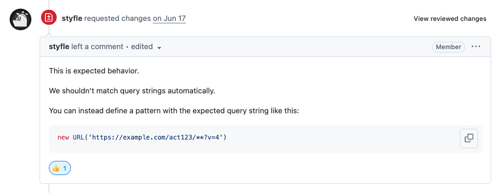

# 3번의 실패 끝에 Next.js 커미터가 된 한 개발자의 성장기

## 들어가며

> "띠링" 새벽 2시, 내 핸드폰에 또 다른 GitHub 알림이 울렸다.  
> **발신자: vercel/next.js**  
> [[제목] : Re:[vercel/next.js] Fix remote pattern (#80294) (PR #80428)](https://github.com/vercel/next.js/pull/80428)  
> 

아, 이건 하면 안 되는 거였구나...

빨간색 **"Closed"** 라벨이 붙은 내 PR을 멍하니 바라보며, 가슴이 철렁 내려앉았다. 잠은 이미 다 깼고, 구글링으로 찾은 "How to contribute to
Next.js" 글들은 아무런 도움이 되지 않았다. 마치 미로에 갇힌 기분이었다.

**"생각보다 많이 어렵네..."**

내적으로 혼잣말을 중얼거렸다. 이전에는 괜히 어려운 걸 도전해서 실패했는데, 이번엔 눈에도 익고 자주 사용하는 기능이라 자신 있었다. 그런데 또 실패했다. 가슴이 답답하고
막막했다.

**"다음엔 어떤걸 도전해볼까? 아니면 그냥 포기할까?"**

이게 나의 두 번째 실패였다. 하지만 포기하고 싶지 않았다. 어딘가에서 '너도 할 수 있어'라는 목소리가 들리는 것 같았다.

3개월 후, 나는 Next.js Contributors 목록에 이름을 올렸다. 그 순간의 짜릿함과 벅참은 지금도 잊을 수 없다.

여러분도 오픈소스 기여에 도전하다가 좌절한 경험이 있으신가요? 그 과정에서 느꼈던 막막함과 불안감, 그리고 다시 일어서고 싶은 마음... 모두 이해합니다. 그 사이에 무슨 일이
있었는지, 지금부터 솔직하게 털어놓겠습니다.

## 첫 번째 실패: "이런 게 개발자의 현실인가?"

### [Fix segment prefetches fail with HTTP 400](https://github.com/vercel/next.js/issues/80014#issuecomment-2927911102)

3개월 전, Next.js 이슈 페이지를 뒤적이던 나는 마치 보물을 발견한 듯 가슴이 뛰었다.

**"이거다! 예제 코드도 있고, 문제 코드 추정 부분까지 친절하게 써있어. 이 정도면 금방 할 수 있겠지?"**

당시 내 마음은 설렘이 90%, 불안감이 10% 정도였다. 솔직히 말하면 **"이거 성공하면 이력서에 써도 되겠는걸?"** 이런 생각까지 들었다. 오픈소스 기여가
Next.js라니, 생각만 해도 가슴이 뛰었다.

실제로는 아무것도 모르는 상태로 무작정 도전했다. 지금 생각해보니 정말 용감했다. App Router의 prefetch라는 실험적인 기능에 덤벼들었는데, 이게 얼마나 복잡한
기능인지도 모르고 말이다. 로컬 환경 설정부터 막혀서 3일 동안 삽질했지만, 그래도 열심히 테스트 코드만큼은 작성했다. 지금도 그 부분은 뿌듯하다.

일주일 후, 내 PR은 조용히 닫혔다. 더이상 어딜 고쳐야 할 지도 진입점도 못 찾았다.

**그 순간의 감정:** 허탈함 100%. 하지만 이상하게도 완전히 포기하고 싶지는 않았다.

비록 실패했지만, 이 과정에서 소중한 것들을 배웠다. e2e 테스트 코드가 `nextTestSetup()`라는 특별한 함수를 사용한다는 것도 이때 처음 알았다. 그리고 가장 뼈아픈
깨달음은 내가 너무 어려운 걸 골랐다는 것이었다. 첫 도전치고는 너무 무모했던 것 같다.

```typescript
// 당시 내가 만든 테스트 코드
import { nextTestSetup } from 'e2e-utils';
import { fetchViaHTTP } from 'next-test-utils';

describe('Segment prefetches with rewritten paths', () => {
  const { next } = nextTestSetup({
    files: __dirname,
  });

  // 필요한 부분만 이렇게 셋팅해서 테스트가 가능 하다.
  it('should fail with HTTP 400 when path is rewritten but hash is incorrect (reproducing issue #80014)', async () => {
    const res = await fetchViaHTTP(next.url, '/test', undefined, {
      headers: {
        RSC: '1',
        'Next-Router-Prefetch': '1',
        'Next-Router-Segment-Prefetch': '/_tree',
      },
    });

    expect(res.status).toBe(200);
  });
});
```

그날 밤, 침대에 누워서 생각했다. "다음엔 좀 더 쉬운 걸로 해야겠어."

## 두 번째 실패: "자신감이 독이 될 줄이야"

### [Fix remote pattern](https://github.com/vercel/next.js/pull/80428)

첫 번째 실패 후 한 달 뒤, 나는 다시 도전장을 내밀었다.

**"이번엔 다르다. `next/image`는 내가 매일 쓰는 컴포넌트잖아. 이정도는 할 수 있어!"**

이번엔 자신감이 70%, 조심스러움이 30% 정도였다. "이번엔 확실히 쉬운 걸로 골랐어"라고 생각했다. `next/image`는 내가 프로젝트에서 매일 사용하는 컴포넌트니까
말이다.

`next/image` 컴포넌트의 쿼리스트링 와일드카드 문제를 선택했다. 이슈를 보면서 "아, 이미지 src에 `?*` 같은 와일드카드가 안 들어가는 거네?"라고 파악했다. 이번엔
테스트 코드도 자신 있게 작성했는데, dist가 있다는 걸 모르고 며칠을 고생했다.

```typescript
import type { RemotePattern } from './image-config';
import { makeRe } from 'next/dist/compiled/picomatch';

// Modifying this function should also modify writeImagesManifest()
export function matchRemotePattern(
  pattern: RemotePattern | URL,
  url: URL,
): boolean {
  if (pattern.protocol !== undefined) {
    if (pattern.protocol.replace(/:$/, '') !== url.protocol.replace(/:$/, '')) {
      return false;
    }
  }
  if (pattern.port !== undefined) {
    if (pattern.port !== url.port) {
      return false;
    }
  }

  if (pattern.hostname === undefined) {
    throw new Error(
      `Pattern should define hostname but found\n${JSON.stringify(pattern)}`,
    );
  } else {
    if (!makeRe(pattern.hostname).test(url.hostname)) {
      return false;
    }
  }

  /**
   *  이 부분을 새로 썻다 기존 테스트 코드도 통과 시키면서 와일드 카드를 허용 시키는 코드였다.
   */
  const patternSearch = pattern.search ?? '';
  const patternPath = pattern.pathname ?? '**';
  const isSpecificWildcardPath =
    patternPath.includes('**') && patternPath !== '**' && patternPath !== '/**';

  if (patternSearch !== '') {
    if (patternSearch !== url.search) {
      return false;
    }
  } else if (url.search && !isSpecificWildcardPath) {
    return false;
  }

  // Should be the same as writeImagesManifest()
  if (!makeRe(pattern.pathname ?? '**', { dot: true }).test(url.pathname)) {
    return false;
  }

  return true;
}
```

```typescript
// 그당시 적었던 테스트 코드
it('should match URLs with wildcard patterns', () => {
  // 허용되는 패턴
  const p = 'https://example.com/act123/**';
  expect(m(new URL(p), new URL('https://example.com/act123/usr4?v=4'))).toBe(
    true,
  );
  expect(
    m(new URL(`${p}/*`), new URL('https://example.com/act123/u/74867549?v=4')),
  ).toBe(true);
});
```

2주 후, 또다시 내 PR이 닫혔다. 이번엔 더 상세한 설명과 함께.

메인테이너: "이 동작은 예상된 동작입니다. 이 코드가 머지되면 안 돼요."

**그 순간 나는 뒤통수를 맞은 기분이었다.**

"아... 이게 버그가 아니라 의도적인 거였구나. 나는 왜 이걸 미리 확인 안 했지?"

이번에도 새로운 걸 배웠다. 단위 테스트 중에도 dist 빌드가 필요한 테스트가 있다는 것이었다. 하지만 가장 중요한 깨달음은 따로 있었다. 바로 이슈를 제대로 이해하지 못했다는
것이다. 내가 버그라고 생각한 것이 사실은 보안상의 이유로 의도적으로 막아놓은 기능이었다.

그날은 정말 자존심이 상했다. 커피숍에 앉아서 노트북을 덮고 한참을 멍때렸다. "내가 개발을 잘못 배운 건가?"

## 세 번째 도전: "AI와 함께라면 다를 거야"

### [Fix before interactive incorrectly render css](https://github.com/vercel/next.js/pull/81146)

두 번의 실패 후 2개월이 지났다. 솔직히 말하면 조금 겁이 났다.

어느 날, AI와 코드 리뷰를 하다가 문득 생각이 들었다. "이번엔 혼자 하지 말고 AI와 함께 해볼까?"

이번엔 마음가짐부터 달랐다. 겸손함이 50%, 신중함이 40%, 기대감이 10% 정도였다. "이번엔 정말 확실하게 하자"는 다짐을 했다. 두 번의 실패를 겪으니 자연스럽게
조심스러워졌다.

**AI와 함께한 과정:**

**나:** "이 이슈 어떻게 생각해?"  
**AI:** "script 컴포넌트의 다른 옵션들은 모두 파싱 함수를 거치는데, 이 부분만 빠져있네요."  
**나:** "맞네! 다른 옵션들은 잘 동작하는데 이것만 안 되고 있어."

```typescript
/**
 * Before starting the Next.js runtime and requiring any module, we need to make
 * sure the following scripts are executed in the correct order:
 * - Polyfills
 * - next/script with `beforeInteractive` strategy
 */

import { setAttributesFromProps } from './set-attributes-from-props';

function loadScriptsInSequence(
  scripts: [src: string, props: { [prop: string]: any }][],
  hydrate: () => void,
) {
  if (!scripts || !scripts.length) {
    return hydrate();
  }

  return scripts
    .reduce((promise, [src, props]) => {
      return promise.then(() => {
        return new Promise<void>((resolve, reject) => {
          const el = document.createElement('script');

          if (props) {
            // 여기 하나 추가 해줬다. 하지만 엄청 짜릿했다.
            setAttributesFromProps(el, props);
          }

          if (src) {
            el.src = src;
            el.onload = () => resolve();
            el.onerror = reject;
          } else if (props) {
            el.innerHTML = props.children;
            setTimeout(resolve);
          }

          document.head.appendChild(el);
        });
      });
    }, Promise.resolve())
    .catch((err: Error) => {
      console.error(err);
      // Still try to hydrate even if there's an error.
    })
    .then(() => {
      hydrate();
    });
}
```

이때의 감정은 정말 특별했다. 마치 퍼즐의 마지막 조각을 맞춘 기분이었달까. AI의 객관적인 시각이 내가 놓친 부분들을 하나씩 짚어주었다.

```typescript
// 그때 보다 훨씬 풍부해지고 깔끔한 테스트 코드를 작성할 수 있게 되었다.
import { nextTestSetup } from 'e2e-utils';

describe('Script component with beforeInteractive strategy CSS class rendering', () => {
  const { next } = nextTestSetup({
    files: __dirname,
  });

  it('should render script tag with correct class attribute instead of classname', async () => {
    const browser = await next.browser('/');

    // Wait for the page to fully load
    await browser.waitForElementByCss('#example-script');

    // Get the HTML content to check the actual rendered attributes
    const html = await browser.eval(() => document.documentElement.innerHTML);

    // Check that the script tag has 'class' attribute, not 'classname'
    expect(html).toContain('class="example-class"');
    expect(html).not.toContain('classname="example-class"');

    // Also verify the script element directly
    const scriptElement = await browser.elementByCss('#example-script');
    const className = await scriptElement.getAttribute('class');

    expect(className).toBe('example-class');
  });

  it('should execute beforeInteractive script correctly', async () => {
    const browser = await next.browser('/');

    // Check that the script executed by looking for its side effects
    const hasExecuted = await browser.eval(() => {
      return (window as any).beforeInteractiveExecuted === true;
    });

    expect(hasExecuted).toBe(true);
  });

  it('should render script in document head with beforeInteractive strategy', async () => {
    const browser = await next.browser('/');

    // Check that the script is in the head section
    const scriptInHead = await browser.eval(() => {
      return document.head.querySelector('#example-script') !== null;
    });

    expect(scriptInHead).toBe(true);
  });

  it('should render multiple beforeInteractive scripts with correct class attributes', async () => {
    const browser = await next.browser('/multiple');

    const html = await browser.eval(() => document.documentElement.innerHTML);

    // Check that both scripts have correct class attributes
    expect(html).toContain('class="first-script"');
    expect(html).toContain('class="second-script"');
    expect(html).not.toContain('classname="first-script"');
    expect(html).not.toContain('classname="second-script"');
  });
});
```

AI와 함께 코드베이스 전체를 체계적으로 분석했다. 이번엔 정말 간단하고 명확한 이슈를 선정했다. script 컴포넌트에서 누락된 유틸 함수를 찾아내는 것이었다. e2e 테스트
코드도 이전보다 훨씬 꼼꼼히 작성했다.

AI와의 대화에서 새로운 사실들을 알게 되었다. script 컴포넌트도 다른 컴포넌트들처럼 일일이 파싱 과정을 거친다는 것이었다. 그런데 다른 옵션들은 모두 동일한 패턴으로
처리되고 있는데, 이 부분만 실수로 빠져있었다. 무엇보다 기존 코드에 전혀 영향을 주지 않는다는 확신을 가질 수 있었다.

3주 후...

**GitHub 알림:** "✅ Merged into main branch"

그 순간을 지금도 생생히 기억한다. 손이 떨렸다. 정말로. 가슴이 벅차올랐고, 눈물까지 날 뻔했다. "드디어 해냈구나!"

## 이 경험이 내게 남긴 것들

감정적으로 많이 성장했다. 무엇보다 실패에 대한 두려움이 줄어들었다. 예전 같으면 한 번 실패하고 나서 주저했을 텐데, 이제는 실패도 성장의 과정이라고 받아들이게 되었다. 혼자서
모든 걸 해결하려는 고집 대신 협력의 힘을 배웠다. 그리고 포기하지 않는 끈기의 가치를 정말 몸으로 느꼈다.

기술적으로도 확실히 늘었다. 복잡한 코드베이스를 읽는 능력이 향상되었고, 테스트 코드 작성 스킬도 많이 늘었다. 무엇보다 이슈를 제대로 분석하는 방법을 익혔다. 단순히 코드만 보는
것이 아니라, 그 이슈가 왜 생겼는지, 어떤 맥락에서 발생한 건지를 파악하는 능력 말이다.

**앞으로의 도전:**
지금은 내가 직접 이슈를 찾아서 기여하고 싶다. 그리고 이 경험을 다른 개발자들과 나누고 싶다.

여러분도 비슷한 경험이 있으신가요? 혹시 오픈소스 기여에 도전하고 싶으시다면, 제 경험이 조금이라도 도움이 되었으면 좋겠습니다. 실패해도 괜찮습니다. 그 실패가 더 큰 성공의
발판이 될 테니까요.

**결국 성공했다. 다음에 또 하라고 하면? 당연히 하고 싶다.**  
**그리고 AI와 함께 하는 이런 협력 방식, 정말 추천하고 싶다.**
