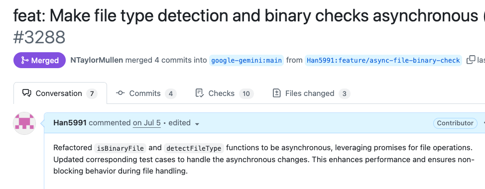
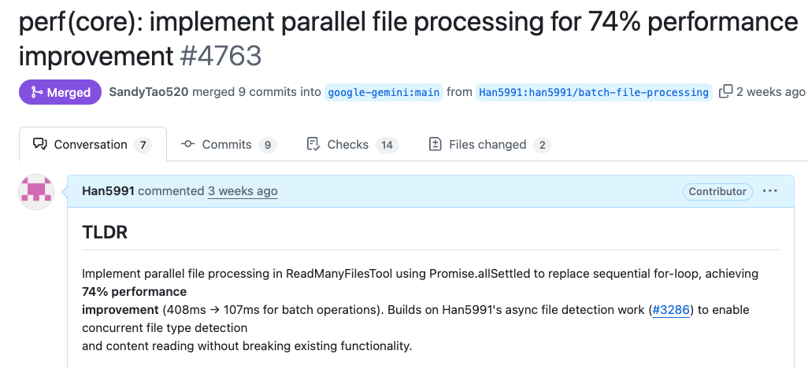

## 들어가며

> 2025년 6월 25일 gemini-cli가 출시 되었습니다.  
> 요즘 cli 환경의 ai 도구들이 많이 나오고 있습니다.  
> 그중에 제가 gemini-cli에 관심을 가지게된 이유는 javascript로 되어 있기 때문이았습니다.  
> 이번 기여는 다른 오픈소스 프로젝트와는 다르게 화재성도 있고 코드베이스도 아직 크지 않았습니다.  
> 게다가 급하게 만들었는지 코드가 여기저기 정리가 되어있지 않는 모습이었습니다.  
> 그리고 일부러 오픈소스로 하여 전세계 개발자들에게 참여를 유도하고 적극적으로 리뷰를 해준다는 점이 매력적이었습니다.**(구글러에게 코드 리뷰 받는다!)**  
> 가장 큰건 구글의 프로젝트였단느 점입니다.  
> **내 코드를 구글의 프로젝트에 넣을 수 있다니!**

## 기여할 것을 찾아보자

설레는 마음으로 코드베이스를 뜯어보기 시작했습니다.  
ai와 함께 코드베이스를 분석하고 기여할 점을 부탁 하였습니다.

**User**

> 여기는 gemini-cli 프로젝트예요. 함께 개선할 점을 찾아봐요!

---

**AI Assistant**

> read-many-files.ts에서 파일 처리가 동기적으로 이뤄지고 있어요. 개선 방향은 아래와 같아요:
>
> - for...of 순회를 Promise 목록 기반 병렬 처리로 전환
> - detectFileType 함수를 비동기로 변경

이 내용을 보았을 때 너무 바꿀 범위가 많다고 생각을 했다.  
그래서 pr을 2개 쪼개어 날리기로 했다.  
두 번이나 pr을 날릴수도 있고 계획적으로 나만의 로드맵을 그려갈 수 있다고 생각을 했다.

1. fileUtils.ts -> 개선
2. read-many-files.ts -> 병렬처리로 전환

## 기여 시작

### 1차 기여: fileUtils.ts 비동기 전환

저 파일안에 있는 `detectFileType` 만 비동기로 만들어도 되었지만
ai는 나에게 좀 더 몇 가지 개선점을 알려주었다.

```javascript
// AS-IS
export function isBinaryFile(filePath: string): boolean {
  try {
    const fd = fs.openSync(filePath, 'r');
    // Read up to 4KB or file size, whichever is smaller
    const fileSize = fs.fstatSync(fd).size;
    if (fileSize === 0) {
      // Empty file is not considered binary for content checking
      fs.closeSync(fd);
      return false;
    }
    const bufferSize = Math.min(4096, fileSize);
    const buffer = Buffer.alloc(bufferSize);
    const bytesRead = fs.readSync(fd, buffer, 0, buffer.length, 0);
    fs.closeSync(fd);

    if (bytesRead === 0) return false;

    let nonPrintableCount = 0;
    for (let i = 0; i < bytesRead; i++) {
      if (buffer[i] === 0) return true; // Null byte is a strong indicator
      if (buffer[i] < 9 || (buffer[i] > 13 && buffer[i] < 32)) {
        nonPrintableCount++;
      }
    }
    // If >30% non-printable characters, consider it binary
    return nonPrintableCount / bytesRead > 0.3;
  } catch {
    // If any error occurs (e.g. file not found, permissions),
    // treat as not binary here; let higher-level functions handle existence/access errors.
    return false;
  }
}

// TO-BE
export async function isBinaryFile(filePath: string): Promise<boolean> {
  let fileHandle: fs.promises.FileHandle | undefined;
  try {
    fileHandle = await fs.promises.open(filePath, 'r');

    // Read up to 4KB or file size, whichever is smaller
    const stats = await fileHandle.stat();
    const fileSize = stats.size;
    if (fileSize === 0) {
      // Empty file is not considered binary for content checking
      return false;
    }
    const bufferSize = Math.min(4096, fileSize);
    const buffer = Buffer.alloc(bufferSize);
    const result = await fileHandle.read(buffer, 0, buffer.length, 0);
    const bytesRead = result.bytesRead;

    if (bytesRead === 0) return false;

    let nonPrintableCount = 0;
    for (let i = 0; i < bytesRead; i++) {
      if (buffer[i] === 0) return true; // Null byte is a strong indicator
      if (buffer[i] < 9 || (buffer[i] > 13 && buffer[i] < 32)) {
        nonPrintableCount++;
      }
    }
    // If >30% non-printable characters, consider it binary
    return nonPrintableCount / bytesRead > 0.3;
  } catch (error) {
    // Log error for debugging while maintaining existing behavior
    console.warn(
      `Failed to check if file is binary: ${filePath}`,
      error instanceof Error ? error.message : String(error),
    );
    // If any error occurs (e.g. file not found, permissions),
    // treat as not binary here; let higher-level functions handle existence/access errors.
    return false;
  } finally {
    // Safely close the file handle if it was successfully opened
    if (fileHandle) {
      try {
        await fileHandle.close();
      } catch (closeError) {
        // Log close errors for debugging while continuing with cleanup
        console.warn(
          `Failed to close file handle for: ${filePath}`,
          closeError instanceof Error ? closeError.message : String(closeError),
        );
        // The important thing is that we attempted to clean up
      }
    }
  }
}
```

> fs.promises 를 붙인 것만으로도 아래와 개선 효과를 볼 수 있다는 걸 ai와 함께 정리 했다.

### 주요 차이점

#### 1. **동기 vs 비동기 처리**

- **AS-IS**: 동기 함수 (`function`)
- **TO-BE**: 비동기 함수 (`async function`)

#### 2. **파일 시스템 API**

- **AS-IS**: 동기 메서드들
  - `fs.openSync()`, `fs.fstatSync()`, `fs.readSync()`, `fs.closeSync()`
- **TO-BE**: 비동기 Promise 기반 메서드들
  - `fs.promises.open()`, `fileHandle.stat()`, `fileHandle.read()`, `fileHandle.close()`

#### 3. **에러 처리**

- **AS-IS**: 간단한 `catch` 블록
- **TO-BE**: 상세한 에러 로깅 + `finally` 블록으로 리소스 정리

#### 4. **리소스 관리**

- **AS-IS**: 명시적 `fs.closeSync(fd)` 호출
- **TO-BE**: `finally` 블록에서 안전한 파일 핸들 정리

### 장단점 비교

#### AS-IS 장점

✅ **간단함**: 코드가 직관적이고 이해하기 쉬움  
✅ **동기 처리**: 순차적 실행으로 디버깅이 용이  
✅ **가벼움**: 추가 Promise 오버헤드 없음

#### AS-IS 단점

❌ **블로킹**: 파일 읽기 중 다른 작업 불가  
❌ **에러 정보 부족**: 디버깅 시 구체적 오류 정보 없음  
❌ **리소스 누수 위험**: 예외 발생 시 파일 디스크립터 정리 불완전

#### TO-BE 장점

✅ **논블로킹**: 다른 작업과 병렬 처리 가능  
✅ **상세한 에러 처리**: `console.warn`으로 디버깅 정보 제공  
✅ **안전한 리소스 관리**: `finally` 블록으로 확실한 정리  
✅ **확장성**: 비동기 생태계와 잘 맞음

#### TO-BE 단점

❌ **복잡성**: 코드가 길어지고 이해하기 어려움  
❌ **Promise 오버헤드**: 작은 성능 비용 발생  
❌ **호출부 변경 필요**: `await` 키워드 추가 필요

### 권장사항

**대량 파일 처리**나 **웹 서버 환경**에서는 **TO-BE** 방식을, **간단한 CLI 도구**나 **소규모 스크립트**에서는 **AS-IS** 방식이 적합합니다.

### fs.promises API 설명

#### 기본 개념

**`fs.promises`** 는 Node.js의 파일 시스템 모듈에서 **Promise 기반의 비동기 API**를 제공하는 네임스페이스입니다.

#### 주요 차이점

##### `fs.openSync()` - 동기 방식

```javascript
const fd = fs.openSync('/path/file', 'r');
// ✅ 즉시 파일 디스크립터 반환
// ❌ 파일이 열릴 때까지 코드 실행 중단 (블로킹)
// ❌ 이벤트 루프 차단
```

##### `fs.promises.open()` - Promise 방식

```javascript
const fileHandle = await fs.promises.open('/path/file', 'r');
// ✅ Promise 반환으로 논블로킹
// ✅ 다른 작업과 병렬 처리 가능
// ✅ FileHandle 객체 반환 (더 안전한 API)
```

#### fs.promises API의 핵심 특징

##### 1. **FileHandle 객체**

```javascript
// 기존: 단순 숫자 파일 디스크립터
const fd = fs.openSync('file.txt', 'r'); // 3 (숫자)

// fs.promises: FileHandle 객체
const fileHandle = await fs.promises.open('file.txt', 'r');
// { fd: 3, read: Function, write: Function, close: Function, ... }
```

##### 2. **자동 리소스 관리**

```javascript
// 위험한 패턴 (동기)
const fd = fs.openSync('file.txt', 'r');
// 에러 발생 시 close 안됨
const data = fs.readSync(fd, buffer, 0, buffer.length, 0);
fs.closeSync(fd);

// 안전한 패턴 (Promise + try/finally)
let fileHandle;
try {
  fileHandle = await fs.promises.open('file.txt', 'r');
  const data = await fileHandle.read(buffer, 0, buffer.length, 0);
} finally {
  await fileHandle?.close(); // 항상 정리됨
}
```

##### 3. **병렬 처리 지원**

```javascript
// 동기: 순차 처리만 가능
const file1 = fs.readFileSync('file1.txt');
const file2 = fs.readFileSync('file2.txt');
const file3 = fs.readFileSync('file3.txt');

// Promise: 병렬 처리 가능
const [file1, file2, file3] = await Promise.all([
  fs.promises.readFile('file1.txt'),
  fs.promises.readFile('file2.txt'),
  fs.promises.readFile('file3.txt'),
]);
```

#### 언제 사용해야 할까?

**fs.promises 사용 권장:**

- 웹 서버, API 서버
- 대량 파일 처리
- 사용자 상호작용이 있는 앱
- 다른 비동기 작업과 함께 사용

**fs.openSync 사용 권장:**

- 빌드 스크립트, CLI 도구
- 간단한 일회성 작업
- 성능보다 단순함이 중요한 경우

> 이런 내용을 기반으로 공부도 되었고 다음 작업을 위해서 1차 [pr](https://github.com/google-gemini/gemini-cli/pull/3288)을 날렸다.



머지 성공을 하고 나서 매우 기뻣다.  
내가 이슈업부터 해서 성능 개선에 기여했다는 사실이 너무나도 좋았던거 같다.  
게다가 다음 작업을 위한 계획까지 세웠으니 말이다.

### 2차 기여: 병렬 처리로 성능 개선

그 다음은 이제 for ..of 문법을 map으로 만든 PromiseList 로 만들고 이것을  
`Promise.allSettled` 을 사용해서 실패와 성공 케이스를 나눠서 처리하게 했다.

이과정에서 약간의 코드리뷰가 있었는대


! 를 없애들라는 것이었다(원래 그렇게 되어 있어서 옮긴건대 말이다.)  
그래서 이렇게 타입을 만들어 성공과 실패 케이스를 나누어서 처리를 하였다.

```typescript
/**
 * Result type for file processing operations
 */
type FileProcessingResult =
  | {
      success: true;
      filePath: string;
      relativePathForDisplay: string;
      fileReadResult: NonNullable<
        Awaited<ReturnType<typeof processSingleFileContent>>
      >;
      reason?: undefined;
    }
  | {
      success: false;
      filePath: string;
      relativePathForDisplay: string;
      fileReadResult?: undefined;
      reason: string;
    };
```

그리고 성능이 중요하다고 생각 하여 병렬 처리에대한 속도 처리 테스트를 만들어 넣었다.

```typescript
it('should process files in parallel for performance', async () => {
  // Mock detectFileType to add artificial delay to simulate I/O
  const detectFileTypeSpy = vi.spyOn(
    await import('../utils/fileUtils.js'),
    'detectFileType',
  );

  // Create files
  const fileCount = 4;
  const files = createMultipleFiles(fileCount, 'Batch test');

  // Mock with 100ms delay per file to simulate I/O operations
  detectFileTypeSpy.mockImplementation(async (_filePath: string) => {
    await new Promise(resolve => setTimeout(resolve, 100));
    return 'text';
  });

  const startTime = Date.now();
  const params = { paths: files };
  const result = await tool.execute(params, new AbortController().signal);
  const endTime = Date.now();

  const processingTime = endTime - startTime;

  console.log(`Processing time: ${processingTime}ms for ${fileCount} files`);

  // Verify parallel processing performance improvement
  // Parallel processing should complete in ~100ms (single file time)
  // Sequential would take ~400ms (4 files × 100ms each)
  expect(processingTime).toBeLessThan(200); // Should PASS with parallel implementation

  // Verify all files were processed
  const content = result.llmContent as string[];
  expect(content).toHaveLength(fileCount);

  // Cleanup mock
  detectFileTypeSpy.mockRestore();
});
```

**이 부분이 좋다고 칭찬을 받았다!**


**이번 pr은 예전 작업부터 시작 한걸 명시해서 그런지 승인이 매우 빠르게 났다.**



## 마무리

이번 경험을 통해 느낀 점들:

- AI와 함께하면 코드베이스 분석이 훨씬 수월함
- 작은 PR부터 시작하면 리뷰어의 신뢰를 얻을 수 있음
- 성능 테스트까지 포함하면 더 좋은 평가를 받음
