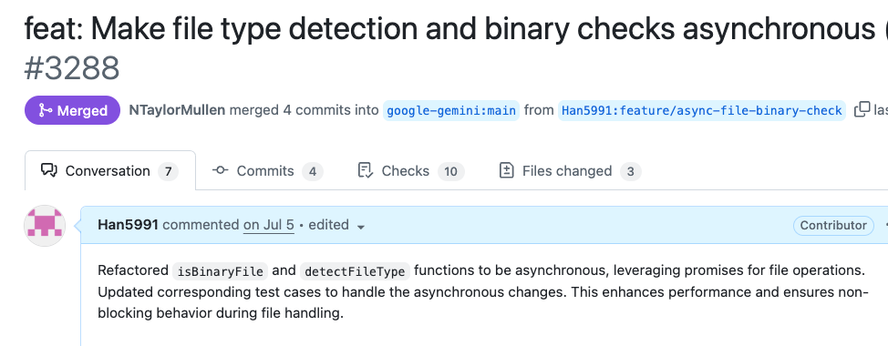
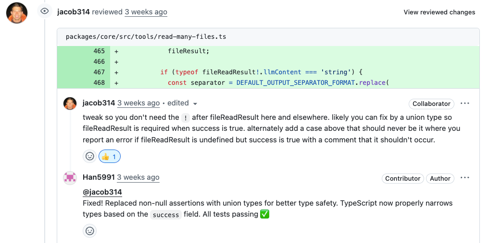
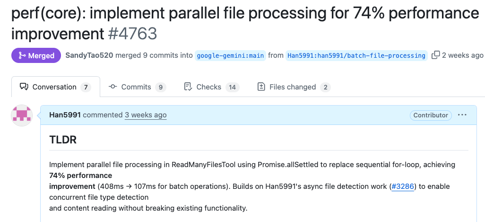

# 구글 개발자에게 인정받은 성능 최적화: gemini-cli 기여 후기

## 이 글을 읽고 나면

- AI와 협업해서 오픈소스 기여하는 방법을 알게 됩니다
- 성능 최적화 PR이 더 좋은 평가를 받는 이유를 이해합니다
- 구글같은 대기업 프로젝트에 기여하는 전략을 배웁니다
- 실제 머지된 PR 사례를 통해 구체적인 노하우를 얻습니다

## 들어가며

> "**내 코드를 구글의 프로젝트에 넣을 수 있다니!**"
>
> 2025년 6월 25일 gemini-cli가 출시되었습니다. CLI 환경의 AI 도구들이 쏟아져 나오는 요즘, 이 프로젝트가 특별했던 이유는:
>
> - **JavaScript 기반**: 익숙한 기술 스택
> - **화제성**: 출시 직후부터 관심 집중
> - **작은 코드베이스**: 아직 분석 가능한 규모
> - **개선 여지**: 급하게 만들어진 티가 여기저기 보임
> - **적극적인 오픈소스**: 전세계 개발자들의 참여를 적극 유도
>
> 무엇보다 **구글러들에게 직접 코드리뷰를 받을 수 있다**는 점이 가장 매력적이었습니다.

## 기여할 것을 찾아보자

설레는 마음으로 코드베이스를 뜯어보기 시작했습니다.  
ai와 함께 코드베이스를 분석하고 기여할 점을 부탁 하였습니다.

ex) 사용했던 프롬프트  
**User**

> 여기는 gemini-cli 프로젝트예요. 함께 개선할 점을 찾아봐요!

---

**AI Assistant**

> read-many-files.ts에서 파일 처리가 동기적으로 이뤄지고 있어요. 개선 방향은 아래와 같아요:
>
> - for...of 순회를 Promise 목록 기반 병렬 처리로 전환
> - detectFileType 함수를 비동기로 변경

---

**User**

> 개선할 코드 제안해주고 이게 어떤 이점을 가져오는지 설명해줘

---

**AI Assistant**

> (변경 코드 보여주고 설명 하는 중)

이 내용을 보았을 `성능관련 기여`를 할 수 있다고 생각을 했고 메인테이너의 입장에서는  
새로운 기능을 추가하는 PR은 메인테이너 입장에서 고려할 게 많습니다.  
프로젝트의 방향성과 맞는지, 다른 기능과 충돌은 없는지, 앞으로 유지보수 비용은 어떨지 등등... 하지만 성능 개선 PR은 `빚을 갚아주는` 것과 같습니다.  
누구도 마다할 이유가 없죠. 프로젝트를 더 건강하게 만드는, 가장 환영받는 기여 중 하나입니다.  
하지만 너무 바꿀 범위가 많다고 생각을 했습니다. 그래서 pr을 2개 쪼개어 날리기로 했습니다.  
두 번이나 pr을 날릴수도 있고 계획적으로 나만의 로드맵을 그려갈 수 있다고 생각을 했습니다.

1. fileUtils.ts -> 개선
2. read-many-files.ts -> 병렬처리로 전환

## 기여 시작

### 1차 기여: fileUtils.ts 비동기 전환

저 파일안에 있는 `detectFileType` 만 비동기로 만들어도 되었지만
ai는 나에게 좀 더 몇 가지 개선점을 알려주었습니다.

```javascript
// AS-IS
export function isBinaryFile(filePath: string): boolean {
  try {
    const fd = fs.openSync(filePath, 'r');
    // Read up to 4KB or file size, whichever is smaller
    const fileSize = fs.fstatSync(fd).size;
    if (fileSize === 0) {
      // Empty file is not considered binary for content checking
      fs.closeSync(fd);
      return false;
    }
    const bufferSize = Math.min(4096, fileSize);
    const buffer = Buffer.alloc(bufferSize);
    const bytesRead = fs.readSync(fd, buffer, 0, buffer.length, 0);
    fs.closeSync(fd);

    if (bytesRead === 0) return false;

    let nonPrintableCount = 0;
    for (let i = 0; i < bytesRead; i++) {
      if (buffer[i] === 0) return true; // Null byte is a strong indicator
      if (buffer[i] < 9 || (buffer[i] > 13 && buffer[i] < 32)) {
        nonPrintableCount++;
      }
    }
    // If >30% non-printable characters, consider it binary
    return nonPrintableCount / bytesRead > 0.3;
  } catch {
    // If any error occurs (e.g. file not found, permissions),
    // treat as not binary here; let higher-level functions handle existence/access errors.
    return false;
  }
}

// TO-BE
export async function isBinaryFile(filePath: string): Promise<boolean> {
  let fileHandle: fs.promises.FileHandle | undefined;
  try {
    fileHandle = await fs.promises.open(filePath, 'r');

    // Read up to 4KB or file size, whichever is smaller
    const stats = await fileHandle.stat();
    const fileSize = stats.size;
    if (fileSize === 0) {
      // Empty file is not considered binary for content checking
      return false;
    }
    const bufferSize = Math.min(4096, fileSize);
    const buffer = Buffer.alloc(bufferSize);
    const result = await fileHandle.read(buffer, 0, buffer.length, 0);
    const bytesRead = result.bytesRead;

    if (bytesRead === 0) return false;

    let nonPrintableCount = 0;
    for (let i = 0; i < bytesRead; i++) {
      if (buffer[i] === 0) return true; // Null byte is a strong indicator
      if (buffer[i] < 9 || (buffer[i] > 13 && buffer[i] < 32)) {
        nonPrintableCount++;
      }
    }
    // If >30% non-printable characters, consider it binary
    return nonPrintableCount / bytesRead > 0.3;
  } catch (error) {
    // Log error for debugging while maintaining existing behavior
    console.warn(
      `Failed to check if file is binary: ${filePath}`,
      error instanceof Error ? error.message : String(error),
    );
    // If any error occurs (e.g. file not found, permissions),
    // treat as not binary here; let higher-level functions handle existence/access errors.
    return false;
  } finally {
    // Safely close the file handle if it was successfully opened
    if (fileHandle) {
      try {
        await fileHandle.close();
      } catch (closeError) {
        // Log close errors for debugging while continuing with cleanup
        console.warn(
          `Failed to close file handle for: ${filePath}`,
          closeError instanceof Error ? closeError.message : String(closeError),
        );
        // The important thing is that we attempted to clean up
      }
    }
  }
}
```

> fs.promises 를 붙인 것만으로도 아래와 개선 효과를 볼 수 있다는 걸 ai와 함께 정리 했습니다.

### 주요 차이점

#### 1. **동기 vs 비동기 처리**

- **AS-IS**: 동기 함수 (`function`)
- **TO-BE**: 비동기 함수 (`async function`)

#### 2. **파일 시스템 API**

- **AS-IS**: 동기 메서드들
  - `fs.openSync()`, `fs.fstatSync()`, `fs.readSync()`, `fs.closeSync()`
- **TO-BE**: 비동기 Promise 기반 메서드들
  - `fs.promises.open()`, `fileHandle.stat()`, `fileHandle.read()`, `fileHandle.close()`

#### 3. **에러 처리**

- **AS-IS**: 간단한 `catch` 블록
- **TO-BE**: 상세한 에러 로깅 + `finally` 블록으로 리소스 정리

#### 4. **리소스 관리**

- **AS-IS**: 명시적 `fs.closeSync(fd)` 호출
- **TO-BE**: `finally` 블록에서 안전한 파일 핸들 정리

### 장단점 비교

#### AS-IS 장점

✅ **간단함**: 코드가 직관적이고 이해하기 쉬움  
✅ **동기 처리**: 순차적 실행으로 디버깅이 용이  
✅ **가벼움**: 추가 Promise 오버헤드 없음

#### AS-IS 단점

❌ **블로킹**: 파일 읽기 중 다른 작업 불가  
❌ **에러 정보 부족**: 디버깅 시 구체적 오류 정보 없음  
❌ **리소스 누수 위험**: 예외 발생 시 파일 디스크립터 정리 불완전

#### TO-BE 장점

✅ **논블로킹**: 다른 작업과 병렬 처리 가능  
✅ **상세한 에러 처리**: `console.warn`으로 디버깅 정보 제공  
✅ **안전한 리소스 관리**: `finally` 블록으로 확실한 정리  
✅ **확장성**: 비동기 생태계와 잘 맞음

#### TO-BE 단점

❌ **복잡성**: 코드가 길어지고 이해하기 어려움  
❌ **Promise 오버헤드**: 작은 성능 비용 발생  
❌ **호출부 변경 필요**: `await` 키워드 추가 필요

### 권장사항

**대량 파일 처리**나 **웹 서버 환경**에서는 **TO-BE** 방식을, **간단한 CLI 도구**나 **소규모 스크립트**에서는 **AS-IS** 방식이 적합합니다.

### fs.promises API 설명

#### 기본 개념

**`fs.promises`** 는 Node.js의 파일 시스템 모듈에서 **Promise 기반의 비동기 API**를 제공하는 네임스페이스입니다.

#### 주요 차이점

##### `fs.openSync()` - 동기 방식

```javascript
const fd = fs.openSync('/path/file', 'r');
// ✅ 즉시 파일 디스크립터 반환
// ❌ 파일이 열릴 때까지 코드 실행 중단 (블로킹)
// ❌ 이벤트 루프 차단
```

##### `fs.promises.open()` - Promise 방식

```javascript
const fileHandle = await fs.promises.open('/path/file', 'r');
// ✅ Promise 반환으로 논블로킹
// ✅ 다른 작업과 병렬 처리 가능
// ✅ FileHandle 객체 반환 (더 안전한 API)
```

#### fs.promises API의 핵심 특징

##### 1. **FileHandle 객체**

```javascript
// 기존: 단순 숫자 파일 디스크립터
const fd = fs.openSync('file.txt', 'r'); // 3 (숫자)

// fs.promises: FileHandle 객체
const fileHandle = await fs.promises.open('file.txt', 'r');
// { fd: 3, read: Function, write: Function, close: Function, ... }
```

##### 2. **자동 리소스 관리**

```javascript
// 위험한 패턴 (동기)
const fd = fs.openSync('file.txt', 'r');
// 에러 발생 시 close 안됨
const data = fs.readSync(fd, buffer, 0, buffer.length, 0);
fs.closeSync(fd);

// 안전한 패턴 (Promise + try/finally)
let fileHandle;
try {
  fileHandle = await fs.promises.open('file.txt', 'r');
  const data = await fileHandle.read(buffer, 0, buffer.length, 0);
} finally {
  await fileHandle?.close(); // 항상 정리됨
}
```

##### 3. **병렬 처리 지원**

```javascript
// 동기: 순차 처리만 가능
const file1 = fs.readFileSync('file1.txt');
const file2 = fs.readFileSync('file2.txt');
const file3 = fs.readFileSync('file3.txt');

// Promise: 병렬 처리 가능
const [file1, file2, file3] = await Promise.all([
  fs.promises.readFile('file1.txt'),
  fs.promises.readFile('file2.txt'),
  fs.promises.readFile('file3.txt'),
]);
```

#### 언제 사용해야 할까?

**`fs.promises` 사용 권장**

- 웹 서버, API 서버
- 대량 파일 처리
- 사용자 상호작용이 있는 앱
- 다른 비동기 작업과 함께 사용

**`fs.openSync` 사용 권장**

- 빌드 스크립트, CLI 도구
- 간단한 일회성 작업
- 성능보다 단순함이 중요한 경우

> 이런 내용을 기반으로 공부도 되었고 다음 작업을 위해서 1차 [이슈](https://github.com/google-gemini/gemini-cli/issues/3286)와 [PR](https://github.com/google-gemini/gemini-cli/pull/3288)을 작성했습니다.

### 실제 이슈 & PR 작성법 공개

**구글러들을 설득한 실제 문서**를 보여드리겠습니다:

#### [이슈 #3286](https://github.com/google-gemini/gemini-cli/issues/3286)

```markdown
# Convert synchronous file binary detection to async to eliminate event loop blocking

## 🚨 Problem

Current file binary detection uses synchronous file operations that:

- Block Node.js event loop causing UI freezing
- Prevent concurrent file processing
- Create poor scalability for large projects

## 📊 Expected Benefits

- 20-80% performance improvement depending on project size
- Improved UI responsiveness
- Enables concurrent file processing foundation

## 🎯 Technical Solution

- Convert `isBinaryFile()` and `detectFileType()` to async
- Use `fs.promises` API for non-blocking operations
- Update all callers to use `await`
```

#### [PR #3288](https://github.com/google-gemini/gemini-cli/pull/3288)

```markdown
# feat: Make file type detection and binary checks asynchronous (#3286)

## 🔧 Changes Made

- Converted sync file operations to async implementations
- Used `fs.promises` for non-blocking file I/O
- Enhanced resource management with proper cleanup
- Updated test cases for async compatibility

## 💡 Why This Matters

"The original sync file operations were blocking the Node.js event loop,
causing UI freezes and poor performance when processing multiple files."

## 🎯 Next Steps

This lays the foundation for parallel file processing (coming in next PR)
```

**리뷰어 반응:**

- **Gemini Code Assist**: _"clean and thorough implementation"_
- **NTaylorMullen**: _"Thanked for the contribution"_ ✅ **승인**



첫 PR이 성공적으로 머지되었을 때의 기쁨은 정말 컸습니다.  
이슈 등록부터 시작해 제 코드로 직접 성능 개선에 기여했다는 성취감, 그리고 다음 기여를 위한 발판까지 마련했다는 생각에 뿌듯했습니다.

### 2차 기여: 병렬 처리로 성능 개선

1차 PR 머지 후, 바로 2차 [이슈](https://github.com/google-gemini/gemini-cli/issues/4712)와 [PR](https://github.com/google-gemini/gemini-cli/pull/4763)을 진행했습니다.

### 📈 2차 작업: 74% 성능 개선

#### 🎯 [이슈 #4712](https://github.com/google-gemini/gemini-cli/issues/4712)

```markdown
# Implement batch/parallel file processing for performance optimization

## 🚀 Goal

Improve file processing performance for large projects by implementing parallel processing

## 📊 Expected Impact

- 20-80% performance improvement
- Better UX for large projects
- Leverage async foundation from previous PR #3288
```

#### 💥 [PR #4763](https://github.com/google-gemini/gemini-cli/pull/4763)

```markdown
# perf(core): implement parallel file processing for 74% performance improvement

## 🔥 Performance Results

- **Before**: 408ms (sequential processing)
- **After**: 107ms (parallel processing)
- **Improvement**: 74% faster! 🚀

## 🛠️ Technical Implementation

- Replaced sequential for-loop with Promise.allSettled()
- Maintained error isolation for individual files
- Added comprehensive performance test coverage
```

**리뷰어들의 극찬:**

- **jacob314**: _"Praised the performance optimization and test coverage"_ ✅ **승인**
- **SandyTao520**: **머지 완료**

이과정에서 약간의 코드리뷰가 있었는대


리뷰어는 ! non-null assertion이 잠재적 버그를 가릴 수 있다고 지적했습니다.  
파일 처리 중 실패하는 엣지 케이스에서 에러를 던지는 대신 undefined를 반환하며 조용히 넘어가버릴 수 있기 때문입니다.  
그의 지적에 따라, 성공과 실패 케이스를 명확히 구분하는 Result 타입을 도입하여 코드의 안정성을 한층 높일 수 있었습니다.  
작은 기호 하나에도 깊은 뜻이 있다는 것을 배운 순간이었습니다.  
그래서 이렇게 타입을 만들어 성공과 실패 케이스를 나누어서 처리를 하였습니다.

```typescript
/**
 * Result type for file processing operations
 */
type FileProcessingResult =
  | {
      success: true;
      filePath: string;
      relativePathForDisplay: string;
      fileReadResult: NonNullable<
        Awaited<ReturnType<typeof processSingleFileContent>>
      >;
      reason?: undefined;
    }
  | {
      success: false;
      filePath: string;
      relativePathForDisplay: string;
      fileReadResult?: undefined;
      reason: string;
    };
```

그리고 성능이 중요하다고 생각 하여 병렬 처리에대한 속도 처리 테스트를 만들어 넣었습니다.

```typescript
it('should process files in parallel for performance', async () => {
  // Mock detectFileType to add artificial delay to simulate I/O
  const detectFileTypeSpy = vi.spyOn(
    await import('../utils/fileUtils.js'),
    'detectFileType',
  );

  // Create files
  const fileCount = 4;
  const files = createMultipleFiles(fileCount, 'Batch test');

  // Mock with 100ms delay per file to simulate I/O operations
  detectFileTypeSpy.mockImplementation(async (_filePath: string) => {
    await new Promise(resolve => setTimeout(resolve, 100));
    return 'text';
  });

  const startTime = Date.now();
  const params = { paths: files };
  const result = await tool.execute(params, new AbortController().signal);
  const endTime = Date.now();

  const processingTime = endTime - startTime;

  console.log(`Processing time: ${processingTime}ms for ${fileCount} files`);

  // Verify parallel processing performance improvement
  // Parallel processing should complete in ~100ms (single file time)
  // Sequential would take ~400ms (4 files × 100ms each)
  expect(processingTime).toBeLessThan(200); // Should PASS with parallel implementation

  // Verify all files were processed
  const content = result.llmContent as string[];
  expect(content).toHaveLength(fileCount);

  // Cleanup mock
  detectFileTypeSpy.mockRestore();
});
```

### 성능 테스트가 게임 체인저였다!

구글러들이 특히 좋아한 부분은 **구체적인 성능 측정 테스트**였습니다.

```typescript
// 실제 성능 개선을 증명하는 테스트
it('should process files in parallel for performance', async () => {
  // 4개 파일 처리 시간 측정
  const startTime = Date.now();
  const result = await tool.execute(params, signal);
  const endTime = Date.now();

  const processingTime = endTime - startTime;

  // 🎯 병렬 처리 효과 검증: 400ms → 200ms 이하
  expect(processingTime).toBeLessThan(200); // ✅ PASS!
});
```

**jacob314의 극찬:**
_"Praised the performance optimization and test coverage"_

** 결과:**

- **74% 성능 향상**: 408ms → 107ms
- **구체적 증거**: 테스트 코드로 성능 개선 입증
- **빠른 승인**: 성능 데이터 덕분에 논의 없이 바로 머지


**이번 PR은 이전 작업과의 연관성을 명시해서 승인이 매우 빠르게 났습니다.**



## 여러분도 구글 프로젝트에 기여해보세요!

이번 경험을 통해 확실히 알게 된 것들:

- **AI와 함께하면 코드베이스 분석이 훨씬 수월함**
- **작은 PR부터 시작하면 리뷰어의 신뢰를 얻을 수 있음**
- **성능 테스트까지 포함하면 더 좋은 평가를 받음**
- **이전 작업과의 연관성을 명시하면 승인이 빨라짐**

### 다음 액션 플랜

이 성공적인 기여 경험을 바탕으로, **더 큰 임팩트를 만들어갈 계획**입니다.

**단기 목표**

- gemini-cli의 TODO 이슈들을 지속적으로 해결하며 **핵심 컨트리뷰터** 지위 확보
- 성능 최적화, 에러 핸들링, 사용자 경험 개선 등 **고부가가치 기여** 집중
