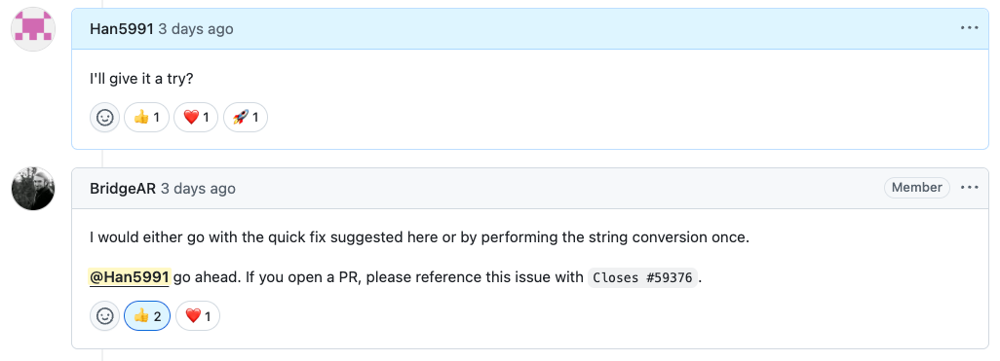
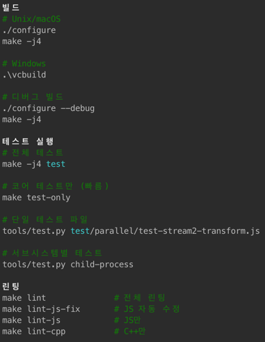

# 4시간 만에 Node.js PR 승인받기 - AI 페어 프로그래밍으로 오픈소스 진입 장벽 낮추기


> “무조건 Node.js에 내 코드를 넣고 말겠다!”  
> 오픈소스 기여가 점점 재미있어지고, 자신감도 차오르던 시기였다.  
> 하지만 매일같이 이슈를 살펴봐도 여전히 모르는 것이 많았다. C++ 코드도 보였고, fs 같은 코어 모듈이 대부분이었기 때문이다. (게다가 그 이슈들을 잘 이해한 것도 아니었다.)  
> 그러던 중 우연히 오픈소스 기여 모임을 알게 되었는데, 조금 특이하게도 AI를 활용한 오픈소스 기여를 주제로 한 모임이었다.  
> 공지 사항에서 본 링크는 나에게 혁신을 가져다 주었다.

## 이슈 탐색

이슈 분석부터 여러워 하고 힘들어 하던 나에게 혁신적인 [링크(이슈 수집기)](https://contribution-issue-collector.streamlit.app/)가 있었다.  
바로 고민도없이 nodejs/node를 때려 넣고 내 토큰을 넣고 모든 이슈를 풀로 땡겼다(지금도 매일 한다.)

그중 하나 걸려든 이슈

> **Issue 23: util.inspect incorrectly formats negative fractional numbers**

- 라벨: 없음
- 내용: numericSeparator: true 옵션 사용시 음수 소수점 숫자 포맷팅 버그
- 원인: formatNumber 함수에서 -0 처리시 부호 손실
- 해결방향: 없음
- 기준 적합도: 상 (상세 재현 코드, 해결방향 명시)
- 기술적 난이도: 중

c++ 내용도 없고, 너무 코어 모듈도 아니며, 넘버 유틸함수 하나 고치는 일이었다.  
그 당시 이슈 생선된 지 5시간이 된 이슈였기에 바로 내가 댓글을 달아 내가 하겠다고 선점 하였다.

그러자 바로 달리는 댓글



메인테이너가 확인 하고 해결방안 및 최적화 방안까지 제시해주었다!!! 지체없이 코드를 고치러 갔다.

## 이슈 분석

내용은 심플 하다

inspect 모듈에 numericSeparator을 줄 때 0과 1사이의 - 부호가 붙으면 출력이 이상하게 된다는 것

```typescript
import { inspect } from 'util';

const values = [0.1234, -0.12, -0.123, -0.1234, -1.234];
const text = inspect(values, { numericSeparator: true });
console.log(text);

// 기대한 것
[ 0.123_4, -0.12, -0.123, -0.123_4, -1.234 ]

// 실제 나온 것
[ 0.123_4, 0..12, 0..12_3, 0..12_34, -1.234 ]
```

이슈 제기자의 말에 따르면 `lib/internal/util/inspect.js` 에 이 코드가 있는대 맨 처음에 number을 받아 string 바꿔버리는 것이었다.  
예를 들어 -0 이면 "0" 으로 바꾸어 버려 부호가 사라지는 것  
고치는 방법 알았으니 이제 고치러 가보자

## 개발 환경 구성

nodejs의 프로젝트를 포크하여 클론 받아 cli 환경에서 /init 를 날려서 ai에게 코드베이스를 학습 하게 했다.

```aiignore
ai: /init
ai: 빌드하는 스크립트나 방버 찾아줘
```



**이 중에 내가 필요한건 전체 빌드 였다.**

```bash
./configure
make -j4
```

에러나 나기 시작 했고 이유는 c++이 없다는 것이었다. ai와 같이 머리를 맡대어 생각해보니
command line tools 을 설치하면 c++이 설치된다는 걸 알았다.  
약간의 삽질로 c++ 설치하는대에 성공 하고 다시 빌드 명령어를 넣었다.  
대략 30분의 시간이 흐르고 빌드 성공했다.

이 때 좀 신기 했다. 내가 nodejs를 빌드 하고 이걸 직접 사용해볼 수 있다니! 하고

빌드 한 node를 가지고 테스트 코드를 돌려보니 잘 돌아간다! 개발 환경 구축 끝!

## 테스트 환경 구성

이제 이슈 기반의 테스트 코드를 작성할 차례다

ai: https://github.com/nodejs/node/issues/59376 기반으로 아직 통과 못 하는 테스트 코드를 만들어줘
ai: 단일 파일의 테스트를 사용하는 방법 알려줘
A: `./out/Release/node test/parallel/test-util-inspect.js` -> 에러 남

이제 이슈 상황을 테스트 코드로 재현 완료 했다. 커밋을 하고 코드 고치기 시작

## bug 고치기

```javascript
/**
* 수정후
**/
function formatNumber(fn, number, numericSeparator) {
  if (!numericSeparator) {
    // Format -0 as '-0'. Checking `number === -0` won't distinguish 0 from -0.
    if (ObjectIs(number, -0)) {
      return fn('-0', 'number');
    }
    return fn(`${number}`, 'number');
  }

  // 메인 테이너의 요구대로 string 바꾸는건 한번만
  const numberString = String(number);
  const integer = MathTrunc(number);

  // 바꾸려는 숫자가 똑같으면 _ 찍어서 내보내기
  if (integer === number) {
    if (!NumberIsFinite(number) || StringPrototypeIncludes(numberString, 'e')) {
      return fn(numberString, 'number');
    }
    return fn(addNumericSeparator(numberString), 'number');
  }

  // NaN이면 함수로 씌워서 리턴
  if (NumberIsNaN(number)) {
    return fn(numberString, 'number');
  }

  * 여기는 실행 되면 안 되지만 방어적 코드로 작성
  * 여기는 이슈제기자가 내 코드를 보고 이 흐름을 모를 수 있다고 하여 나는 이내용을 주석으로 작성
  // ---------------------------------------------------------------------------
  // From this point on, only *non-integer* numbers will reach the code below.
  // Values where `integer === number` (plain integers, exponential notation,
  // Infinity, etc.) have already been returned in the previous branch.
  // For IEEE-754 doubles within the ±2^53 exact-integer range, `String(number)`
  // never inserts a decimal point, therefore encountering
  // `decimalIndex === -1` in the next lines should be impossible under
  // normal circumstances. (kept here as a defensive fallback)
  // ---------------------------------------------------------------------------
  const decimalIndex = StringPrototypeIndexOf(numberString, '.');
  if (decimalIndex === -1) {
    return fn(numberString, 'number');
  }

  const integerPart = StringPrototypeSlice(numberString, 0, decimalIndex); // "-0"
  const fractionalPart = StringPrototypeSlice(numberString, decimalIndex + 1); // "12"

  return fn(`${
    addNumericSeparator(integerPart)   // "-0"
  }.${
    addNumericSeparatorEnd(fractionalPart)  // 결과: "-0.12" (부호 보존!)
  }`, 'number');
}
```

## pull request

이제 ai 에게 요약 해서 pr 메시지를 작성하고 로컬에서 테스트 다 통과했다는 이미지도 넣고 push!

메인 테이너가 매우빠르게 승인 해주었지만 바로 머지되지는 않았다 (나중에 한번에 하려고 하나보다)

이슈 제기자가 내 코드를 보고 버그가 날거라고 이야기 해줬고 난 거기에 테스트 코드 기반으로 이미 다 통과한거라고
했다 이미 이슈제기자가 말한 케이스가 이미 테스트 코드에 있기 때문이었다.

하지만 64비트 IEEE 754 부동 소수점 값을 사용하기에 이런 내용이 내 코드에 담기지 않았다는 것이었다.  
난 이 뜻을 존중하여 이 부분의 주석을 길게 남겨놓았다.(위의 주석 참고)

## 마무리

ai를 활용하여 이슈를 분석 하는 내용이 매우 매우 흥미로웠고  
코드베이스를 학습시켜 빌드나 테스트 환경을 구성하는 건 정말 즐거운 경험이었다.  
이전 좀 더 적극적으로 ai를 활용하여 오픈소스에 기여 및 학습을 해보는 경험을 하고 싶다.
