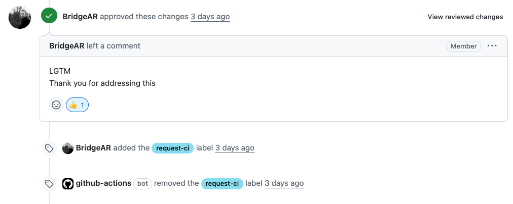
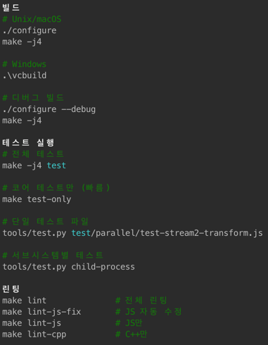
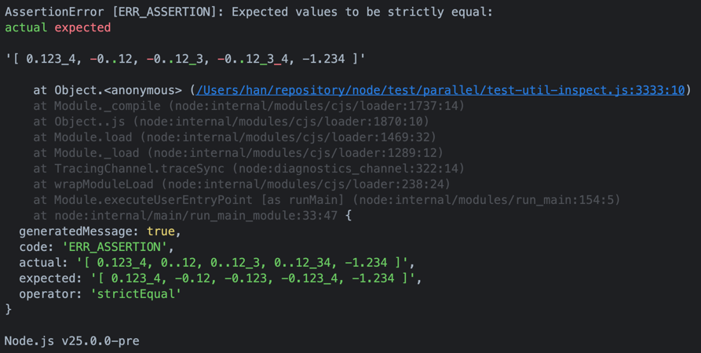

# 4시간 만에 Node.js PR 승인받기

## AI 페어 프로그래밍으로 오픈소스 진입 장벽 낮추기



> “무조건 Node.js에 내 코드를 넣고 말겠다!”  
> 오픈소스 기여가 점점 재미있어지고, 자신감도 차오르던 시기였다.  
> 하지만 매일같이 이슈를 살펴봐도 여전히 모르는 부분이 많았다. C++ 코드가 보이기도 했고, `fs` 같은 코어 모듈이 대부분이었기 때문이다. (게다가 이슈를 완벽히 이해한 것도 아니었다.)  
> 그러던 중 **AI를 활용한 오픈소스 기여 모임**을 알게 되었고, 거기서 본 한 링크가 나에게 혁신을 가져다주었다.

---

## 1. 이슈 찾기: AI로 시작하는 빠른 탐색

이슈 분석에 어려움을 느끼던 내게 구세주가 나타났다.  
바로 [이슈 수집기](https://contribution-issue-collector.streamlit.app/)였다.  
곧장 `nodejs/node` 저장소와 내 토큰을 입력하고 모든 이슈를 긁어왔다. (지금도 매일 한다.)

그중 눈에 들어온 이슈가 있었다.

> **Issue 23: util.inspect incorrectly formats negative fractional numbers**
>
> - **라벨:** 없음
> - **내용:** `numericSeparator: true` 옵션 사용 시 음수 소수점 숫자 포맷팅 버그
> - **원인:** `formatNumber` 함수에서 -0 처리 시 부호 손실
> - **해결 방향:** 없음
> - **적합도:** 상 (재현 코드와 명확한 문제 설명)
> - **기술 난이도:** 중

C++도 없고, 복잡한 코어 모듈도 아닌, 숫자 유틸 함수 하나를 수정하는 일이었다.  
게다가 이슈가 올라온 지 5시간밖에 되지 않아 바로 댓글을 달고 선점했다.

곧 메인테이너가 해결 방향과 최적화 아이디어를 제시해주었고, 나는 지체 없이 코드를 수정하러 들어갔다.

---

## AI 활용 팁: 이슈 선택 시 체크리스트

- **난이도**: 너무 어려운 영역(C++, 네이티브 모듈 등)은 피하고, 변경 범위가 명확한 이슈를 선택합니다.
- **재현 가능성**: 이슈 설명에 재현 코드나 명확한 조건이 포함되어 있는지 확인합니다.
- **라벨 여부**: 'good first issue', 'help wanted' 라벨은 초심자에게 좋은 출발점입니다.

---

## 2. 문제 분석: 버그 원인 파악하기

문제는 간단했다.  
`util.inspect`에서 `numericSeparator` 옵션을 켜면, 0과 1 사이의 음수 값에서 부호가 사라지는 현상이 있었다.

```typescript
import { inspect } from 'util';

const values = [0.1234, -0.12, -0.123, -0.1234, -1.234];
const text = inspect(values, { numericSeparator: true });
console.log(text);

// 기대 출력
[ 0.123_4, -0.12, -0.123, -0.123_4, -1.234 ]

// 실제 출력
[ 0.123_4, 0..12, 0..12_3, 0..12_34, -1.234 ]
```

문제의 원인은 `lib/internal/util/inspect.js`에서 숫자를 문자열로 변환할 때, `-0`이 `"0"`으로 변환되어 부호가 사라지는 것이었다.

---

## 3. 개발 환경 구축: 로컬에서 Node.js 빌드하기

Node.js 저장소를 포크 후 클론 받아 AI CLI 환경에서 코드베이스를 학습시켰다.



처음에는 C++이 없어서 빌드 에러가 발생했다. AI와 함께 원인을 찾아보니 Command Line Tools 설치가 필요했다. 설치 후 다시 빌드하니 약 30분 만에 성공.

처음 직접 빌드한 Node.js를 실행했을 때, 테스트 코드가 정상 동작하는 것을 보고 꽤 뿌듯했다.

---

## AI 활용 팁: 빌드 에러 대처

- **환경 의존성**: C++ 컴파일러, Python 버전 등 필수 의존성을 먼저 확인합니다.
- **빌드 로그 분석**: 에러 메시지를 그대로 AI에게 전달하면 빠르게 해결책을 제시해줍니다.
- **부분 빌드**: 전체 빌드가 오래 걸린다면, 변경된 부분만 빌드하는 방법을 찾아보세요.

---

## 4. 테스트 작성: 버그 재현부터 시작

다음 단계는 재현 테스트 작성이었다.  
이슈(#59376) 내용을 기반으로 아직 통과하지 못하는 테스트를 만들고, 단일 파일 테스트를 실행했다.



```bash
./out/Release/node test/parallel/test-util-inspect.js
```

이슈 상황이 정상적으로 재현되는 것을 확인하고 수정 작업에 착수했다.

---

## 5. 버그 수정: 부호 보존 로직 추가

수정 전 `formatNumber`

```javascript
// 수정 전 (버그가 있던 코드)
const integer = MathTrunc(number);
const string = String(integer);

// 소수점 처리
return fn(
  `${
    addNumericSeparator(string) // <- 여기서 음수 부호 손실
  }.${addNumericSeparatorEnd(
    StringPrototypeSlice(String(number), string.length + 1),
  )}`,
  'number',
);
```

수정 후 `formatNumber`

```javascript
function formatNumber(fn, number, numericSeparator) {
  if (!numericSeparator) {
    if (ObjectIs(number, -0)) return fn('-0', 'number');
    return fn(`${number}`, 'number');
  }

  const numberString = String(number);
  const integer = MathTrunc(number);

  if (integer === number) {
    if (!NumberIsFinite(number) || StringPrototypeIncludes(numberString, 'e')) {
      return fn(numberString, 'number');
    }
    return fn(addNumericSeparator(numberString), 'number');
  }

  if (NumberIsNaN(number)) {
    return fn(numberString, 'number');
  }

  // 원본 문자열에서 직접 소수점 위치 찾기
  const decimalIndex = StringPrototypeIndexOf(numberString, '.');
  // 방어적 주석: IEEE-754에서 이 분기까지 오는 경우는 거의 없음
  if (decimalIndex === -1) return fn(numberString, 'number');

  // 원본 문자열에서 정수/소수 부분 분리
  const integerPart = StringPrototypeSlice(numberString, 0, decimalIndex);
  const fractionalPart = StringPrototypeSlice(numberString, decimalIndex + 1);

  return fn(
     return fn(`${
    addNumericSeparator(integerPart)  // <- 음수 부호 보존
  }.${
    addNumericSeparatorEnd(fractionalPart)
  }`, 'number');
}
```

이유

- 문제: -0.1234에서 Math.trunc(-0.1234) = -0, String(-0) = "0"이 되어 음수 기호가 사라짐
- 해결: 원본 문자열 -0.1234에서 직접 . 앞부분(-0)과 뒷부분(1234)을 분리

메인테이너가 제안한 방향(string 한번만 사용)을 반영하고, 이슈 제기자가 지적한 잠재적 케이스에 대해 방어적 주석을 남겼다.

---

## 6. Pull Request

AI에게 요약을 맡겨 PR 메시지를 작성하고, 로컬 테스트 통과 스크린샷과 함께 Push했다.  
메인테이너는 [빠르게 승인](https://github.com/nodejs/node/pull/59379)을 줬지만, 병합은 다른 PR과 함께 진행하는 듯했다.

이슈 제기자는 내 코드에 특정 케이스에서 버그가 날 수 있다고 했지만, 해당 케이스가 이미 테스트 코드에 포함되어 있었기에 문제없음을 설명했다.

---

## 7. 회고: AI와 함께한 오픈소스 첫걸음

이번 경험에서 느낀 점은 다음과 같다.

1. **AI는 오픈소스 진입 장벽을 크게 낮춰준다.**  
   빌드·테스트 환경 설정, 코드 구조 파악 등에서 큰 도움을 받았다.
2. **작은 이슈도 충분히 가치 있다.**  
   코어 모듈이 아니더라도 유지보수와 품질 개선에 기여할 수 있다.
3. **테스트 코드 작성이 핵심이다.**  
   버그를 명확히 재현하고, 수정 후에도 안정성을 보장할 수 있었다.

앞으로도 AI를 적극적으로 활용해 더 많은 오픈소스 기여와 학습을 이어가고 싶다.
