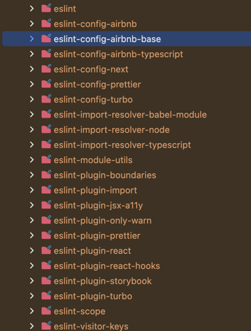
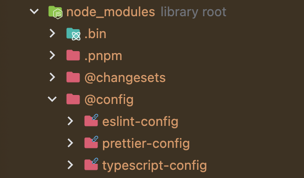

## 0. 프롤로그

> pnpm 9 → 10 업그레이드 후 monorepo에서 eslint가 동작하지 않는 문제를 겪은 경험을 공유 합니다.

---

## 1. 상황설명

> 저희 회사는 `pnpm`을 패키지 매니저로 사용하고 있습니다.  
> 최근 `pnpm 9`에서 `pnpm 10`으로 업그레이드를 진행했습니다.  
> 업그레이드 이후, 기존에 잘 동작하던 `eslint`가 더 이상 제대로 실행되지 않는 문제가 발생했습니다.

**예시 프로젝트 구조**

```
📂 root
├── 📦 apps
│   ├─ 📂 web1
│   └─ 📂 web2
└── 📦 packages
    └─ 📂 @config
       ├── 📂 eslint-config
       ├── 📂 prettier-config
       └── 📂 typescript-config
```

---

## 2. 문제 원인 분석

> 9버전에서는 패키지를 최상단에 설치를 하면 같은 경로 node_modules로 설치가 되었습니다.  
> 그래서 각 앱과 패키지에서 로드 하는대에서 문제가 없었지만  
> 10버전 부터는 최상단으로 올라오지 않고 그대로 패키지 않에 들어 있는 문제가 생겼습니다.

**문제 생기기전**  


**문제가 생긴 후**  


이렇게 로드가 되면 결국 @config 안에만 eslint가 설치가 되어 사용할수가 없게 되어버립니다.

### 2.1 이슈 탐색

pnpm issues를 찾아보니 관련 이슈가 올라왔다.
[pnpm/issues/8378](https://github.com/pnpm/pnpm/issues/8378)  
내용을 살펴보면 eslint의 9버전이 released가 되면서 eslint config가 flat로 바뀌어 더이상 모듈을 호이스트 안 하고 직접 찾아올 수 있게 된겁니다.

사이드 이펙트에대하서 논의가 있었지만 사라진 옵션을 직접 추가하면 된다는 댓글이 있었고 그대로 진행이 되었던겁니다.

### 2.2 해결 방안

1. 새롭게 eslint9로 설정하여 셋팅한다. -> 현재 여유가 없고 기존에 사용하던 룰이 아직 flat에 지원을 안하는 것도 있어 아직은 시기상조
2. eslint를 root에 설치하지 말고 각 app에 설치한다. -> husky에 설정해둔 스크립트가 루트 기준으로 동작을 하고 있어 추가 작업이 필요
3. 사라진 옵션을 직접 추가 한다. -> 가장 간단하고 개발 관련 패키지여서 사이드이펙트도 없음
   ```code
   public-hoist-pattern[]=*eslint*
   public-hoist-pattern[]=*prettier*
   ```

---

## 3. 해결

기존에도 사용하고 옵션이었던 3번으로 해결 하였고, 추후에 eslint9 버전을 적용할 때에 해결 하는것으로 결정하였다.

---

## 4. 느낀점

이번 문제는 pnpm의 버전을 업그레이드 하면서 생긴 문제라는 점을 인식을 하고는 있었지만 브레이크포인트에도 없어 찾기가 어려웠다.
혹시나 해서 gemini에게 물어보니 해당 링크를 찾아주었다. 여러모로 내 시간을 아껴준 것 같아 너무 감사히 쓰고 있다.
그리고 해당 이슈를 가서 보면 현재도 댓글이 계속 달리고 있는 것으로 보아 아직 사이드이펙트가 발생하는 듯 하다.
안정화 되고 나면 eslint9로 올려야지
