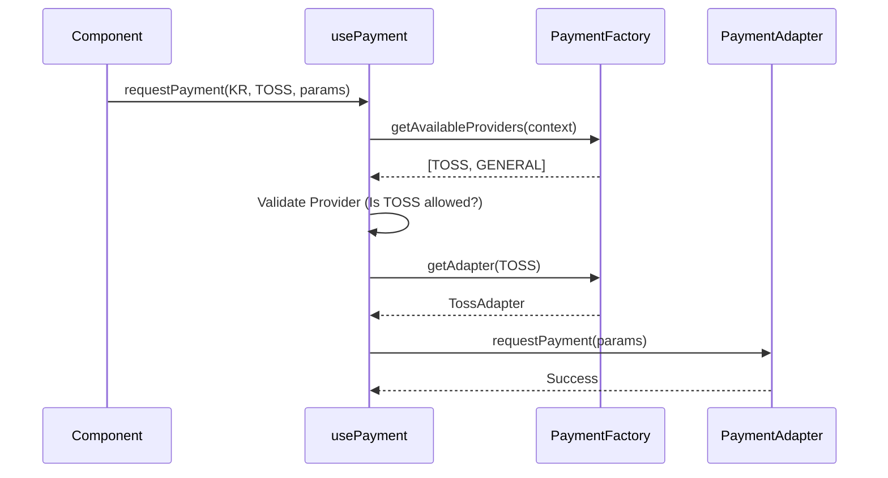

> **"만약 내일 당장 '프랑스'가 서비스 국가로 추가된다면? 그리고 한국에서 '사업자 유형'에 따라 결제 수단이 달라져야 한다면?"**
> 이 질문들이 우리 팀의 결제 시스템 설계를 완전히 바꿔놓았습니다.

---

## 🎭 Prologue: "팀장님의 무리한(?) 요구"

어느 날 오후, 코드 리뷰 중에 팀장님이 툭 던지신 질문 하나가 뇌리를 스쳤습니다.

_"이번에 프랑스(France) 런칭 결정됐어. 기존 **PayPal**이랑 **무통장 입금** 은 그대로 쓰고, 프랑스 국민 결제인 **'Carte Bancaire'** 도 추가해야 돼."_

여기까진 괜찮았습니다. 그런데 덧붙이시더군요.

_"아, 그리고 한국(KR) 쪽 로직도 바꿔야 해. **사업자 유형**이 추가됐거든.
'해당 없음'이면 그냥 기존처럼 **Toss** 쓰면 되는데,
**'개인/법인 사업자'** 를 선택하면 세금계산서 때문에 **'신용카드(Toss)'** 랑 **'법인계좌 송금(무통장)'** 만 허용해야 돼."_

순간 머릿속이 하얘졌습니다.
'국가별 분기도 벅찬데, 국가 안에서 또 조건부 분기라고? `if (country === 'KR' && businessType === 'CORPORATE')`...'

하지만 대답을 주저했습니다. 직감적으로 알았거든요. **"if문 몇 개 추가"** 가 쌓이고 쌓여서, 나중엔 **"건드리기만 하면 터지는 레거시 코드"** 가 된다는 것을요.

그래서 결심했습니다. **"복잡한 요구사항? 설정과 규칙만 정의하면 끝납니다."** 라고 자신 있게 말할 수 있는 구조를 만들어보자고요.

---

## 🛑 1. 평범한 일상: "if문의 지옥" (Before)

초기 결제 시스템은 단순했습니다. 하지만 요구사항이 늘어날수록 코드는 스파게티가 되어갔습니다.

```typescript
// 😱 흔한_결제_로직.ts
const handlePayment = async (country, businessType, paymentMethod) => {
  if (country === 'KR') {
    if (businessType === 'NONE') {
      // 다 됨 (Toss)
    } else {
      // 사업자는 무통장이랑 카드만 됨
      if (paymentMethod === 'VIRTUAL_ACCOUNT')
        throw new Error('사업자는 가상계좌 안됨');
      // ...복잡한 검증 로직...
    }
    // 토스 호출...
  } else if (country === 'FR') {
    // 프랑스 로직...
  }
};
```

**문제점 분석:**

1.  **관심사의 혼재**: '누가 결제 가능한가(Business Rule)'와 '어떻게 결제하는가(Implementation)'가 한 함수에 뒤섞여 있습니다.
2.  **높은 결합도**: PG사 API가 변경되면 비즈니스 로직까지 영향을 받고, 반대로 비즈니스 규칙이 바뀌면 결제 호출 코드도 수정해야 합니다.
3.  **확장성 부족**: 조건이 추가될 때마다 `if-else` 블록을 찾아 헤매야 합니다.

---

## 💡 2. 해결책: "변하는 것과 변하지 않는 것을 분리하라"

무작정 디자인 패턴을 도입하기보다, 문제의 본질을 먼저 파악했습니다.
우리가 겪는 고통의 원인은 **"변하는 것(국가별 규칙, PG사 API)"** 과 **"변하지 않는 것(결제 요청 행위)"** 이 섞여 있기 때문이었습니다.

이를 분리하기 위해 우리는 다음 세 가지 패턴을 적재적소에 배치했습니다.

### 🛠️ 우리가 선택한 도구들

| 패턴         | 핵심 역할                 | 선택 이유                                                                                                     |
| :----------- | :------------------------ | :------------------------------------------------------------------------------------------------------------ |
| **Adapter**  | **호환성(Compatibility)** | 서로 다른 PG사 API를 **하나의 인터페이스로 통일**하여, 클라이언트 코드가 PG사 구현 내용을 몰라도 되게 합니다. |
| **Factory**  | **생성 위임(Delegation)** | 어떤 결제 수단을 쓸지 결정하는 **복잡한 분기 로직(if-else)** 을 별도 객체로 분리하여 관리합니다.              |
| **Strategy** | **유연성(Flexibility)**   | 실행 시점(Runtime)에 상황에 맞는 **알고리즘(UI/로직)을 동적으로 교체**할 수 있게 합니다.                      |

### 🔌 Step 1: Adapter Pattern (통역사 두기)

**Why?**
Toss는 `requestPayment()`, PayPal은 `createOrder()`... PG사마다 메서드명도, 파라미터도 다릅니다. 우리 비즈니스 로직이 이 차이를 다 알 필요가 있을까요?

**Solution**
우리 시스템은 `requestPayment`라는 하나의 언어만 쓰기로 하고, 중간에 **통역사(Adapter)** 를 두어 변환하게 했습니다.

```typescript
// IPaymentAdapter.ts
export interface IPaymentAdapter {
  requestPayment(params: PaymentRequestParams): Promise<void>;
}
```

이제 **Toss**, **PayPal**, **General(무통장)** 각각의 어댑터가 내부적으로 지지고 볶든 말든, 우리 코드는 깔끔해집니다.

> **⚖️ Trade-off**:
>
> - (👍 장점) PG사가 변경되거나 추가되어도 클라이언트 코드는 수정할 필요가 없습니다. (OCP)
> - (👎 단점) 모든 PG사의 기능을 공통 인터페이스로 맞추다 보니, 특정 PG사만의 고유 기능(예: Toss의 전용 포인트 할인)을 살리기 어려울 수 있습니다. 때로는 추상화 누수(Leaky Abstraction)가 발생하여 고유 기능을 억지로 끼워 맞춰야 할 수도 있습니다.

### 🏗️ Step 2: Factory Pattern (규칙 자판기)

**Why?**
"한국 사업자는 무통장만 됨" 같은 규칙은 어디에 둬야 할까요? UI 컴포넌트? 훅? 아닙니다. 이런 규칙이 여기저기 흩어지면 유지보수 지옥이 열립니다.

**Solution**
규칙을 한곳에 몰아넣고, 입력(Context)만 넣으면 결과(Available Providers)를 뱉어주는 **자판기(Factory)** 를 만들었습니다.

```typescript
// PaymentFactory.ts
export const PaymentFactory = {
  getAvailableProviders(context: { country: string; businessType?: string }) {
    // 🇰🇷 한국: 사업자 유형에 따른 동적 필터링 (이곳에 분기 로직이 캡슐화됩니다!)
    if (context.country === 'KR') {
      if (['CORPORATE', 'INDIVIDUAL'].includes(context.businessType)) {
        return [PaymentProviderType.TOSS, PaymentProviderType.GENERAL];
      }
      return [PaymentProviderType.TOSS];
    }
    // ...
  },

  getAdapter(providerType: PaymentProviderType): IPaymentAdapter {
    const adapters: Partial<Record<PaymentProviderType, new () => IPaymentAdapter>> = {
      [PaymentProviderType.TOSS]: TossAdapter,
    };

    const AdapterClass = adapters[providerType];
    if (!AdapterClass) {
      throw new Error(`${providerType}에 대한 어댑터를 찾을 수 없습니다.`);
    }
    return new AdapterClass();
  },
};
```

> **⚖️ Trade-off**:
>
> - (👍 장점) 복잡한 `if-else` 로직이 Factory 한곳으로 격리되어 관리가 쉬워집니다.
> - (👎 단점) 클래스나 객체가 늘어나고, 코드의 흐름을 따라가려면(Factory -> Adapter) 파일을 이동해야 하는 번거로움이 생깁니다.

---

## 🔗 3. 통합: "이 모든 것을 하나로 묶는 마법, usePayment Hook"

제아무리 좋은 설계도 사용하기 불편하면 실패합니다. `usePayment` 훅은 이 모든 복잡성을 감추고 **단일 인터페이스**를 제공합니다.



> **요약**: UI가 훅을 호출하면, 훅은 팩토리에 생성을 위임하고, 반환된 어댑터를 실행합니다.

```typescript
// usePayment.ts
export const usePayment = () => {
  const requestPayment = async (
    context: { country: string; businessType?: string },
    providerType: PaymentProviderType,
    params: PaymentRequestParams,
  ) => {
    // 1. 비즈니스 로직 검증 (Factory에게 위임)
    const allowed = PaymentFactory.getAvailableProviders(context);
    if (!allowed.includes(providerType)) {
      throw new Error('지원하지 않는 결제 수단입니다.');
    }

    // 2. 어댑터 획득 및 실행
    const adapter = PaymentFactory.getAdapter(providerType);
    await adapter.requestPayment(params);
  };

  return { requestPayment };
};
```

---

## 🛡️ 4. 디테일: Zod로 데이터 무결성 철통 방어

설계가 유연해진 만큼, 입력값에 대한 엄격한 검증이 중요해졌습니다. 팩토리가 올바른 객체를 생성하려면 입력값(Context)의 무결성이 보장되어야 하기 때문입니다.

"사업자일 때만 무통장 입금이 가능하다"는 규칙을 UI뿐만 아니라 **데이터 스키마 레벨**에서도 검증하고 싶었습니다. Zod의 `discriminatedUnion`이 빛을 발하는 순간입니다.

```typescript
// schemas.ts

// 1. 일반 유저 (해당 없음)
const KrNormalSchema = z.object({
  businessType: z.literal('NONE'),
  paymentMethod: z.literal(PaymentProviderType.TOSS), // 문자열 대신 enum 사용
});

// 2. 사업자 (개인/법인)
const KrBusinessSchema = z.object({
  businessType: z.enum(['INDIVIDUAL', 'CORPORATE']),
  paymentMethod: z.enum([PaymentProviderType.TOSS, PaymentProviderType.GENERAL]), // 문자열 대신 enum 사용
  registrationFile: z.instanceof(File), // 사업자등록증 필수
});

// 3. 통합 스키마
export const KrPurchaseSchema = z.discriminatedUnion('businessType', [
  KrNormalSchema,
  KrBusinessSchema,
]);
```

이제 잘못된 조합(예: `NONE`인데 `GENERAL` 선택)은 아예 타입 에러가 나거나 검증을 통과할 수 없습니다.

### ⚡️ Strategy Pattern을 활용한 'Lazy Loading UI'

로직만 분리한다고 끝이 아닙니다. UI도 전략 패턴으로 분리할 수 있습니다.
특히 React의 `lazy`를 활용하면, **한국 유저는 프랑스 결제 폼 코드를 다운로드할 필요가 없게 되어(Code Splitting)** 초기 로딩 속도까지 잡을 수 있습니다.

```typescript
// SelfPurchaseOrder/Create/index.tsx
import { Suspense, lazy } from 'react';

// 1. 전략 정의 (Code Splitting)
const UI_STRATEGIES = {
  KR: lazy(() => import('./KrCreate')), // 한국: 복잡한 사업자 로직 포함
  FR: lazy(() => import('./FrCreate')), // 프랑스: 간소화된 UI
  DEFAULT: lazy(() => import('./GlobalCreate')),
};

// 2. 전략 선택 (Strategy Selection)
const PurchaseFormStrategy = ({ country }: { country: string }) => {
  // UI_STRATEGIES의 키에 대한 타입 가드 함수
  const isUIStrategyKey = (key: string): key is keyof typeof UI_STRATEGIES => key in UI_STRATEGIES;

  const TargetForm = isUIStrategyKey(country)
    ? UI_STRATEGIES[country]
    : UI_STRATEGIES.DEFAULT;
  return <TargetForm />;
};

// 3. 상위 컴포넌트에서 우아한 로딩 처리 (Suspense at Page Level)
export const PurchasePage = ({ country }: { country: string }) => {
  return (
    <Suspense fallback={<PageSkeleton />}>
      <PurchaseFormStrategy country={country} />
    </Suspense>
  );
};
```

---

## 🎉 5. 결론: "복잡성은 숨기고, 유연함은 챙기고"

이제 팀장님의 질문에 자신 있게 대답할 수 있습니다.

> **"팀장님, 프랑스 추가든 한국 사업자 조건 변경이든 걱정 마세요. 비즈니스 규칙은 Factory에 모아뒀고, 실행은 Adapter가 알아서 하고, 데이터는 Zod가 지키고 있습니다. 요구사항만 말씀해 주세요."**

### ✅ 이번 리팩토링으로 얻은 것

1.  **비즈니스 로직 격리**: '사업자 유형별 제한' 같은 규칙이 `PaymentFactory` 한곳에 모였습니다.
2.  **안전한 확장**: 새 국가나 결제 수단 추가 시 기존 코드를 건드리지 않아도 됩니다. (OCP)
3.  **타입 안전성**: Zod를 통해 복잡한 조건부 유효성 검사를 선언적으로 해결했습니다.

### 📝 바로 적용해보기 체크리스트

- [ ] 비즈니스 규칙(`if`)이 UI 컴포넌트에 흩어져 있지 않은지 확인한다.
- [ ] 조건에 따라 객체 생성이 달라진다면 `Factory Pattern`을 도입한다.
- [ ] 실행 로직이 다양하다면 `Adapter`로 인터페이스를 통일한다.
- [ ] 복잡한 폼 검증은 `Zod Discriminated Union`으로 해결해본다.

> **여러분은 어떠신가요?**
>
> 혹시 지금 보고 계신 코드에 **"국가 코드"나 "유저 타입"을 체크하는 `if`문이 화면 곳곳에 흩어져 있나요?** 그곳이 바로 팩토리 패턴이 필요한 지점일 수 있습니다. 댓글로 경험을 공유해주세요!

<br>

**태그**: #TypeScript #DesignPattern #FactoryPattern #AdapterPattern #Zod #Refactoring #결제시스템
