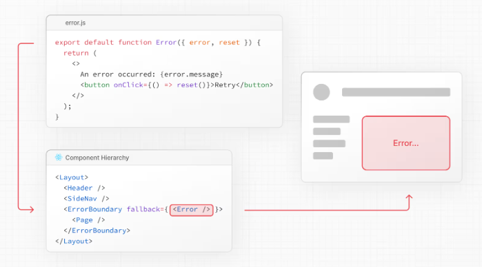

## 0. 프롤로그

> 이전까지는 javascript의 try catch과 React의 ErrorBoundary로 error 객체의 전파와 핸들링하는 방법에 대해 알아 보았습니다.
> <br/>이번글에서는 Next.js의 error.js와 동작 방법에 대해 알아보겠습니다.

---

## 1. Next.js error.js란? [공식홈피](https://nextjs.org/docs/app/api-reference/file-conventions/error)

- Next.js 13부터 제공되는 기능으로, 애플리케이션의 에러를 처리하는 데 사용됩니다.
- 애플리케이션의 모든 에러를 처리할 수 있는 global-error 와 특정 페이지의 에러를 처리할 수 있는 error로 나뉘어 집니다.

1. Next.js의 기본 에러 처리 흐름
   1. 서버를 시작 하면 각 경계의 error.tsx를 찾아 AppRouter에 넣어줍니다. [next.js app-router](https://github.com/vercel/next.js/blob/canary/packages/next/src/client/components/app-router.tsx#L690C1-L714C2)
      - ErrorBoundary next.js [참조](https://github.com/vercel/next.js/blob/canary/packages/next/src/client/components/error-boundary.tsx#L66C1-L145C2)
   2. 각 layout에서 사용할 provider를 설정해줍니다. [참조](https://github.com/vercel/next.js/blob/canary/packages/next/src/client/components/app-router.tsx#L669)
   3. 아래 그림과 같이 ErrorBoundary가 구성됩니다. 
   4. 에러가 발생하면 ErrorBoundary의 까지 전파되어 처리됩니다.

---

## 2. Next.js가 에러를 처리하는 방식과 React ErrorBoundary의 차이점

Next.js는 페이지별로 에러 처리를 할 수 있는 기능을 제공합니다. 예를 들어, 특정 경로에 `error.js` 또는 `error.tsx` 파일을 정의하면 해당 경로와 매핑된
페이지에서 발생한 에러만을 처리할 수 있습니다. 이 방식은 페이지 단위로 에러를 관리 가능하게 해주며, 전체 애플리케이션에 영향을 주지 않고 단일 페이지의 에러만 독립적으로 처리할
수 있습니다.

다음은 Next.js에서 페이지별 에러 처리를 구현하는 예제입니다:

```tsx
// app/web/error.js
'use client';

export default function Error({ error, reset }) {
  return (
    <div>
      <h2>An error occurred in the Blog Page!</h2>
      <p>{error.message}</p>
      <button onClick={() => reset()}>Retry</button>
    </div>
  );
}
```

위 코드는 `/blog` 경로에서 발생한 에러를 처리하기 위한 파일입니다. `reset` 함수를 호출하여 상태를 초기화하고, 에러 핸들링 후 동작을 재시도할 수 있습니다.

한편, React의 `ErrorBoundary`는 특정 컴포넌트 단위에서 발생하는 에러를 처리할 수 있도록 합니다. ErrorBoundary를 사용하면 UI의 일부에서 발생하는
에러를 다른 컴포넌트로 전파시키지 않고 해당 컴포넌트 내부에서 처리할 수 있습니다.

다음은 React의 `ErrorBoundary`를 사용하여 컴포넌트 단위의 에러 처리를 구현하는 예제입니다:

```tsx
import { notFound } from 'next/navigation';
import type { Post } from '../page';
import Page1 from './Page1';
import Page2 from './Page2';
import { ErrorBoundary } from '@/components';

type PostProps = {
  params: Promise<{ id: string }>;
};

const Post = async ({ params }: PostProps) => {
  const { id } = await params;
  const res = await fetch(`https://api.vercel.app/blog/${id}`);
  if (res.status === 404) {
    notFound();
  }

  const data = (await res.json()) as Post;

  return (
    <>
      <div>{data.title}</div>
      <ErrorBoundary>
        <Page1 />
      </ErrorBoundary>
      <ErrorBoundary>
        <Page2 />
      </ErrorBoundary>
    </>
  );
};

export default Post;
```

이 방식에서는 `ErrorBoundary`가 감싸고 있는 `Page1` 과 `Page2` 컴포넌트에서 발생하는 에러를 각각 처리할 수 있습니다.

### 2.1 실제 시나리오에서의 사용 전략

- **통합 접근**:
  Next.js error.js와 React ErrorBoundary는 상호 보완적인 역할을 수행할 수 있습니다.

  - 전역 또는 페이지 수준에서는 error.js를 통해 큰 틀의 에러 핸들링을 관리하며,
  - 세부 컴포넌트 수준에서는 ErrorBoundary를 사용해 특정 영역의 예외 상황에 대해 상세하게 대응하는 방식이 효과적입니다.

- **상황에 따른 선택**:
  - **페이지 전체가 영향을 받는 에러**의 경우: error.js를 사용하여, 전체 페이지 혹은 애플리케이션 차원의 복구 및 사용자 안내 메시지를 집중 관리하는 것이 유리합니다.
  - **특정 컴포넌트 내부의 작은 예외 처리**가 필요한 경우: ErrorBoundary를 통해 컴포넌트 내부의 에러를 캡처하고, 복구 로직 혹은 사용자 피드백을 제공함으로써, 나머지 페이지에 영향을 주지 않는 방식으로 처리하는 것이 효과적입니다.

Next.js의 error.js와 React의 ErrorBoundary는 개별적으로 사용될 수도 있지만, 함께 조합하면 더욱 강력한 에러 관리 시스템을 구축할 수 있습니다.

---

## 3. 결론

Next.js의 error.js 기능을 통해, 애플리케이션 전반에 걸친 에러 관리가 한층 체계적이고 유연하게 구현될 수 있음을 확인할 수 있습니다.

- **글로벌 및 페이지별 에러 처리**
  Next.js는 전역적으로 발생하는 에러와 특정 페이지에서 발생하는 에러를 구분하여 처리할 수 있도록 지원합니다. 이를 통해, 전체 애플리케이션에 영향을 주지 않으면서도 특정 페이지의 문제를 독립적으로 해결할 수 있습니다.
- **React ErrorBoundary와의 차별화**
  React의 ErrorBoundary는 컴포넌트 단위에서 발생하는 에러를 효과적으로 처리하지만, Next.js의 error.js는 애플리케이션 레벨에서 보다 구조적인 에러 핸들링을 제공합니다. 이로 인해, 에러 상황에 따른 사용자 경험(UX)을 더 세밀하게 제어할 수 있습니다.
- **실무에서의 유연한 적용**
  에러 발생 시 전체 에러 페이지를 띄우기 보다는 각 컴포넌트에서 에러를 처리하여 좀 더 유연한 사용자 경험을 제공할 수 있습니다.

결국 Next.js의 error.js를 적절히 활용하면, 애플리케이션의 안정성을 강화하고 예기치 못한 에러 상황에서도 사용자에게 원활한 경험을 제공할 수 있습니다. 이러한 기능을 적절히 활용하여 유지보수성이 뛰어난 Next.js 애플리케이션을 구축해 보시길 바랍니다.
[예제 코드 확인](https://github.com/Han5991/fe-lab/blob/main/apps/next.js/src/app/error/server/blog/%5Bid%5D/page.tsx)
