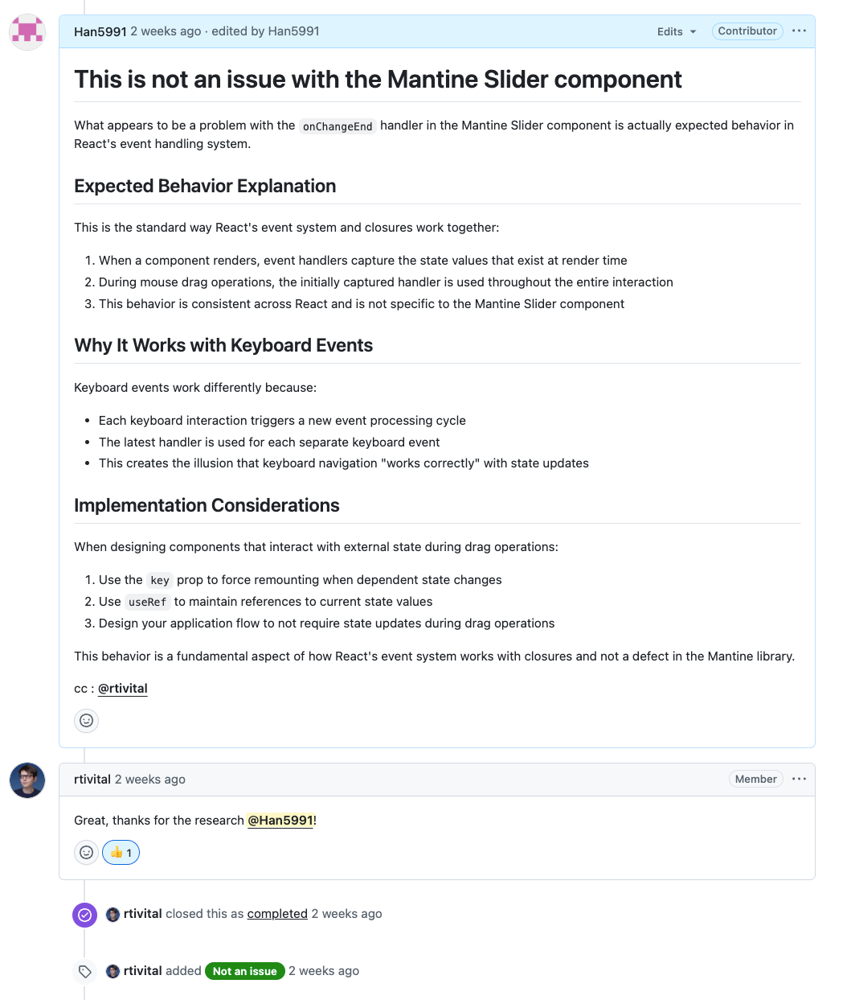
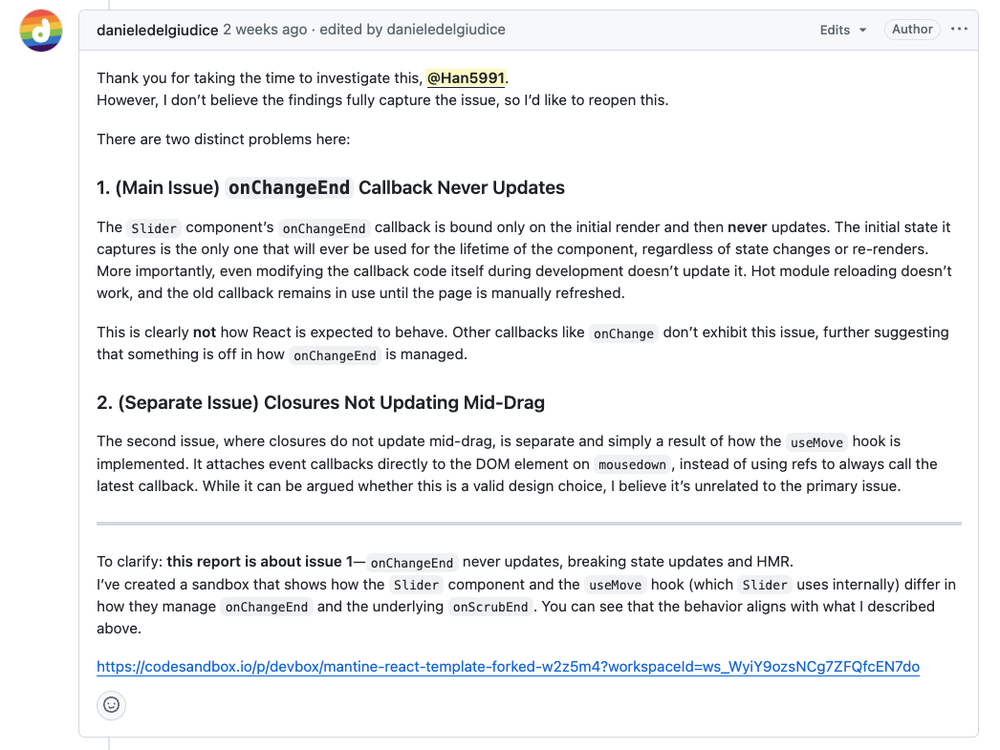
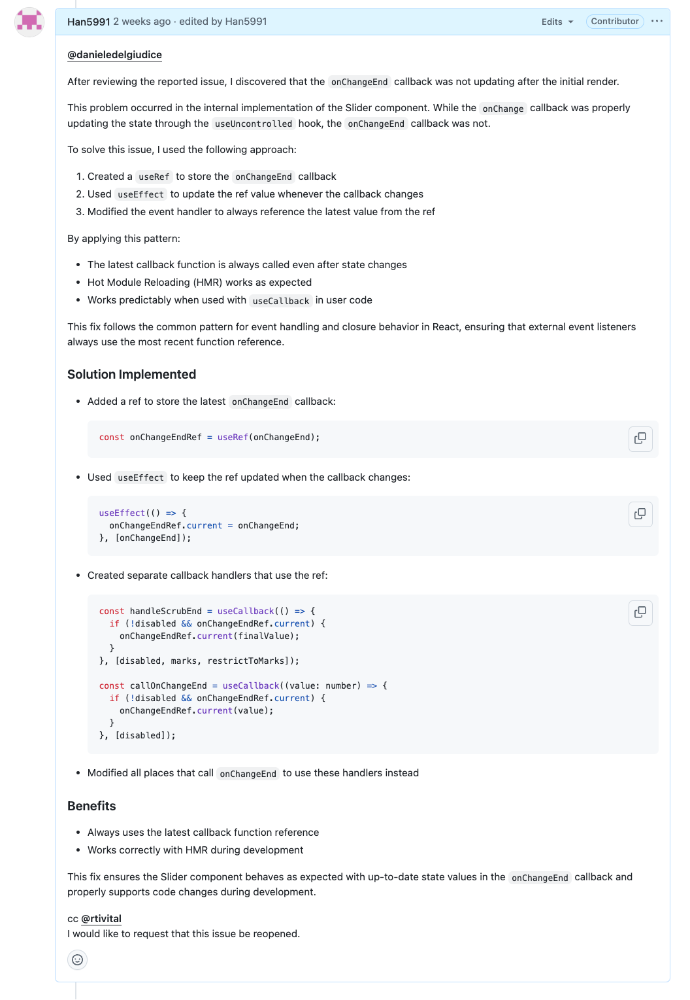
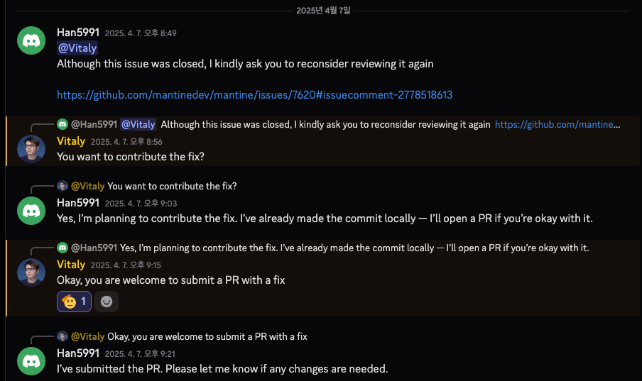

# 0. 프롤로그

> **"내가 자주 사용하는 오픈 소스에 기여 해보고 싶다."** 늘 마음 한켠에 있었지만, 다른 사람의 기여 후기를 보거나 기여 방법을 보아도 막막 했습니다.  
> 그러던 중, 회사 프로젝트에서 Slider를 구현해야 할 일이 생겼습니다. 디자이너님께서 전달해주신 피그마 시안을 보자마자 든 생각은 **"아... 망했다 저 기능 없는대"** 였습니다.

---

## 1. 상황 설명

> 저희 팀은 작년부터 자체 디자인 시스템을 구축하여 사용하고 있습니다.
[Mantine + panda-css](https://velog.io/@rewq5991/%EB%94%94%EC%9E%90%EC%9D%B8-%EC%8B%9C%EC%8A%A4%ED%85%9C-%EC%8B%9C%EC%9E%91%ED%95%B4%EB%B3%B4%EA%B8%B0)를 조합하여 사용 합니다.  
따라서 디자인은 디자인 시스템의 컴포넌트를 활용하거나, mantine 공식 홈페이지를 참고하여 구현합니다.

> 그런데 전달받은 슬라이더 디자인 시안을 구현하는 데 필요한 특정 옵션이 Mantine 공식 문서에 없다는 사실을 발견했습니다.
> 그 순간 **"아... 이 기능 없는데 큰일이다."** 라는 생각이 들었고, 곧바로 담당 PM과 디자이너에게 상황을 공유하며 도움을 요청했습니다.
> "현재 이 기능은 Mantine에서 공식적으로 지원하지 않아 바로 구현하기는 어려워 보입니다. 일단 해당 기능을 제외하고 진행하는 방향으로 다시 논의해보는 것은 어떨까요?"
> 다행히 제 의견이 수용되어, 해당 기능은 추후 다시 구현하기로 하고 1차 구현을 진행했습니다.

> 1차 구현 완료 후, 미구현 기능을 어떻게 구현할 수 있을지 고민하며 Mantine의 전체 코드를 내려받아 슬라이더 부분을 분석하기 시작했습니다.
> 코드를 분석하던 중 **'분명 나만 이런 어려움을 겪는 것은 아닐 거야!'** 라는 생각이 들어 GitHub에서 관련 이슈나 토론 글들을 찾아보았습니다.
> 하지만 비슷한 사례를 찾기 어려웠고, **'아, 정말 나만 겪는 문제였나...'** 하는 생각과 함께 다시 이슈 목록을 살펴보던 중, 슬라이더 관련 이슈 하나를 발견하게 되었습니다.

> 이슈 내용을 자세히 읽어보니, 이슈 제기자가 코드나 동작 방식에 대해 충분히 이해하지 못한 상태에서 문제를 제기한 것으로 보였습니다.
> 옆자리 동료와 함께 해당 이슈를 더 자세히 살펴보았습니다.
> 그러던 중 동료가 키보드로 슬라이더를 조작해보며 **"이슈 내용에는 키보드로는 정상 작동한다고 되어 있네요?"** 라고 말했습니다.
> 그 말을 듣는 순간, 제가 파악한 문제 해결 방법을 Mantine 코드에 적용할 수 있겠다는 확신이 들었습니다!

> 바로 이슈 댓글을 통해 메인테이너에게 제가 수정해도 괜찮은지 물었고, 다행히 긍정적인 답변을 받았습니다.

---

## 2. 이슈 파악
**[이슈 링크](https://github.com/mantinedev/mantine/issues/7620)**

- **문제 현상**: 상태 변경과 함께 `onChangeEnd` 콜백이 제대로 업데이트되지 않음
- **발생 환경**: Slider를 제어 컴포넌트(controlled component)로 사용할 때 발생
- **특이사항**:
    - 마우스로 슬라이더를 조작할 때만 문제 발생
    - 키보드로 조작할 때는 정상 작동
    - 비제어 컴포넌트(uncontrolled)로 만들면 문제가 해결됨

- **원인 분석**: Slider 컴포넌트 내부에서 상태 업데이트와 이벤트 핸들러 간의 동기화 문제로, React의 closure 특성과 관련된 이슈로 판단됨

```tsx
import "@mantine/core/styles.css";
import { MantineProvider, Slider, Button, Stack } from "@mantine/core";
import { useCallback, useState } from "react";

export default function App() {
  return (
    <MantineProvider>
      <Demo />
    </MantineProvider>
  );
}

function Demo() {
  const [value, setValue] = useState(0);
  const [state, setState] = useState(10);

  // useCallback으로 인해 state 값이 클로저에 캡처됩니다.
  // state가 변경되어도 handleChangeEnd는 재생성되지 않으면 이전 state 값을 참조합니다.
  const handleChangeEnd = useCallback(() => {
    // 마우스 조작 시, 이 alert 창에는 이전 state 값이 표시될 수 있습니다.
    alert(`state: ${state}`);
  }, [state]);

  return (
    <Stack p="lg">
      <p>Increase the state then try changing the slider</p>
      {/* value와 onChange를 통해 제어 컴포넌트로 사용 */}
      <Slider value={value} onChange={setValue} onChangeEnd={handleChangeEnd} />
      <Button onClick={() => setState((prev) => prev + 1)}>
        Increase state ({state})
      </Button>
    </Stack>
  );
}
```

주말 동안 고민한 결과, 이 문제는 근본적으로 React 클로저의 동작 방식과 관련된 것이므로 Mantine 라이브러리 자체를 수정하기보다는 사용하는 측에서 주의해야 할 부분이라고 생각했습니다. 이러한 의견을 이슈에 댓글로 남겼고, 메인테이너도 동의하여 이슈는 바로 닫혔습니다.



하지만 얼마 지나지 않아 이슈 제기자가 다시 의견을 제시했습니다. 그의 의견 중 **`onChangeEnd` 콜백 관리 방식 자체에 개선의 여지가 있다**는 부분에 공감했고, 다시 코드를 살펴보며 수정 방향을 고민하기 시작했습니다.




## 3. 문제 해결

Mantine의 Slider 컴포넌트는 내부적으로 useUncontrolled Hook을 사용하여 value의 상태를 관리합니다.
```tsx
// Slider.tsx
const [_value, setValue] = useUncontrolled({
  value: typeof value === 'number' ? clamp(value, min!, max!) : value,
  defaultValue: typeof defaultValue === 'number' ? clamp(defaultValue, min!, max!) : defaultValue,
  finalValue: clamp(0, min!, max!),
  onChange,
});
```

```tsx
export function useUncontrolled<T>({
  value,
  defaultValue,
  finalValue,
  onChange = () => {},
}: UseUncontrolledInput<T>): [T, (value: T, ...payload: any[]) => void, boolean] {
  const [uncontrolledValue, setUncontrolledValue] = useState(
    defaultValue !== undefined ? defaultValue : finalValue
  );

  const handleUncontrolledChange = (val: T, ...payload: any[]) => {
    setUncontrolledValue(val);
    onChange?.(val, ...payload);
  };

  if (value !== undefined) {
    return [value as T, onChange, true];
  }

  return [uncontrolledValue as T, handleUncontrolledChange, false];
}
```

`useUncontrolled` 훅은 `value`와 `onChange`를 관리하며 상태 동기화를 처리하고 있었습니다. 여기서 아이디어를 얻어, **`onChangeEnd` 콜백도 비슷한 방식으로 관리하면 되지 않을까?** 하는 생각이 들었습니다. 즉, `onChangeEnd` 콜백 함수가 변경될 때마다 최신 함수를 참조하도록 만들면 문제를 해결할 수 있을 것 같았습니다.  
이 아이디어를 바탕으로 `useRef`를 사용하여 `onChangeEnd` 콜백을 관리하는 코드를 작성했습니다. `useRef`는 컴포넌트의 생애주기 동안 동일한 참조를 유지하며, `.current` 프로퍼티를 통해 최신 값을 읽거나 업데이트할 수 있습니다.

```tsx
// 해결 코드
const onChangeEndRef = useRef(onChangeEnd);

useEffect(() => {
  onChangeEndRef.current = onChangeEnd;
}, [onChangeEnd]);
```

이 방식을 적용하니 예상대로 문제가 해결되었습니다! `useRef`를 통해 항상 최신 `onChangeEnd` 함수를 참조하게 되면서, 외부 상태(`state`)가 변경되어도 콜백이 올바르게 동작하는 것을 확인했습니다.
기쁜 마음에 메인테이너에게 다시 PR을 열어달라고 요청했습니다.



## 4. 머지 과정

하지만 닫혔던 이슈여서인지 메인테이너의 응답은 바로 오지 않았습니다.
하루 이틀 시간이 지나면서 혹시 거절당하는 것은 아닐까 하는 걱정에 자신감이 조금씩 떨어졌습니다.
그러다 문득 Mantine의 디스코드 커뮤니티가 있다는 것을 떠올렸고, 바로 찾아가 메인테이너에게 직접 연락했습니다




다행히 메인테이너는 제 해결책을 긍정적으로 검토해주었고, 다시 PR을 올려달라고 답변해주었습니다.  
기쁜 마음을 감추지 못하고 바로 PR을 생성하여 제출했습니다. 이제 머지되기만을 기다리던 며칠 뒤, 출근길 아침에 습관처럼 확인한 메일함에 반가운 알림이 와 있었습니다.  
바로 제 PR이 머지되었다는 소식이었습니다! 운 좋게도 해당 변경 사항은 바로 다음 버전 릴리스에 포함되어 배포까지 이어졌고,  
저는 Mantine 프로젝트의 컨트리뷰터 목록에 당당히 이름을 올릴 수 있게 되었습니다.

**[머지 링크](https://github.com/mantinedev/mantine/pull/7660)**  
**[배포 링크](https://github.com/mantinedev/mantine/releases/tag/7.17.4)**

## 5. 느낀점

> 첫 오픈소스 기여를 통해 정말 많은 것을 배우고 경험했습니다.
> - 오픈소스를 로컬 환경에 `포크하여 개발 환경을 구축`하는 과정
> - GitHub에서 다른 개발자들과 `이슈를 통해 의견을 나누고 소통`하는 경험
> - PR 승인을 위해 `디스코드 커뮤니티까지 찾아가 적극적으로 소통`했던 여정
>
> 이번 경험을 통해 기여할 기회는 생각보다 가까이에 있으며, 평소 관심 있는 `오픈소스 코드를 꾸준히 살펴보고 분석하는 습관`이 중요하다는 것을 깨달았습니다.  
> 무엇보다 문제 해결 과정 자체와 다른 개발자들과 협력하는 경험이 너무나 즐거웠습니다.  
> 앞으로도 꾸준히 오픈소스 생태계에 기여하고 싶다는 강한 동기 부여가 되었습니다.