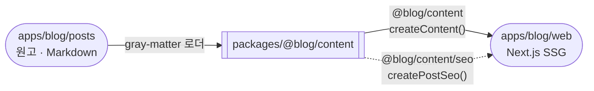
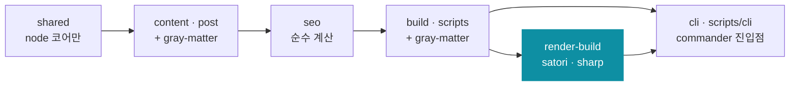
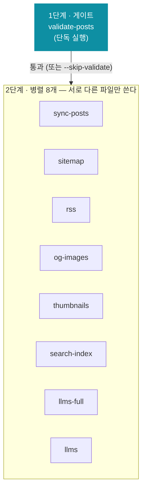
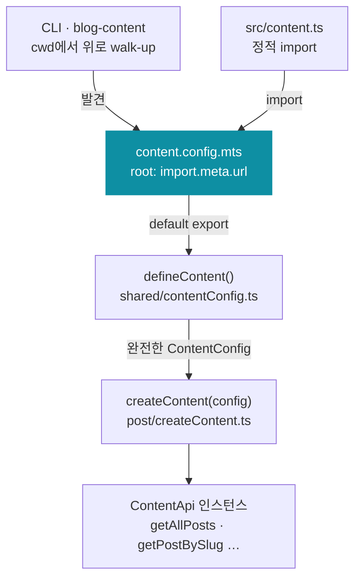

# @blog/content

`apps/blog/web`의 콘텐츠 프레임워크를 떼어 낸 패키지 — 스키마(frontmatter
서술자 테이블) · 로더 · 공개 판정 · 시리즈 선언 · URL 계약 · 빌드 스크립트 ·
2층 검증(`validate-posts`가 원문 / `check-seo`·`check-bundle`이 산출물).

운영 규칙(발행 판정 축, frontmatter 키 표, `--strict` 승격 규칙, SEO 게이트)의
단일 출처는 루트 `AGENTS.md`의 "Blog —" 절(§7–9)이다. 여기는 **패키지의
모양**만 적는다.

## 문 두 개 (소스 익스포트 — 빌드 스텝 없음)

| 문                  | 내용                                                                                    |
| :------------------ | :-------------------------------------------------------------------------------------- |
| `@blog/content`     | 프레임워크 전체 — `createContent`(로더 인스턴스 factory)·타입·visibility·urls·순수 유틸 |
| `@blog/content/seo` | SEO 빌더 factory(`createPostSeo`) + 순수 계산 — 프레임워크 중립 DTO(`PostSeoData`) 반환 |

fs를 읽는 API는 전부 **인스턴스**다 — 소비자가 `content.config.mts`로 만든
설정을 `createContent(config)`에 넘겨 로더 묶음(getAllPosts·getPostBySlug·
getSeriesMeta·getAllSeries…)을 받는다. 캐시는 인스턴스 안에 살아서 루트가
다른 인스턴스끼리 섞이지 않는다. zero-arg 전역 로더는 없다.



실선은 로더 인스턴스가 나가는 문, 점선은 SEO 빌더가 나가는 문이다.

빌드 스크립트(`src/scripts/`)는 API가 아니라 실행 파일이고, package.json의
`bin`에 걸린 **`blog-content` 하나**로만 나간다. 앱은 서브커맨드 이름만 안다
(`blog-content sitemap`) — 이름과 옵션을 단계 모듈에 잇는 곳은
`src/scripts/cli/program.ts`(commander) 하나뿐이라, 패키지 안에서 파일을 옮겨도
앱은 그대로다. 인자 파싱이 cli 레이어에만 있는 것도 경계다 — 단계 모듈은
commander를 모른 채 **이미 파싱된 값**을 받고, 도메인 규칙(`--scheduled`를 주면
status가 scheduled가 된다 같은)은 파싱이 아니므로 단계 쪽에 남는다.

> 예전에는 앱이 `npx tsx node_modules/@blog/content/src/scripts/…`처럼 **파일
> 경로를 직접** 지목했다. 패키지 내부 배치가 앱 스크립트에 새어 나오는 계약이라
> 파일을 옮기면 앱이 조용히 깨졌고, "직접 실행인가"를 판정하는 가드
> (`cliEntry.ts`)까지 따로 필요했다 — pnpm은 심링크 경로로 부르는데 ESM 로더는
> 모듈을 realpath로 해석해서, 순진한 `import.meta.url === argv[1]` 비교가 **항상
> false**였고 모든 생성기가 무음 no-op이던 사고가 있었다. 진입점이 하나가 되면서
> 가드도, 그 함정도 사라졌다.

**로더 없이 node로 그대로 돈다.** shebang이 `#!/usr/bin/env node`다 — 상대
import가 전부 `.ts` 확장자를 달고 있고(`allowImportingTsExtensions`), 문법은
`erasableSyntaxOnly`로 묶여 있어 node의 type stripping만으로 실행된다. 빌드
산출물도, tsx 같은 별도 로더도 없다. 앱 tsconfig에도 같은 플래그가 켜져 있어야
한다 — 이 소스가 앱 program에 섞이기 때문이다.

## 레이어 (eslint-plugin-boundaries가 강제)

```
shared → content(post) → seo → build(scripts) → render-build(scripts/render) → cli(scripts/cli)
```

| element        | 폴더                 | 가져올 수 있는 것                                                                                                       |
| :------------- | :------------------- | :---------------------------------------------------------------------------------------------------------------------- |
| `shared`       | `src/shared`         | node 코어만                                                                                                             |
| `content`      | `src/post`           | `shared` + node 코어 + `gray-matter`                                                                                    |
| `seo`          | `src/seo`            | `shared`·`content` — 순수 계산(node 코어·외부 의존 없음)                                                                |
| `build`        | `src/scripts`        | `shared`·`content`·`seo` + node 코어 + `gray-matter`                                                                    |
| `render-build` | `src/scripts/render` | 위 전부 + `satori`·`sharp`                                                                                              |
| `cli`          | `src/scripts/cli`    | 위 전부 + node 코어 + `commander` — 단계 모듈은 전부 **동적** import(부르지 않은 단계의 satori·sharp는 로드되지 않는다) |



- 네이티브 이미지 스택(satori·sharp)은 `render-build`만 만질 수 있다. 이 패키지는
  React를 의존하지 않는다 — satori에 넘기는 엘리먼트 모양은 `generate-og-images.ts`의
  `OgNode`가 직접 선언한다.
- boundaries 블록은 `src/{shared,post,seo,scripts}/**`에만 건다. 최상위 배럴
  `src/index.ts`만 그 스코프 밖이고(`src/seo/index.ts`는 `seo` element 안에서 검사된다),
  새 파일을 `src/` 바로 아래 두면 경계 검사를 아예 받지 않으니 네 폴더 중 한 곳에 둘 것.
  프로덕션은 테스트를 import 못 한다.
- 앱(`apps/blog/web`)의 eslint 설정과 **같은 엄격 수준**을 유지해야 한다 — 소스
  익스포트라 이 패키지 파일이 앱 program에 소스째 섞이기 때문. `lint`는 양쪽 다
  `--max-warnings=0`이고, `noInlineConfig` +
  `@eslint-community/eslint-comments/no-use`로 인라인 `eslint-disable` 주석이 금지다
  — 예외는 이 설정 파일에 `files` 스코프로 적는다.

## 디렉터리

```
src/
├─ index.ts · seo/index.ts        익스포트 문 둘 (내부 배럴 post/index.ts는 별개)
├─ shared/     contentConfig(defineContent + ContentValues 계약) · contentPaths(절대 경로)
│              · testValues(테스트 픽스처 — 패키지 안의 유일한 "어떤 사이트")
│              · dates · format · guards · jsonLd · url · postFiles · prismLanguages
│              · markdownHeadings(h1→h2 매핑, 사이트 본문용) · viewCookie
├─ post/       createContent(인스턴스 조립) · repository(gray-matter 로더 factory) · service(읽기 API factory)
│              · visibility(공개 판정 한 곳) · series(_series.yml factory) · urls(postPath·archivePath — 후행 슬래시는 여기서만)
│              · filtering · aggregate · thumbnail · assetUrl · frontmatterSchema(서술자 테이블)
│              · types · utils · testing(테스트 픽스처 인스턴스)
├─ seo/        postSeo — createPostSeo(buildPostSeo·buildPostJsonLd·buildBreadcrumbJsonLd) + 순수 계산
└─ scripts/    build-content(진입점) · validate-posts + validate/{rules,frontmatter,body,corpus,shared}
               · check-seo · check-bundle(번들 누수 마커) · artifacts(산출물 레지스트리 7종) · generate-{sitemap,rss,search-index,llms,llms-full}
               · sync-posts · new-post
               · context(ContentContext — 스텝이 받는 실행 컨텍스트)
               ├─ cli/     index(bin 진입점) · program(commander 서브커맨드·옵션 정의) · discoverConfig(설정 발견·로드)
               └─ render/  generate-og-images(satori+sharp) · generate-thumbnails(sharp)
```

## `build-content.ts` — 2단계

| 단계             | 스텝                                                                                                  | 비고                                                                                   |
| :--------------- | :---------------------------------------------------------------------------------------------------- | :------------------------------------------------------------------------------------- |
| 1 (게이트, 단독) | `validate-posts`                                                                                      | `--strict`를 그대로 넘긴다. `--skip-validate`로만 건너뛴다(앱 스크립트는 안 넘김)      |
| 2 (병렬 8개)     | `sync-posts` · `sitemap` · `rss` · `og-images` · `thumbnails` · `search-index` · `llms-full` · `llms` | 서로 다른 파일만 쓴다. `media`·`thumbs`·`og` 디렉터리는 겹치면 안 됨(각자 orphan 삭제) |

각 스텝은 `node <cli/index.ts> --config <절대경로> --now <ISO> <서브커맨드>`로
spawn되고 cwd·PATH 어디에도 기대지 않는다 — 부모가 발견한 설정 파일을 자식에
명시 전달하므로(`stepArgv`) 부모와 자식이 다른 설정을 잡을 수 없다. 앱의
`predev:web`과 `prebuild`는 같은 명령이고 `prebuild`만 `--strict`다(검증은 둘 다 돈다).

**기준 시각도 부모가 한 번 정해 넘긴다**(`--now`). 예약 글의 공개 판정·sitemap의
오늘·RSS lastBuildDate·strict 승격 범위가 전부 이 값을 본다 — 단계마다 제 시계를
보던 때는 공개 시각이 빌드 도중에 지나면 산출물끼리 글 집합이 갈렸다. 전역
`--now`를 생략하면 환경 변수 `BLOG_CONTENT_NOW`, 그것도 없으면 지금이다(offset을
명시한 ISO만 받는다). `next build`는 아직 로더의 자기 시각으로 판정하므로, 페이지와
산출물의 어긋남은 `check-seo`의 sitemap ↔ 페이지 대조가 잡는다.

2단계 스텝이 쓰는 곳(경로는 `dirs` 기본값, 앱 루트 기준):

| 스텝                                     | 산출물                                                                                                                  | 증분 기준 · 정리                                                         |
| :--------------------------------------- | :---------------------------------------------------------------------------------------------------------------------- | :----------------------------------------------------------------------- |
| `sync-posts`                             | `public/posts/**` — **공개 글이 원고에서 가리키는** 이미지·미디어 사본(draft·예약 글·메타 노트 전용 파일은 싣지 않는다) | 크기가 같고 사본이 더 새로우면 건너뜀, 대상에서 빠진 파일(orphan)은 삭제 |
| `og-images`                              | `public/og/{slug}.png` — thumbnail이 없거나 `/og/*`를 가리키는 발행 글의 OG 카드                                        | 내용 해시 manifest(`.cache/og-images.json`), orphan 삭제                 |
| `thumbnails`                             | `public/thumbs/**/*-thumb.webp` — 로컬 썸네일 최적화                                                                    | manifest(`.cache/thumbnails.json`), orphan 삭제                          |
| `search-index`                           | `search-index.json`(공개 글) · `admin-posts-index.json`(비공개 포함, 대시보드가 읽는 필드만 — 요약·시리즈 없음)         | 매번 다시 쓴다                                                           |
| `sitemap` · `rss` · `llms` · `llms-full` | `sitemap.xml` · `rss.xml` · `llms.txt` · `llms-full.txt`                                                                | 매번 다시 쓴다                                                           |

산출물은 전부 `.gitignore`다 — 신선한 체크아웃에는 없고, 낡은 `public/`은 무음 no-op 생성기를 가릴 수 있다.



## `defineContent` (`src/shared/contentConfig.ts`)

서버·빌드 전용 설정 표면. **사이트 고유 값에는 기본값이 없다** —
`root`(경로 앵커)와 같은 이유로, 어떤 기본값이든 특정 사이트의 하드코딩이기
때문이다. 그래서 `root` · `site` · `author` · `timezone` ·
`registries.diagramNames` · `og.palette` · `og.fonts` 가 필수(`ContentValues` 계약)이고,
값 자체는 소비자 앱의 `content.values.mts`(순수 리터럴, 값 import 없음)가
소유한다 — 방향은 항상 `content.values → content.config → @blog/content`.

기본값이 **남아 있는 것은 어떤 사이트에서도 같은 값뿐이다**: SEO 길이 예산,
펜스 라벨, 경로 관례, OG 카드 규격(1200×630). 사이트마다 다르지만 없어도 도는
축은 비어 있고(`sitemap.staticPages` · 우선순위 · `llms.facts`), 소비자가 이미 선언한 값에서
파생할 수 있는 축은 파생한다(`seo.titleSuffix` ← `site.name`,
`llms.indexIntro`/`fullIntro` ← `site.description`).

클라이언트 컴포넌트가 소비하는 값(타임존·다이어그램 이름)도 그 값 모듈에서
직접 가져간다. 해석된 설정 객체를 클라이언트가 import하면 og 팔레트·llms 산문
까지 번들에 실리기 때문이다(defineContent 호출 결과라 번들러가 미사용 필드를
털지 못한다).

나머지 그룹은 기본값이 있고 그룹 단위 shallow-Partial로 병합된다
(`llms.facts`·`llms.docs`만 한 단계 더 병합. `og.palette`·`og.fonts`는 필수라 병합할
기본값이 없고 준 값이 그대로 실린다):

| 그룹           | 키                                                                                                                                                                                                                                                                                                                                                                                |
| :------------- | :-------------------------------------------------------------------------------------------------------------------------------------------------------------------------------------------------------------------------------------------------------------------------------------------------------------------------------------------------------------------------------- |
| `root`         | **필수.** 경로 앵커 — `file://` URL(관례: `import.meta.url`) 또는 절대 경로. 상대 경로는 거부(cwd 의존 금지)                                                                                                                                                                                                                                                                      |
| `site`         | **필수(전체).** `url` · `name` · `description` · `descriptionExpanded` · `ogDefaultImage`                                                                                                                                                                                                                                                                                         |
| `author`       | **필수(전체).** `name` · `alternateName` · `role` · `github` · `linkedin`                                                                                                                                                                                                                                                                                                         |
| `seo`          | `titleSuffix` · `titleMaxLength`(60) · `descriptionMinLength`(120) · `descriptionMaxLength`(160, 자동 발췌 길이 겸용)                                                                                                                                                                                                                                                             |
| `timezone`     | **필수(전체).** `iana` · `isoOffset` · `utcOffsetMs`                                                                                                                                                                                                                                                                                                                              |
| `runtime`      | `isDevelopment()` — `NODE_ENV === 'development'` 정확 비교(빌드 스크립트를 dev로 오인하지 않게)                                                                                                                                                                                                                                                                                   |
| `registries`   | `diagramNames`가 **필수**(컴포넌트 매핑을 가진 앱만 쓸 수 있다). `supportedFenceLabels`는 기본값 있음. `metaFilenames`는 로더가 원고 디렉터리를 걸을 때 이름만 보고 건너뛸 작업 노트 파일 — 선택, 기본 빈 목록. 값 모듈은 순수 리터럴이라 배열로 받고, 판정용 집합은 `defineContent`가 만든다                                                                                     |
| `bundleGuards` | **선택.** `check-bundle`의 규칙 목록(label·marker·forbiddenIn·requiredIn)이 통째로 실린다 — 병합할 기본값이 없고, 선언하지 않은 사이트는 `check-bundle`이 검사를 건너뛴다                                                                                                                                                                                                         |
| `dirs`         | **앱 루트 기준 상대 경로** — `content`(`../posts`) · `public` · `cache` · `out` · `media` · `thumbs` · `og`                                                                                                                                                                                                                                                                       |
| `sitemap`      | `staticPages`(글이 아닌 페이지 — `/`·`/posts/`는 패키지 소유라 여기 없다) · `highPriorityFolders`(0.75) · `highPrioritySlugs`(0.8). 전부 **빈 배열**                                                                                                                                                                                                                              |
| `og`           | `palette`가 **필수**(satori는 CSS 변수를 못 읽어 리터럴 색이 필요하다 — 소비자가 자기 디자인 토큰에서 해석해 넘긴다). `fonts`도 **필수**(사이트 타이포그래피 선택 — 소비자가 자기 폰트 배포판 파일의 절대 경로로 서술자 `{name, weight, path}` 배열을 만들어 넘긴다. 만드는 방법은 `OgFont` 주석 참고, 템플릿은 400·500·700 사용). `width` · `height`는 소셜 카드 표준이라 기본값 |
| `thumbnails`   | `maxWidth` · `webpQuality`                                                                                                                                                                                                                                                                                                                                                        |
| `llms`         | `summaryMaxLength` · `docs.home`/`archive`/`full`(중립 기본값 — 경로는 패키지 소유) · `docs.extra`(사이트 고유 페이지, 경로까지 소비자가 준다. 기본 **빈 배열**) · `indexIntro`/`fullIntro`(← `site.description`) · `facts.*`(**전부 선택** — 준 항목만 줄로 나간다)                                                                                                              |

## 경로 앵커 — `content.config.mts`

앵커는 **소비자 앱 루트의 `content.config.(m)ts`** 하나다:

```ts
// apps/blog/web/content.config.mts — 최소 형태(발췌). 실제 파일은 값 모듈의
// site·author·timezone·registries와 og 팔레트·폰트까지 넘긴다(ContentValues 계약이 필수로 강제)
import { defineContent } from '@blog/content';
export default defineContent({ root: import.meta.url, ...values });
```

`root: import.meta.url`이 계약의 핵심 — **설정 파일의 위치 자체가 앵커**라서
`dirs.*` 상대 경로가 전부 그 디렉터리 기준으로 풀리고, 이 패키지는 모노레포/
폴리레포 구조를 전혀 모른다. 절대 경로 해석은 `resolveContentPaths(config)`
(`src/shared/contentPaths.ts`, 순수 함수)가 한다.

- **CLI**: cwd에서 위로 올라가며 설정 파일을 발견한다(`cli/discoverConfig.ts`).
  전역 `--config <경로>`로 명시할 수 있고(서브커맨드 이름 **앞**에 적는다),
  없으면 해결책을 담은 에러가 실행을 막는다 — 폴백은 없다
- **앱**: `src/content.ts`가 같은 설정 파일을 정적 import해
  `createContent`/`createPostSeo` 인스턴스를 만든다
- 파일명이 `.mts`인 이유: `"type": "module"` 없는 패키지에서 `.ts`는 node가
  CJS로 파싱했다가 ESM으로 재파싱한다(경고 + 오버헤드)



콘텐츠 원본(`apps/blog/posts`)은 이 패키지로 옮기지 않았다(`dirs.content` 한
줄이므로 필요해질 때 싸게 옮긴다). 실제 코퍼스를 읽는 계약 테스트는
`src/post/testing.ts`의 `testContent`(테스트 픽스처 인스턴스)로 배선한다.

## 검증

```sh
pnpm --filter @blog/content check-types   # tsconfig.json + tsconfig.test.json
pnpm --filter @blog/content lint          # --max-warnings=0
pnpm --filter @blog/content test          # vitest run (node 환경, src/**/*.{test,spec}.{ts,tsx})
pnpm --filter @blog/content test:coverage # 같은 스위트 + v8 커버리지
```

계약 테스트가 실제 원고·산출물을 잠근다:

- `src/post/contract.test.ts` — 실제 `apps/blog/posts/`에 대한 불변식(slug 유일, `getAllPosts` ↔ `isPostVisible` 일치, `_series.yml` 폴더만 시리즈 …)
- `src/scripts/contract.test.ts` — 산출물 불변식(sitemap·rss·search-index·admin-index·llms-full의 포함/제외 규칙)
- `src/scripts/url-consistency.test.ts` — 비ASCII slug가 sitemap·rss·llms·llms-full·페이지 링크 다섯 곳에서 같은 인코딩인지
- `src/post/frontmatterSchema.test.ts` — 루트 `AGENTS.md`의 frontmatter 표를 **글자 단위**로 서술자 테이블과 대조한다. 표의 `**Frontmatter 전체 목록**` 마커와 뒤따르는 `` `series`는 frontmatter가 아니라 `` 문장 사이만 읽으므로 둘 다 살아 있어야 하고, 키 순서·필수 ✅·설명 문구를 고치면 `frontmatterSchema.ts`의 `doc`도 함께 고칠 것

저장소 문서·워크플로 계약도 이 패키지에서 돈다(패키지 테스트가 이미 저장소 루트를 읽기 때문):

- `src/scripts/docPaths.test.ts` — 문서(AGENTS.md·README들·스킬)와 `.github/` 스크립트가 인용한 파일 경로가 실제로 있는지. 새 README를 만들면 파일 안의 `DOCS` 목록에 추가할 것
- `src/scripts/workflowPromptSize.test.ts` — `claude-code-review.yml` 프롬프트가 GitHub 한계(21,000B) 아래 예산(20,500B)을 지키는지. 넘으면 GitHub이 워크플로를 조용히 거부한다

이 패키지의 테스트는 전부 node 환경이라 `vitest.config.mts`를 프로젝트로 나누지
않는다(앱은 `src/`가 jsdom을 요구해 갈린다). `include` 글롭은 `tsconfig.test.json`·
`eslint.config.mts`의 테스트 블록과 **대칭**이므로 한쪽을 고치면 셋을 함께 고칠 것.
